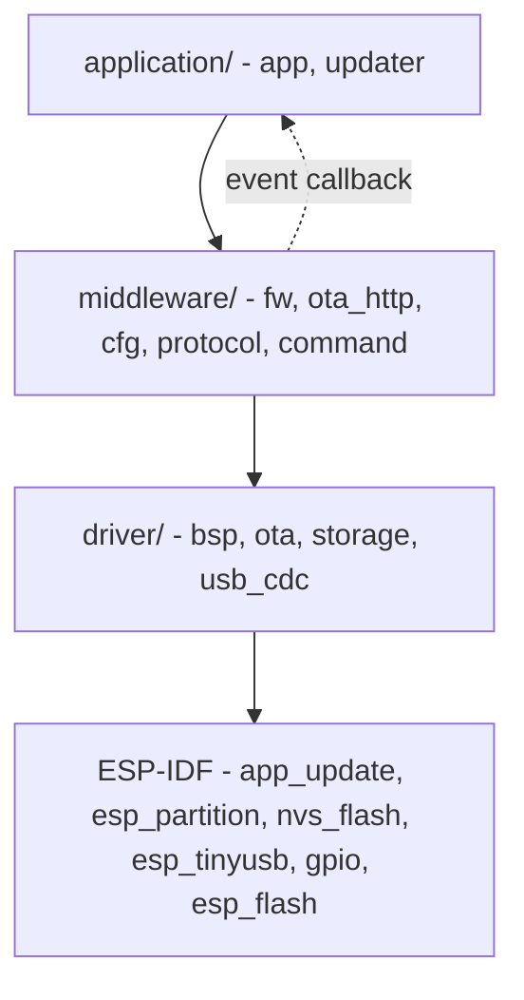

# Layering and Dependencies

> Calls go down, events come back up through a callback, and no file includes a header from a layer above it.

## Responsibility

The layer a module sits in decides what it may include. Naming the layer in the
path makes a violation visible at review, in the `#include` line, before anyone
opens a header.

**Middleware reaches the SDK through a driver, not directly** - two named
exceptions aside. That is a rule of this repo rather than of the house
standard, whose own table is looser; it has its own doc, with the exceptions
and the two greps that check it:
[../rule/layer-boundaries.md](../rule/layer-boundaries.md).

## Component dependency graph

Each module is one ESP-IDF component. `REQUIRES` means the dependency appears in
the module's own public header; `PRIV_REQUIRES` means only the `.c` uses it.

| Component | Layer | REQUIRES | PRIV_REQUIRES (ours) | PRIV_REQUIRES (SDK) |
|-----------|-------|----------|----------------------|---------------------|
| `app` | application | `fw` | `bsp`, `cfg`, `command`, `ota`, `protocol`, `storage`, `updater`, `usb_cdc` | `esp_app_format`, `esp_timer`, `esp_hw_support`, `freertos` |
| `updater` | application | `fw` | `ota_http` | `app_update`, `esp_partition` (both unused today - the CHECKING and DOWNLOADING steps are written against them) |
| `ota_http` | middleware | `fw` | — | `esp_http_client`, `esp-tls` (exception 2) |
| `command` | middleware | `bsp`, `fw`, `ota`, `protocol` | — | — |
| `protocol` | middleware | `fw` | — | — |
| `cfg` | middleware | `fw` | — | — |
| `fw` | middleware | — | — | — |
| `bsp` | driver | — | — | `esp_driver_gpio`, `esp_hw_support`, `esp_system`, `freertos`, `spi_flash`, `soc` (via the common requires, for the port's pin headers) |
| `ota` | driver | — | — | `app_update`, `esp_app_format`, `esp_partition` |
| `storage` | driver | — | — | `nvs_flash` |
| `usb_cdc` | driver | — | — | `esp_tinyusb`, `freertos` |

**The SDK column is empty for every middleware component but `ota_http`.** That
is the rule in [../rule/layer-boundaries.md](../rule/layer-boundaries.md) made
visible in the build files: a vendor dependency appearing in a middleware row
is the violation, and it shows up here before anyone opens a source file.

`command` names `bsp` and `ota` in REQUIRES rather than PRIV_REQUIRES because
`command.h` holds an `ota_session_t` and its handler prototypes take a
`bsp_mac_kind_t` - both driver headers are part of its own interface.

`fw` is a leaf: it depends on nothing, which is what lets both layers above it
include it. It is also where a pure function the SDK happened to provide now
lives - `fw_crc32_le()`, which is why `esp_rom` left `protocol`, `cfg` and
`command` in one commit.

## Two error code spaces, and where they meet

| Space | Type | Used by | Why |
|-------|------|---------|-----|
| Project-wide | `fw_err_t` | `application/`, `middleware/` | One code space means the application handles a timeout the same way whichever module produced it. |
| Driver-local | `bsp_err_t` | `driver/bsp/` | The driver layer must not include a middleware header, so it cannot use `fw_err_t`. |
| Driver-local | `usb_cdc_err_t` | `driver/usb_cdc/` | Same reason. Mapped in `bring_up_usb()`, the one place that knows both. |
| Driver-local | `ota_err_t` | `driver/ota/` | Same reason. Mapped where it is read: to `protocol_status_t` in `middleware/command`, and logged by name in `confirm_or_roll_back()`. |
| Driver-local | `storage_err_t` | `driver/storage/` | Same reason. Mapped in `from_storage_err()` in `application/app/src/app.c`, which clamps anything outside the shared -1..-19 range to `FW_ERR_IO` rather than casting a code `fw_err_str()` cannot name. |
| Wire | `protocol_status_t` | the USB channel | Not an internal code at all: these are bytes a PC parses, so they may never be renumbered. `middleware/command` returns them; nothing converts them to `fw_err_t` because they mean different things. |

Every space shares the same meanings for the generic range `-1 .. -19`, so
each map is one-for-one. There is exactly one map per driver, and each lives at
the place that reads the code:

| Driver space | Mapped in | To |
|--------------|-----------|-----|
| `bsp_err_t` | `bring_up_bsp()`, `application/app/src/app.c` | `fw_err_t` |
| `usb_cdc_err_t` | `bring_up_usb()`, `application/app/src/app.c` | `fw_err_t` |
| `storage_err_t` | `from_storage_err()`, `application/app/src/app.c` | `fw_err_t` |
| `ota_err_t` | the handlers in `middleware/command/src/command*.c` | `protocol_status_t` |

If a driver grows a code the layer above must distinguish, its row is the only
edit. `ota_err_t` is the one that does not become an `fw_err_t` anywhere: its
only readers answer a host on the wire, and `protocol_status_t` is not an
internal code.

Vendor status codes (`esp_err_t`) never escape the module that called the SDK:
each of `bsp`, `ota`, `storage` and `ota_http` has a private `from_esp_err()`
helper returning the module's own code. `cfg`, `protocol`, `command` and `fw`
need none - they no longer call an SDK function at all.

`ota`'s mapper is silent, unlike the others: every one of its callers already
logs the raw vendor value with context the mapper does not have - which slot,
how many bytes - so logging in both places would double every failure line.

## Reproduction notes

- Verified by grep on 2026-09-07, both empty: nothing under `driver/` includes
  `fw.h`, `fw_config.h`, `cfg.h`, `ota_http.h`, `protocol.h`, `command.h`,
  `updater.h` or `app.h`; nothing under `middleware/` includes `updater.h`,
  `app.h` or `app_priv.h`. Note `storage.h` is no longer on that list - it is a
  driver header itself now, which is what let it stop returning `fw_err_t`.
  `cfg.h` still includes no storage header of any kind.
- `middleware/fw` is included sideways by its middleware siblings. That is a
  one-way include of a leaf, not a cycle.
- **The USB channel is the sharpest case of "calls go down".** The dispatcher
  in `middleware/command` has to know whether the update cycle - which lives in
  `application/` - is already writing an OTA slot. It may not include
  `updater.h`, so it **asks** through a `command_busy_cb_t` the application
  supplies, exactly as `ota_http` reports progress upward without knowing who it
  notifies. Reading the state directly would have been an upward include and is
  the one thing this layering forbids.
- A driver must never report upward with a direct call. `updater` receives state
  changes from nothing below it, but `ota_http` reports progress upward through
  a `void *ctx` callback supplied at init — the module does not know the name of
  what it notifies.
- **`cfg` uses the same shape to reach *sideways* rather than upward.** It owns
  the settings record but names no storage technology: persistence arrives as a
  `cfg_store_t` of two callbacks plus a `void *ctx`, and the concrete pair —
  `cfg_store_load` / `cfg_store_save` in `application/app/src/app.c` — forwards
  to `storage_blob_*`. So `cfg` does not depend on `storage` at all, and
  re-pointing the settings at the reserved `cfg_setting` partition is a new
  adapter rather than an edit in either module. `cfg` also restates
  `UPDATER_HORIZON_MS` as `CFG_CHECK_INTERVAL_MAX_MS`, because it must validate
  against a constraint that lives in `application/` and may not include the
  header that holds it.
- `esp_err_t` must not appear in any public header above the driver layer.
  `ota_http_t` and `storage_t` therefore hold their vendor handles as `void *`
  and `uint32_t` respectively, described in their interface docs.

## See also

- [repo-layout.md](repo-layout.md) — the tree these layers occupy
- [../rule/layer-boundaries.md](../rule/layer-boundaries.md) — the rule that keeps the SDK column empty
- [../data/error-code-model.md](../data/error-code-model.md) — the two code spaces in detail
