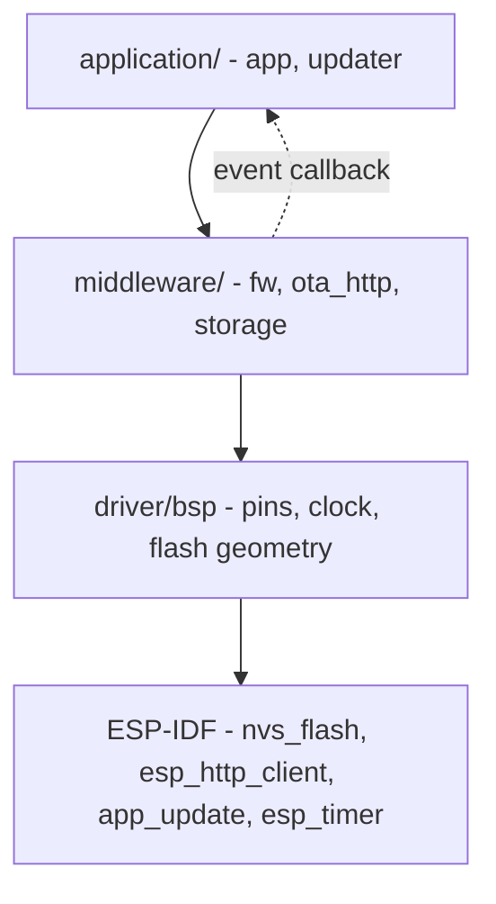

# Layering and Dependencies

> Calls go down, events come back up through a callback, and no file includes a header from a layer above it.

## Responsibility

The layer a module sits in decides what it may include. Naming the layer in the
path makes a violation visible at review, in the `#include` line, before anyone
opens a header.

## Component dependency graph

Each module is one ESP-IDF component. `REQUIRES` means the dependency appears in
the module's own public header; `PRIV_REQUIRES` means only the `.c` uses it.

| Component | REQUIRES | PRIV_REQUIRES (ours) | PRIV_REQUIRES (SDK) |
|-----------|----------|----------------------|---------------------|
| `app` | `fw` | `bsp`, `storage`, `updater` | `app_update`, `esp_app_format`, `esp_partition`, `esp_timer`, `freertos`, `nvs_flash` |
| `updater` | `fw` | `ota_http`, `storage` | `app_update`, `esp_partition` |
| `ota_http` | `fw` | — | `esp_http_client`, `esp-tls` |
| `storage` | `fw` | — | `nvs_flash`, `esp_rom` |
| `fw` | — | — | — |
| `bsp` | — | — | `esp_driver_gpio`, `esp_hw_support` |

`fw` is a leaf: it depends on nothing, which is what lets both layers above it
include it.

## Two error code spaces, and where they meet

| Space | Type | Used by | Why |
|-------|------|---------|-----|
| Project-wide | `fw_err_t` | `application/`, `middleware/` | One code space means the application handles a timeout the same way whichever module produced it. |
| Driver-local | `bsp_err_t` | `driver/bsp/` | The driver layer must not include a middleware header, so it cannot use `fw_err_t`. |

Both share the same meanings for the generic range `-1 .. -19`, so the map
between them is one-for-one. It is applied in exactly one place, inside
`bring_up_bsp()` in `application/app/src/app.c`. If `bsp` ever grows a code the
application must distinguish, that function is the only edit.

Vendor status codes (`esp_err_t`) never escape the module that called the SDK:
each of `bsp`, `storage` and `ota_http` has a private `from_esp_err()` helper
that logs the vendor value and returns the module's own code.

## Reproduction notes

- Verified: nothing under `driver/` includes `fw.h`, `storage.h`, `ota_http.h`,
  `updater.h` or `app.h`; nothing under `middleware/` includes `updater.h` or
  `app.h`.
- `middleware/fw` is included sideways by its middleware siblings. That is a
  one-way include of a leaf, not a cycle.
- A driver must never report upward with a direct call. `updater` receives state
  changes from nothing below it, but `ota_http` reports progress upward through
  a `void *ctx` callback supplied at init — the module does not know the name of
  what it notifies.
- `esp_err_t` must not appear in any public header above the driver layer.
  `ota_http_t` and `storage_t` therefore hold their vendor handles as `void *`
  and `uint32_t` respectively, described in their interface docs.

## See also

- [repo-layout.md](repo-layout.md) — the tree these layers occupy
- [../data/error-code-model.md](../data/error-code-model.md) — the two code spaces in detail
