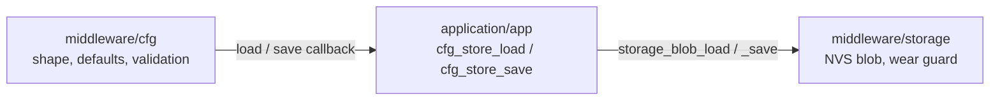

# Config Load and Save

> Every read is validated before it is believed, every write is skipped unless the bytes actually changed — and the module that validates is not the module that writes.

## Who does what

`cfg` decides **what a setting may be**. `storage` decides **where the bytes
go**. The two one-line wrappers in `application/app/src/app.c` are the only
place in the image that knows both.

## Load — `cfg_init()`

1. Reject a NULL instance, a NULL adapter, or an adapter missing either
   callback. Nothing is read.
2. Call the adapter's `load` with a buffer of `sizeof(cfg_record_t)`.
3. Sort the adapter's answer into two groups:
   - `FW_ERR_NOT_FOUND` and `FW_ERR_CRC` are **normal** — nothing stored, or
     bytes that did not check out at the storage layer.
   - Anything else is the caller's problem: logged once here and returned
     unchanged (R-LOG-04). The instance stays unusable, so every accessor
     answers `FW_ERR_STATE`.
4. On `FW_OK`, validate: stored length, CRC, record version, **both** strings
   NUL-terminated inside their buffers, and `check_interval_ms` below the
   scheduling horizon. See [../data/storage-record.md](../data/storage-record.md)
   for the verdict table.
5. A clean verdict installs the stored record. Any failure verdict logs which
   one it was and installs `cfg_record_default()` instead — and **still returns
   `FW_OK`**, because the instance is usable either way (R-CFG-02, R-CFG-03).

The CRC covers every byte before the trailing CRC field, using the ROM CRC-32
routine seeded with zero so the result is the standard CRC-32 of the buffer.

## The storage half of the load

`storage_blob_load()` adds nothing but the NVS call and one translation: NVS
refuses to copy a blob bigger than the caller's buffer, and a blob of a length
this build does not use is not one this build wrote — so it comes back as
`FW_ERR_CRC`, which is the verdict that lands on step 3's "normal" side.

## Save — `cfg_save()`

1. Overwrite `version`, `length` and `crc32` on the live record. A setter never
   touches them, so they are always correct for whatever changed the record.
2. Hand the whole record to the adapter's `save`.
3. `storage_blob_save()` **reads the stored bytes back and compares.** If they
   already equal what is about to be written, it returns success without
   touching flash.
4. Otherwise it writes the blob and commits.

Step 3 is what makes the call safe to make every cycle. NVS wear is measured in
sector erases; the compare is cheap and the erase is not. Its compare buffer is
a fixed `STORAGE_BLOB_MAX` bytes, not a VLA sized from `len`.

Power-fail safety is delegated: NVS commits the new copy before dropping the old
one, so a cut here leaves the previous record readable. Neither module
implements a two-slot scheme of its own.

## Set — the accessors

A setter validates and assigns, and **writes nothing**. A caller that changes
four settings pays for one flash write, and `cfg_defaults_set()` — the factory
reset — is the same: RAM only, so a reboot before `cfg_save()` leaves the old
record readable. `test_cfg_a_setter_never_writes_to_the_store` asserts that
negative against a call-counting fake store.

A refused value leaves the stored one in place. There is no partial assignment:
a string setter checks the length before it copies a byte.

## Inputs → outputs

| Reads | Produces |
|-------|----------|
| NVS blob at the configured namespace/key | A validated record, or the compiled-in defaults plus a log line |
| The live record | A stamped, CRC-correct blob — or nothing, if unchanged |

## Edge cases & error handling

- A record written by a **newer** firmware (unknown version) is reported as
  "not found" rather than reinterpreted, so the device falls back to defaults
  instead of guessing at a layout it does not know. A record whose length
  differs takes the same route via `FW_ERR_CRC`.
- **A valid CRC is not sufficient.** An interval past the scheduling horizon
  fails validation with `FW_ERR_PARAM` and the whole record is refused.
  Before `cfg` existed this value reached `updater_init()` unchecked and
  **failed bring-up**; now it falls back to the defaults.
- 🔴 **Open hole (code, not knowledge):** there is no migration.
  `record_validate()` carries the TODO. Today, changing the struct silently
  costs every deployed unit its stored settings.
- The compare in save step 3 uses the load path, so a **damaged** stored record
  makes the compare fail and the write proceed — which is the right repair
  behaviour.
- ⚠ **Nothing in this firmware calls `cfg_save()` yet.** The record is read at
  boot and never written, which is unchanged from before the refactor — the
  linker drops `cfg_save` from the image for want of a caller. The first writer
  will be whatever records `last_ok_fw_version` or `boot_fail_count`.
- `cfg_init()` and `cfg_save()` block on flash and are not callable from an ISR.

## See also

- [../interface/cfg-api.md](../interface/cfg-api.md) — the accessors and what each refuses
- [../interface/storage-api.md](../interface/storage-api.md) — the blob contract underneath
- [../data/storage-record.md](../data/storage-record.md) — the shape and its invariants
