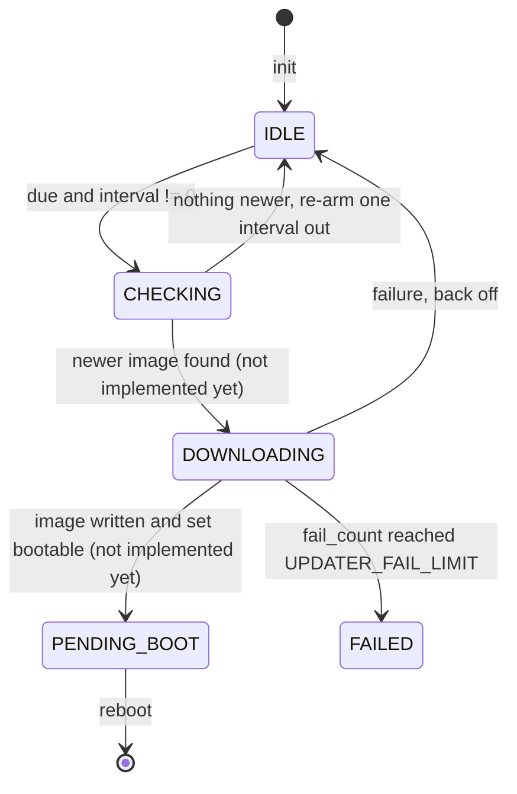

# Update Cycle State Machine

> One state advances per `updater_step()` call, scheduled by a wrapped difference rather than a timestamp comparison, so the cycle survives the 49.7-day clock wrap.

## States and transitions



`PENDING_BOOT` and `FAILED` are terminal until the application reboots or
restarts the cycle. Stepping them is legal and does nothing.

Every transition goes through one helper that logs the change and fires the
optional state callback. A transition to the state already held is a no-op and
does not fire the callback.

## The scheduling arithmetic

The instance holds `next_due_ms`, an absolute deadline on the caller's clock.
The due test is:

```text
due  <=>  (uint32)(now_ms - next_due_ms) < 2^31
```

Unsigned wrap-around is defined in C, so this stays correct across the 2^32 ms
boundary. **Comparing the two timestamps directly would be wrong** for the whole
window after a wrap.

The cost is a hard ceiling: any delay at or past 2^31 ms (~24.8 days) is
indistinguishable from "already due". `updater_init()` therefore rejects a
`check_interval_ms` or `retry_backoff_ms` at or past that value with
`FW_ERR_PARAM`, rather than silently checking every loop.

🟢 Verified by execution, not by reading: the wrap case, the not-yet-due case,
the horizon rejection, the zero-interval case and the re-arm case are all
exercised by assertions that were compiled and run on a host.

## Per-state work

| State | What the step does |
|-------|--------------------|
| `IDLE` | If the interval is non-zero and the deadline has passed, enter `CHECKING`. Otherwise nothing. |
| `CHECKING` | 🔴 **gap** — not implemented. Currently re-arms the deadline and returns to `IDLE`, so the cycle never finds an update. |
| `DOWNLOADING` | 🔴 **gap** — not implemented. Currently records a failure and returns `FW_ERR_UNSUPPORTED`. Unreachable today because nothing enters this state. |
| `PENDING_BOOT` / `FAILED` | Nothing; returns `FW_OK`. |

What `CHECKING` must eventually do: fetch the manifest through the OTA HTTP
module, compare its version against the running image's version, and enter
`DOWNLOADING` only when it is newer. What `DOWNLOADING` must do: drive the fetch
into the OTA write API, set the boot partition, enter `PENDING_BOOT`.

**The stub fails in the safe direction** — finding nothing is harmless, whereas
a stub that claimed to find an update would not be.

## Retry budget

A failed attempt increments `fail_count`:

- Below `UPDATER_FAIL_LIMIT` (3): set the deadline one backoff out and return to
  `IDLE`.
- At or above the limit: log and enter `FAILED`, which is terminal. The cycle
  stops trying until reboot or a fresh `start`.

`fail_count` resets to 0 on `updater_start()`, never on a success — because no
success path exists yet. Whether a completed download should
reset it is an **open design decision**, not something the source answers.

## Edge cases & error handling

- `check_interval_ms == 0` disables checking entirely. Verified: stepping at
  `now_ms` 1 and at `0xFFFFFFFF` both leave the state `IDLE`.
- `stop` then `step` returns `FW_ERR_STATE`; `stop` and `deinit` are both
  repeatable and safe on an instance that was never initialised.
- The state callback must not call back into the updater — the module is
  mid-transition when it fires.

## See also

- [../interface/updater-api.md](../interface/updater-api.md) — the contract these steps implement
- [boot-and-bring-up.md](boot-and-bring-up.md) — who calls `step`
