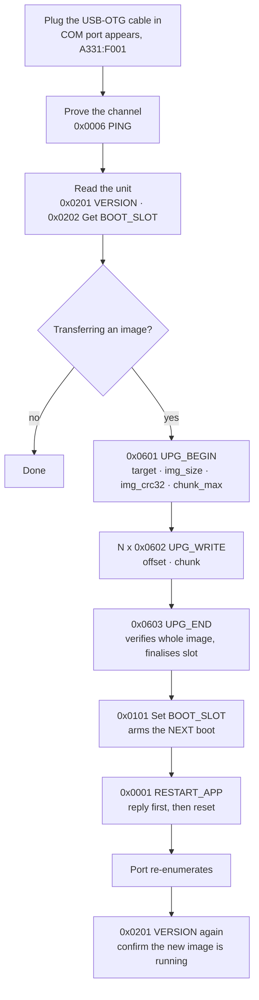

# USB Host Flow

> Plug a cable in, prove the channel, push an image into `app_firmware`, arm it,
> reboot. Written for someone who has not read the frame format.

The wire format and the opcode numbers are
[../data/usb-frame-format.md](../data/usb-frame-format.md) and
[../interface/command-map.md](../interface/command-map.md). This file is the
authority on **the order things happen in and why**.

## Overview

Ordering principle: **prove the channel, then read, then write, then arm, then
reboot.** Nothing before UPG_END can make a slot bootable, so every step up to
it is safe to abandon.

## The steps

| # | Step | Opcode | What it does | What it proves on the board | Pass when | Operator |
|---|------|--------|--------------|-----------------------------|-----------|----------|
| 0 | Power and plug | — | USB-OTG cable into the port on GPIO19/20 | supply, USB PHY, firmware booted, descriptors right | a COM port appears with hardware id `USB\VID_A331&PID_F001` | plug the cable |
| 1 | Handshake | `0x0006` PING | send a few bytes, wait for the echo | the command channel is alive, framing and CRC32 work both ways | the payload returns byte for byte | — |
| 2 | Read versions | `0x0201` VERSION | read the 32-byte block | which image runs, and what sits in the firmware slot | `[0:16]` is the expected updater version; `[16:32]` is the firmware slot, or 16 zero bytes when it was never written | log both |
| 3 | Read the slot | `0x0202` Get BOOT_SLOT | ask which slot is running | the bootloader picked what was expected | `0` on a unit running the updater | — |
| 4 | Identity | `0x0203`/`0x0204` | read the Wi-Fi and BLE MACs from eFuse | the part is the part it claims to be | six bytes each, differing in the last byte | log both |
| 5 | Open a transfer | `0x0601` UPG_BEGIN | declare target, size, CRC32 and chunk size; the slot is erased | the target slot is erasable and the image fits it | `0`; anything else means nothing was erased | — |
| 6 | Send the image | `0x0602` UPG_WRITE × N | one chunk per frame, strictly in order | the flash accepts every byte | `0` for every chunk | watch the progress |
| 7 | Verify and finalise | `0x0603` UPG_END | check the whole-image CRC32, mark the slot valid | the bytes that landed are the bytes that were sent | `0`; `-6` means the image did not survive the trip | — |
| 8 | Arm | `0x0101` Set BOOT_SLOT | write `otadata` for the **next** boot | `otadata` is writable and the image validates | `0`; `-5` means the slot holds no valid image | — |
| 9 | Reboot | `0x0001` RESTART_APP | reply, wait 100 ms, reset | the reply leaves before the reset | `0`, then the port disappears | — |
| 10 | Re-enumerate | — | wait for the port to come back | the new image boots and brings USB up | the COM port reappears | — |
| 11 | Confirm | `0x0201` VERSION | read the block again | **the new image is the one running** | `[0:16]` is the version that was just transferred | log it |

**Step 11 is the one most often skipped and the only one that proves the
upgrade worked.** Everything before it proves bytes moved; only this proves the
unit boots them.

`docs/scripts/tool-usb.py` automates steps 1 to 9:
`upgrade FILE --arm` runs 5 through 9 in one go, and `version` covers 2 and 3.

## The ordering that is not negotiable

1. **UPG_END before Set BOOT_SLOT.** UPG_END is the only thing that marks a
   slot valid. Arming a slot that never finished means arming an image that was
   never verified — and on a unit whose only other slot holds the updater, that
   is the one mistake with no way back over USB.
2. **Set BOOT_SLOT before RESTART_APP.** Obvious in hindsight, and the reason
   `tool-usb.py upgrade` refuses to reboot without `--arm`.
3. **A Set followed by a Get reads the OLD slot.** Set arms the next boot; Get
   reports what is running now. They are asymmetric on purpose, so a tool must
   say "will boot X after restart" rather than read the value back and call the
   difference a failure.
4. **One command at a time, and wait for each answer.** The protocol is
   synchronous and the device serves one frame at a time; a host that sends
   ahead can overflow the 512-byte CDC RX FIFO, and the symptom is a corrupted
   *next* command rather than an error code.
5. **Retry is UPG_BEGIN again.** There is no abort opcode. A host that gave up
   half way, picked the wrong file, or lost the cable simply starts over; the
   device frees the old session first, so retrying does not leak a handle.

## STATUS per item

Every failure this channel can report, and which item produces it.

| STATUS | Where it comes from |
|--------|---------------------|
| `0` OK | success, including the "never written" answers — a firmware slot with no image reads back as 16 zero bytes with OK |
| `-2` BAD_CMD | an opcode this spec does not define at all, including retired ones such as Get System `0x06` (once `PRODUCT_ID`) and the all-zero word |
| `-3` BAD_LEN | wrong payload width: BOOT_SLOT not 1 B, UPG_BEGIN not 13 B, UPG_WRITE under 4 B, a PING over 32768 B (see the note below). And every chunk rule: empty, over `chunk_max`, over 32768, past `img_size`, or not a multiple of 1024 when it is not the last |
| `-4` BAD_ARG | value rejected: a slot that is neither 0 nor 1, an unknown `target`, an `img_size` of zero or past the partition, a `chunk_max` outside 4096..32768 or not a multiple of 1024 |
| `-5` STATE | Set BOOT_SLOT on a slot with no valid image; UPG_BEGIN aimed at the running slot or arriving while the HTTP update cycle is writing; UPG_WRITE or UPG_END with no session open, at the wrong offset, or short of `img_size`. **Always retryable in principle** |
| `-6` HW | a MAC that could not be read; a flash erase or write that failed; an image whose CRC32 did not match at UPG_END |
| `-7` UNSUPPORTED | every opcode the spec defines that this board cannot serve — the whole ATE range, all of Config, Wi-Fi and the network items, and FACTORY_RESET. See [../rule/known-deviations.md](../rule/known-deviations.md) |

Length is always checked **separately from** value, and before it: a two-byte
BOOT_SLOT payload is `-3` whatever it contains, while a one-byte payload
carrying `2` is `-4`. Merging them would leave a tool guessing which half of
its request to fix.

> **A gap in the source spec, resolved here.** It says PING echoes 0 to
> `PROTOCOL_MAX_DATA` bytes *and* that the reply carries `4 + REQ.LENGTH` —
> which at the cap asks for a reply of 32776 bytes, past that same cap. The
> real ceiling is `PROTOCOL_MAX_DATA - PROTOCOL_STATUS_LEN` = **32768**, and
> 32769..32772 answer `-3` rather than a truncated echo. `UPG_WRITE` is
> unaffected: its reply carries a status and nothing else, which is exactly why
> `PROTOCOL_MAX_DATA` is 32772 in the first place.

## Which handlers hold the channel

Dispatch runs on its own task, but that task is the only one parsing frames, so
a slow handler delays the *next* command. Nothing here blocks for long, which is
what makes the synchronous protocol comfortable on this product.

| Item | Holds the channel for |
|------|----------------------|
| `0x0602` UPG_WRITE | one flash write, tens of milliseconds at 4–32 KB |
| `0x0603` UPG_END | the image validation `ota_session_end()` performs |
| `0x0601` UPG_BEGIN | the target slot erase |
| `0x0001` RESTART_APP | 100 ms of grace, then the chip resets |
| everything else | microseconds — an eFuse read, a table lookup, a `memcpy` |

There is no `CHK_TOUCH`-style handler that waits on a human, which is the one
class of blocking the source spec had to clamp. The rule still stands: send one
command, wait for its answer.

## Time budget

A 13.875 MB `app_firmware` image at the 32 KB ceiling:

| Part | Cost |
|------|------|
| chunks | ~425 frames |
| per frame | one 32 KB OUT transfer plus a 16-byte reply |
| USB full speed | ~1 MB/s in practice, so ~14 s of wire time |
| flash writes | the same 13.875 MB, overlapping the transfers |
| steps 1–4 and 8–11 | under a second in total |

So a full firmware transfer is **tens of seconds**, dominated by the image
itself. Dropping `chunk_max` to the 4 KB floor multiplies the frame count by
eight, which is why the floor exists rather than allowing smaller.

## See also

- [../data/usb-frame-format.md](../data/usb-frame-format.md) — the wire format
- [../interface/command-map.md](../interface/command-map.md) — every opcode
- [usb-upgrade-session.md](usb-upgrade-session.md) — the session rules in detail
- [../interface/tool-usb-cli.md](../interface/tool-usb-cli.md) — the script that automates this
