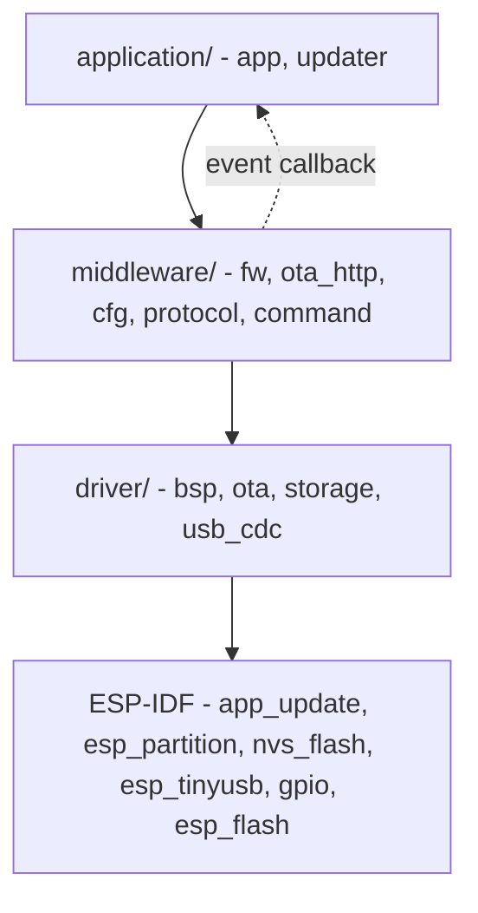
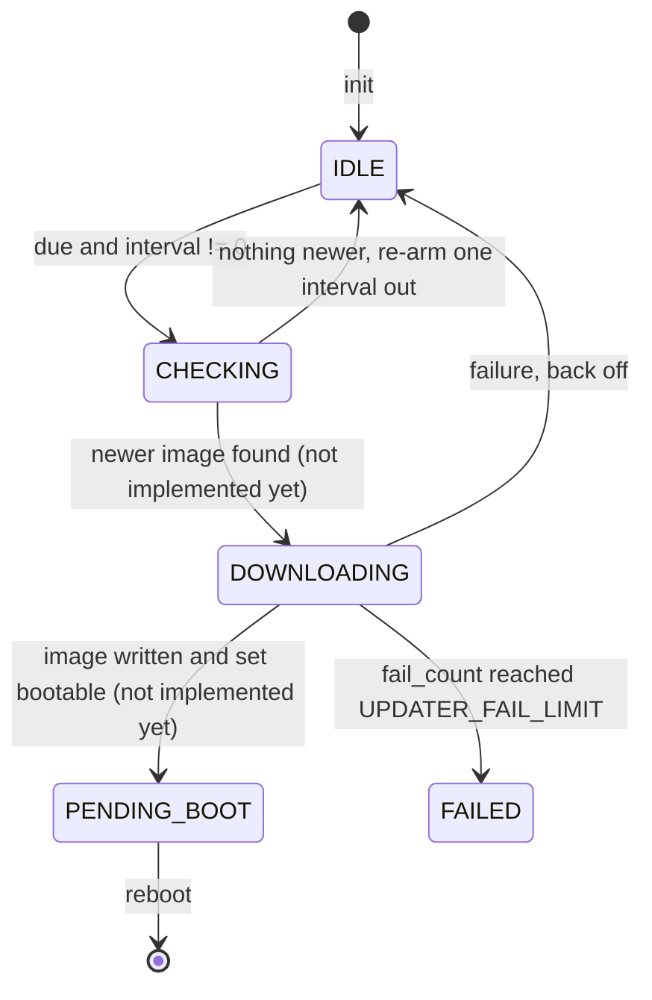
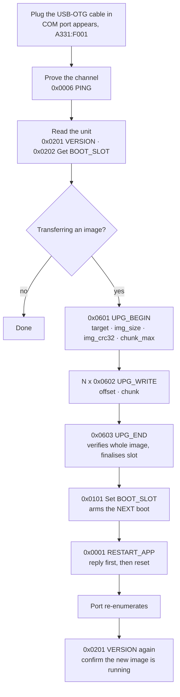

# Project Memory - Full Read

> Auto-generated by `memory_docs.py digest`. Do NOT edit by hand - edit the
> source docs under docs/memory-ai/ and re-run `digest`. This file concatenates
> the whole bank into one read for session start; overview.md stays the map.
> Transient state comes first, then durable docs in reproduction order:
> architecture -> data -> interface -> behavior -> rule (then adr/).
> Confidence per doc: 🟢 confirmed | 🟡 inferred (verify) | 🔴 gap (needs a human).

_Generated 2026-09-08 - 38 durable doc(s)._

## State (transient)

### progress.md

# Progress

> Current delivery state — what works, what's left, known issues. Update at every checkpoint (feature shipped, milestone, direction change).

## What works

- The full three-layer tree exists with ten modules, each with one public
  header, at least one source file, and a component registration.
- **Verified by execution:** the update-cycle state machine and the status-code
  lookup compile clean on host GCC under the house warning set with `-Werror`,
  and every behavioural assertion passes — including the 2^32 ms clock wrap, the
  scheduling horizon rejection, and the repeatable stop/deinit contract.
- **Verified mechanically:** `clang-format` clean across all 43 sources; each
  symbol prefix declared in exactly one module directory; no upward include
  across a layer; no pin literal outside `driver/bsp/`; no source of ours under
  `workspace/`.
- `docs/scripts/tool-esp.py` resolves the repo root and the workspace correctly
  and refuses to run without `IDF_PATH`. The workspace is discovered rather than
  hardcoded — **verified by running the CLI in every state**: a bogus `-w`,
  `-w ../..`, nothing naming a workspace, `WORKSPACE=` in `.env.esp`, `-w`
  overriding it, and a typo in `WORKSPACE=`. Each resolution was proved by which
  workspace's
  `sdkconfig.defaults` the flash size came back from (16 MB vs 4 MB), not by the
  message alone. `format` still runs with an invalid `WORKSPACE=`, proving the
  resolution is lazy. The fresh-clone path was walked too: two workspaces and no
  `.env.esp` refuses **and writes the template**, the second run does not repeat
  that line, and filling `WORKSPACE=` in resolves. Naming the product is
  **required** - re-verified after that rule replaced the infer-the-only-one
  fallback: a blank `WORKSPACE=` refuses with exit 1, `-w` alone passes with no
  `.env.esp` at all (the CI shape, and no file is written), and `format` still
  runs with `WORKSPACE=` blank.
- The repo is published: 8 commits on `main`, `developing` and `release/v0.1`,
  with branch protection on the first two **verified by an actual rejected
  push**, not just by the API response.
- A host test harness that actually runs: **69 Unity tests, green**, built under
  the firmware's own `-Werror` warning set. **Proven to have teeth** — breaking
  the wrap-safe due check makes exactly one test go red, and restoring it makes
  the suite green again.
- Static analysis at a clean baseline, verified by running it locally **and in
  the CI container**: `cppcheck` 0 findings, `clang-tidy` 0 findings, no secrets
  in the tree. One real finding (a parameter that could be `const`) was found
  and fixed, not suppressed.
- **The firmware compiles.** `idf.py build` completes in `espressif/idf:v6.1`:
  1090 targets, `app_updater.bin` 0x31120 bytes (196 KB) against a 2 MB slot,
  90% free. Rebuilt clean on the 16 MB table at 240 MHz.
- **A USB command channel, host-verified end to end.** Three new modules
  (`middleware/protocol`, `middleware/command`, `driver/usb_cdc`) plus the wiring
  in `application/app`. The host suite went from 26 tests to 56, all green: the
  frame codec (resync past garbage, a `LENGTH` past the cap resuming one byte on,
  a bad CRC dropped silently, pad bytes inside the CRC), the dispatch order
  (`-2` before `-7` before `-3` before `-4`), every served handler, and the whole
  upgrade session (the chunk band, sequential offsets, the 1024 rule and its
  last-chunk exemption, a wrong image CRC refusing to finalise, and `UPG_BEGIN`
  freeing the previous OTA handle).
- **Three of those tests were proved to have teeth by mutation**, not assumed:
  changing the parser's resync rule reddens exactly the resync test; reporting a
  wrong `LENGTH` as `-4` reddens exactly the length test; dropping the
  free-the-old-handle call in `UPG_BEGIN` reddens exactly the two open-session
  assertions.
- `docs/scripts/tool-usb.py` speaks the protocol from a PC. Its `selftest` runs
  with no board and no pyserial, and pins the CRC to the same fixed vector the
  firmware tests use.
- **Measured, not estimated:** the channel costs ~65.6 KB of static RAM (two
  32788-byte frame buffers); `.bss` is 70,592 bytes, 20.66 % of DRAM, leaving
  roughly 270 KB for the heap. `app_updater.bin` is 0x3a7f0 with 89 % of its
  2 MB slot free.
- **v0.1.0 is released**, cut end to end by `tool-release.py`: seven phases, two
  merged pull requests, an annotated tag on `main`, and eight published
  artifacts. Both workflows green on the runs that produced it.
- **Middleware calls mapped drivers, not the vendor SDK.** Verified by the two
  greps in [rule/layer-boundaries.md](rule/layer-boundaries.md), not by
  reading: no vendor include in any middleware source but `esp_log.h` and
  `ota_http`'s HTTP client, and no `esp_ota_*` / `esp_partition_*` / `nvs_*` /
  `esp_restart` / `esp_read_mac` / `esp_rom` anywhere in `middleware/` or
  `application/` outside two lines of deliberate comment prose. `driver/` holds
  four modules now: `bsp`, `ota`, `storage`, `usb_cdc`.
- **83 host tests, green**, up from 69, built under the firmware's own
  `-Werror` warning set. Eleven of the new ones are the blob store's first
  tests ever. **Three assertions were proved to have teeth by mutation**, not
  assumed: one wrong nibble in the CRC table reddens both the direct comparison
  against an independent implementation and every protocol frame test; deleting
  the read-compare-write guard reddens exactly the wear test at 11 writes
  instead of 1; `bsp_restart(0U)` reddens exactly the RESTART_APP ordering test.
- **A feature can be compiled out, measured rather than assumed.**
  `FW_FEATURE_USB_COMMAND` at 0 builds clean and frees **67 688 bytes of
  `.bss`** — 20.66 % of DRAM down to 0.85 % — plus 41.4 KB of flash;
  `FW_FEATURE_UPDATER` at 0 builds clean and leaves `updater_step` with no
  address at all in `app_updater.map`. Both restored to 1 and the baseline size
  returns exactly.
- **The factory image says what it is.**
  `tool-esp.py merge` produces `bl_app_updater_0xF001_Sep0726.bin`, every field
  read from the build; `release.yml` copies it by glob and fails unless exactly
  one matches.
- **A settings library with a persistence seam, `middleware/cfg`.** It owns the
  record, the defaults and one validated get/set pair per setting; where the
  bytes go arrives as a two-callback adapter, so `cfg` names no storage
  technology and the blob store it forwards to is now `driver/storage`. One of
  its tests was **proved to have teeth by mutation**: deleting the
  `CFG_CHECK_INTERVAL_MAX_MS` guard from the setter reddens exactly
  `test_cfg_check_interval_refuses_the_scheduling_horizon` and nothing else.
  Restoring it returns the suite to green.
- **`cfg` is in the image, not just in the build.** Verified by reading
  `app_updater.map`: `cfg_init`, `cfg_record_default` and
  `cfg_check_interval_ms_get` carry real addresses, and `app_updater.bin` grew
  from 0x3a820 to 0x3ac20 when `app` started requiring the component.
- **`driver/bsp` has a per-chip port.** The silicon-fixed USB and console pins
  left `bsp.h` for `src/port/bsp_esp32s3.c`, which reads them from the chip's
  own `soc/` headers; `driver/bsp/CMakeLists.txt` selects the port by
  `IDF_TARGET` and refuses with an instruction when a target has none.

- **A core dump partition, built and enabled.** 64 KB at `0xFF0000`, taken off
  the tail of `app_firmware` so not one existing offset moved.
  `CONFIG_ESP_COREDUMP_ENABLE_TO_FLASH=y`; ELF format, SHA256 checksum,
  `CONFIG_ESP_COREDUMP_CAPTURE_DRAM` off. **Verified by the build, not by
  arithmetic alone:** ESP-IDF v6.1's `gen_esp32part.py` accepts the CSV with no
  warning, the generated `partition_table/partition-table.bin` reads back with
  `coredump,data,coredump,0xff0000,64K` and `app_firmware` as `14144K` ending
  exactly at `0xFF0000`, and `libespcoredump.a` costs 9 792 bytes (8 267 flash
  text, 617 flash data, 908 IRAM) with `CONFIG_ESP_COREDUMP_STACK_SIZE=0`, so
  no dedicated DRAM stack. `app_updater.bin` is 0x3f620, 88% of its slot free.
  The `build/sdkconfig` trap was walked, not assumed: the edit to
  `sdkconfig.defaults` only took effect after `build/` was removed.

- **A core dump can be fetched off a running unit, end to end in code.** The
  64 KB partition at `0xFF0000`, `driver/coredump` as the only module naming
  `esp_core_dump_*`, three opcodes in a new `0x07` range, the boot log naming
  the panic reason, and `tool-usb.py dump FILE`. **Verified by execution at
  every step, not by reading:** the served-opcode test was red at 10 vs 13
  before the handlers existed, the ten new handler tests were red with `Was -7`
  (map served, no `case`), and the host suite is **94 tests, all green**.
  `tool-esp.py build` is clean under `-Werror`, `app_updater.bin` is `0x40df0`
  of a `0x200000` slot (87 % free), and `.bss` is 75 504 bytes (22.09 % of
  DRAM) including the 4096-byte `DUMP_READ` staging buffer.
- **Three of those tests were proved to have teeth by mutation.** Reading from
  offset 0 instead of the requested offset left two of three content assertions
  green, because the first fill pattern repeated with period 256 and every
  offset under test was a multiple of 256. Folding the high byte of the index
  in turns all three red under the same mutation. A test that passes for the
  wrong reason was found by trying, not by inspection.
- **`DUMP_READ` could not use the dispatcher's payload buffer at all.**
  `PAYLOAD_MAX` is 32 bytes on the stack of a task with a 4096-byte stack, so
  the answer is staged in `command_t.chunk` and handed to the existing `*echo`
  route — the same mechanism PING uses for the request's own bytes. That
  constraint is why the read chunk is a flash sector and not the upgrade band.

## What's left

1. **Fill the BSP board table from the 0xF001 schematic.** Its GPIO numbers are
   placeholders; driving the wrong pin is how a first bring-up damages a board.
2. **A self-test in `confirm_or_roll_back()`** — the highest-value hole. Until
   it exists, a broken image confirms itself and rollback never fires.
3. `updater` `CHECKING` step: fetch the manifest, compare versions, decide.
4. `updater` `DOWNLOADING` step: drive the fetch into `ota_session_write()`,
   then `ota_boot_slot_set()`. The USB path already runs those session rules in
   `middleware/command/src/command_upgrade.c`; the HTTP path should reuse them
   rather than growing a second set. **Never `esp_ota_*` directly** — see
   [rule/layer-boundaries.md](rule/layer-boundaries.md).
5. Network bring-up (Wi-Fi or Ethernet) — not in this repo at all.
6. **Flash and boot v0.1.0 on real hardware.** Nothing has ever executed on a
   board, so everything about the flash layout is still arithmetic.
7. An **on-target** smoke test. The host suite runs; nothing exercises a board.
8. Record migration in `middleware/cfg` (`record_validate()` carries the
   TODO), before any field release.
8b. **Wire the two layer-boundary greps into CI.** Today the rule in
   [rule/layer-boundaries.md](rule/layer-boundaries.md) is enforced at review,
   which means it is enforced when someone remembers. It is the only new rule
   in the repo with no automated gate.
9b. **Archive `app_firmware`'s `.elf` when that repo ships.** The read-out path
   exists now, but a dump is only decodable against the exact build that
   crashed, and a crash there is the likely one — it is the product and it runs
   almost all the time. `release.yml` here archives `app_updater.elf`; the
   sibling repo is empty and its first release has to do the same, or a dump
   fetched from the field is bytes with nothing to decode them against.
9c. **Prove the core dump path on hardware.** Force a panic, let it reboot,
   check the boot log names the reason, then `tool-usb.py dump crash.bin` and
   `esp-coredump info_corefile --core-format raw` must print a backtrace into
   `app.c`. Nothing before that step proves the feature — only the plumbing.
9. Enable `gcc -fanalyzer` — deferred on purpose, not forgotten. The trigger is
   the first code that does buffer arithmetic, parsing, or allocation; see
   [rule/static-analysis.md](rule/static-analysis.md) for the exact list and the
   two-line change it takes.

## Known issues

- ⚠ **The USB channel has never enumerated on a board.** Every byte of it is
  proved on the host, and the descriptor, the PHY switch and the COM port are
  the parts a host test cannot reach. First thing to check on the bench:
  `USB\VID_A331&PID_F001` in Device Manager, then
  `python docs/scripts/tool-usb.py ping`.
- ⚠ **Flashing changed.** The console moved to UART0 because the USB command
  channel claims the single internal PHY, so there is no USB auto-download reset
  any more: flash over a UART0 bridge, or hold BOOT. Anyone following the older
  instructions will conclude the board is dead when it is not.

- ⚠ The firmware has been **built** but never **flashed**. The partition table
  is accepted by the build and the image fits with 90% of its slot free; whether
  the layout boots on real hardware is still unknown.
- ⚠ **No core dump has ever been written or read.** The partition, the config,
  the driver, the three opcodes, the boot-time report and the host subcommand
  are all in place and all proved on the host, but only a real panic on real
  silicon writes a dump — so nothing yet shows that `esp_partition_read` on
  this partition returns what `espcoredump` wrote. Until that bench run the
  whole feature is plumbing.
- ⚠ **`DUMP_ERASE` is load-bearing and easy to forget.**
  `CONFIG_ESP_COREDUMP_FLASH_NO_OVERWRITE` is on, so a unit whose dump is read
  but never erased **captures no further panic for the rest of its life**.
  `tool-usb.py dump` erases by default and `--keep` is the deliberate opt-out,
  but a host that dies between the last `DUMP_READ` and the `DUMP_ERASE` leaves
  the unit in exactly that state. Recoverable by running `dump` again.
- 🔴 `spec-verify` has never been run against this repo. It will at minimum flag
  the deviations in
  [rule/known-deviations.md](rule/known-deviations.md).
- ⚠ A test function that is not listed in `test/host/runner.c` compiles, links
  and never runs, with nothing going red to say so. The two lists must be kept
  in step by hand.
- ⚠ **v0.1.0's published assets cannot flash a blank board** — see
  [rule/known-deviations.md](rule/known-deviations.md). Fixed for the next tag;
  the tag itself cannot be corrected.
- ⚠ Everything now runs except the thing that matters most: **no code has ever
  executed on a board.** The image builds, is published, and is byte-addressable
  — and has never booted.
- ⚠ The first build may fail on `-Wconversion`/`-Werror` in SDK macros expanded
  inside our translation units. That is the rule working; fix at the call site,
  never by silencing the warning.

- ⚠ **Nothing in the firmware calls `cfg_save()`.** Settings are read at boot
  and never written, so the linker drops `cfg_save` from the image. The API and
  its tests exist; the first writer will be whatever records
  `last_ok_fw_version` or `boot_fail_count`. Until then a setting changed at
  runtime is lost on reset. `storage_blob_save()` now has host tests either
  way, including the wear guard, so the persistence half is no longer unproven
  — only uncalled.
- ⚠ **cppcheck is not version-pinned, and the versions differ.** CI runs
  **2.13.0** (apt, in `espressif/idf:v6.1`); a developer machine here has
  **2.20.0**. They do not report the same findings, so `analyse` can be clean
  locally and red in CI or the other way round. `ci.yml` prints
  `cppcheck --version` for exactly this reason - check it before believing a
  local result. `clang-format` and `clang-tidy` are pinned; cppcheck publishes
  no wheel and no official Linux binary, and an apt pin breaks when the
  container base moves.
- ⚠ **`analyse` reports cppcheck findings as `style:`, not `error:`.** Its real
  signal is the **exit code**: `python docs/scripts/tool-esp.py analyse; echo $?`.
  Grepping the output for `error:` reports a clean run on a tree with findings -
  which is how three of them reached CI on 2026-09-07 while a local check said
  clean.
- ⚠ **The factory image name has no time of day.** Two builds on the same day
  produce the same `bl_..._Sep0726.bin` and the second overwrites the first
  without a word. Deliberate, marked with a `ponytail:` comment in
  `tool-esp.py` naming `-%H%M` as the upgrade.
- ⚠ **`driver/ota` is new code on the path that writes flash and has never run
  on a board.** Its host fake proves the contract; only hardware proves the
  implementation.
- ⚠ `application/updater/CMakeLists.txt` still declares `PRIV_REQUIRES
  ota_http app_update esp_partition`, none of which `updater.c` includes. The
  dead `storage` entry went when that module moved to `driver/`; these three
  stay because the CHECKING and DOWNLOADING steps are written against them.
  They are a lie until those steps exist.

### active-context.md

# Active Context

> What is being worked on right now. Read first every session; rewrite when the focus shifts. Transient — not a durable fact.

## Current focus

**A unit can now be asked why it died, and answer.** Seven tasks on
`release/v0.1`, each gated on a command rather than a reading, covering the
whole path from the panic handler to a backtrace on a laptop:

- A 64 KB `coredump` partition at `0xFF0000`, taken off the **tail** of
  `app_firmware` so not one existing offset moved.
- `driver/coredump` — four calls, no `init`/`deinit` and no instance, because
  there is no hardware to claim and the partition is found by subtype every
  time. That is also what lets the boot-time report run before any module is up.
- A new `0x07` opcode range: `DUMP_INFO` / `DUMP_READ` / `DUMP_ERASE`, with
  **no BEGIN and no END** — a read has no session to open, so a host may retry
  any chunk in any order.
- `report_last_panic()` at boot, logging the reason as text.
- `tool-usb.py dump FILE`, writing the file from a complete transfer **before**
  erasing the device.

Three things this cost, all written down rather than absorbed:

1. **The dispatcher's payload buffer is 32 bytes** (`PAYLOAD_MAX`, on a
   4096-byte task stack), so `DUMP_READ` stages its answer in
   `command_t.chunk` and uses the existing `*echo` route. 4 KB of `.bss`, and
   the reason the read chunk is a flash sector rather than the upgrade band.
2. **`FLASH_NO_OVERWRITE` makes the erase mandatory.** Keeping the first dump
   is right for a boot loop, but a unit read and not erased captures nothing
   further.
3. **A dump is worthless without the exact `.elf`.** Archived here; not yet in
   the sibling repo, which is where the likely crash lives.

**And it has still never run on hardware.** The bench session is still the next
one, and the core dump path is now one more thing that only a board can settle:

1. Fill the BSP board table from the real 0xF001 schematic — still
   placeholders, still able to drive a pin into something that does not like it.
2. Flash over **UART0** (the console moved there; USB auto-download is gone).
3. Cable in, and look for `USB\\VID_A331&PID_F001`.
4. `tool-usb.py ping`, `version`, a real `upgrade`, `boot-slot 1`, `restart`,
   `version` again.
5. **Force a panic**, let it reboot, read the boot log, then
   `tool-usb.py dump crash.bin` and `esp-coredump info_corefile
   --core-format raw -c crash.bin app_updater.elf`. A backtrace into `app.c` is
   the only thing that proves any of this works.

## Recent changes

- 2026-09-08 — **The core dump path, end to end in code.** Seven tasks, twelve
  commits. `driver/coredump` (T1), the `0x07` range in the map (T2), the three
  handlers and the 4 KB staging buffer (T3), `report_last_panic()` at boot (T4),
  `CONFIG_ESP_COREDUMP_FLASH_NO_OVERWRITE=y` (T5), `tool-usb.py dump` (T6) and
  the bank (T7). The host suite went from 83 tests to **94**. Two corrections
  worth keeping: `coredump_read` was changed mid-run to bound on the **stored
  dump length** rather than the partition, because the alternative was one
  full-dump SHA256 per chunk; and T4's planned check — a `report_last_panic`
  symbol in the map — was simply wrong for a `static` single-call-site function
  under `-Os`, so what proves it shipped is its log strings in the `.bin`.

- 2026-09-07 — **The board can now say why it died.** A `coredump` partition,
  64 KB at `0xFF0000`, plus `CONFIG_ESP_COREDUMP_ENABLE_TO_FLASH=y`. The size
  is Espressif's recommended 64 KB, which covers an ELF dump of the task stacks
  but **not** `CONFIG_ESP_COREDUMP_CAPTURE_DRAM` (128 KB minimum) — that option
  stays off. The space came off the tail of `app_firmware`
  (`0xDE0000 → 0xDD0000`, 13.875 → 13.8125 MB) rather than from the two padding
  gaps, which are 24 KB and 12 KB and not contiguous: every other offset in the
  table, including both app slots, is byte-for-byte where it was. Reading a
  dump back off a field unit is still missing — see `progress.md` item 9b.

- 2026-09-07 — **The SDK left middleware, and a feature can be switched off.**
  Nine tasks on `release/v0.1`, each gated on a command rather than a reading:

  `driver/ota` took `esp_ota_*` and `esp_partition_*` out of
  `middleware/command` and `application/app` — eleven functions behind
  `ota_err_t` and an opaque `ota_session_t`. `bsp_restart()` and
  `bsp_mac_get()` took `esp_restart`, `esp_read_mac` and `vTaskDelay`.
  `fw_crc32_le()` in `middleware/fw` took `esp_rom_crc32_le` out of
  `protocol`, `cfg` and `command` for 128 bytes of image.
  `middleware/storage` moved to `driver/storage` with its own `storage_err_t`
  and took over `nvs_flash_init()` from its caller. `fw_config.h` added the two
  feature switches. The merged factory image became
  `bl_<project>_<pid>_<MonDDYY>.bin`, built from the `project()` token, the
  workspace name and the UTC date. The rule and both its exceptions went into
  the bank, and the README into R-RPO-08 order.

  **Three things were proved by mutation rather than assumed:** flipping one
  nibble of the new CRC table reddens the direct comparison against the
  independent implementation *and* every protocol frame test; deleting the
  read-compare-write guard in `storage_blob_save()` reddens exactly the wear
  test, at 11 writes instead of 1; `bsp_restart(0U)` reddens exactly the
  RESTART_APP ordering test.

  **Two things the run found that nobody asked about:** a `TODO` in
  `updater.c` instructing whoever writes the DOWNLOADING step to call
  `esp_ota_write()` directly — the exact thing the new rule forbids — and a
  `tool-esp.py --help` string still advertising the infer-the-only-workspace
  fallback that `resolve_workspace()` deliberately dropped. Both found by
  running a check, not by reading.

  **One deliberate ceiling:** the factory image name has a date but no time of
  day, so two builds on the same day overwrite each other silently. Marked with
  a `ponytail:` comment naming `-%H%M` as the upgrade.

- 2026-09-07 — **A settings library, and `storage` reduced to a byte pusher.**
  `middleware/cfg` holds `cfg_record_t` (the four settings behind a
  version/length/CRC envelope), the compiled-in defaults, and
  `cfg_<field>_get`/`_set` per setting. Persistence is **not** its business: it
  arrives as a `cfg_store_t` of two callbacks, which is what makes re-pointing
  the settings at the reserved `cfg_setting` partition a new adapter instead of
  an edit in `cfg`. `storage` lost the record entirely and gained
  `storage_blob_load`/`storage_blob_save` with a `STORAGE_BLOB_MAX` ceiling,
  which exists so the read-compare-write wear guard keeps a fixed compare
  buffer rather than a VLA on a task stack. **A setter writes nothing**, by
  design: the caller decides when a batch of changes is worth one flash write.
  Three pieces of validation are new, and the last of them —
  `check_interval_ms` refused at or past the scheduling horizon — used to reach
  `updater_init()` unchecked and **fail bring-up** on a CRC-valid record.

- 2026-09-07 — **`driver/bsp` has a per-chip port.** `BSP_USB_DP_GPIO`,
  `BSP_USB_DM_GPIO` and the two console pins left `bsp.h`. They are fixed in
  silicon, so this repo has no business restating them:
  `src/port/bsp_esp32s3.c` reads them from the chip's own `soc/` headers behind
  the new `bsp_priv.h` contract, and `driver/bsp/CMakeLists.txt` picks
  `src/port/bsp_${IDF_TARGET}.c` — failing with an instruction, not a missing
  source error, when a target has no port.

- 2026-09-07 — **`tool-esp.py` picks the product workspace instead of holding
  it.** Workspaces are the directories under `workspace/` that have a
  `CMakeLists.txt`, the answer is `WORKSPACE=` in `.env.esp`, and `-w NAME`
  overrides it per run. **Naming the product is required and there is no
  default**: the first version inferred it when the repo held exactly one
  workspace, which made the answer optional where a mistake is cheap and
  mandatory where it is not.

- 2026-09-07 — **The USB command channel.** CDC-ACM on USB-OTG at
  `0xA331:0xF001`, speaking the binary protocol from
  `data-monitor/data-mirror-firmware/docs/spec/usb`. `middleware/protocol`
  holds the frame codec and a 46-row opcode map; `middleware/command`
  dispatches to thirteen served handlers and answers `-7` for the 36 aimed at
  hardware this board does not have; `driver/usb_cdc` owns TinyUSB, the repo's
  first managed dependency. The console moved to UART0 because the S3 has one
  internal USB PHY and TinyUSB claims it.

- 2026-09-06 — Boot banner with the git commit, BSP asking the chip for its
  flash size, generated `sdkconfig` moved into `build/`, CPU at 240 MHz.
- 2026-09-06 — Flash is 16 MB, not 4 MB, and the partition table was rebuilt on
  that: `app_updater` 2 MB, `app_firmware` the 13.875 MB remainder, plus
  `cfg_factory` (4 KB) and `cfg_setting` (16 KB) inside the old alignment
  padding.
- 2026-09-06 — **v0.1.0 released**, cut end to end by `tool-release.py`. Its
  published assets cannot flash a blank board; fixed for the next tag, and the
  tag itself cannot be corrected.
- 2026-09-06 — History rewritten once to strip the `Co-Authored-By: Claude`
  trailer from 17 commits. The rule is in
  [rule/commit-messages.md](rule/commit-messages.md).
- 2026-09-06 — CI grown to six jobs, host harness added under `test/host/`,
  static analysis at a clean baseline, branch protection on `main` and
  `developing`, memory bank generated.

## Next steps

1. Fill the BSP board table from the real 0xF001 schematic. Do this **before**
   flashing: the current GPIO is a placeholder and may be wired to something
   that does not like being driven.
2. Flash and boot on hardware. That is the only thing that can confirm
   [data/flash-and-partitions.md](data/flash-and-partitions.md), which is still
   arithmetic rather than observation — and now also the only thing that can
   confirm `driver/ota`.
3. Wire the two layer-boundary greps from
   [rule/layer-boundaries.md](rule/layer-boundaries.md) into CI. Today the rule
   is enforced at review, which means it is enforced when someone remembers.
4. Run `spec-verify` and resolve or record what it finds.
5. Then the self-test in `confirm_or_roll_back()`, the hole that matters most —
   it shipped in v0.1.0 and is named in that release's notes.

## Active decisions

- **Middleware calls mapped drivers, not the vendor SDK** — stricter than the
  house standard's own table, which permits "HAL primitives". Two exceptions,
  both with written reasons: `esp_log.h`, and `middleware/ota_http` keeping
  `esp_http_client` because HTTP is a protocol stack rather than a device. See
  [rule/layer-boundaries.md](rule/layer-boundaries.md) and deviations 10 and 11
  in [rule/known-deviations.md](rule/known-deviations.md).
- **The feature switches are a plain header, not Kconfig.** A `CONFIG_*` symbol
  does not exist in the host test build, so `#if CONFIG_FEATURE_X` would read
  one way on target and the other way under test. The cost accepted: no
  `menuconfig` entry.
- **`test/host/stub/esp_rom_crc.h` is kept although it stubs nothing.** It is
  now the independent second opinion `fw_crc32_le()` is compared against; the
  protocol tests build frames with one implementation and the parser checks
  them with the other. Deleting it would collapse two opinions into one.
- **`from_storage_err()` clamps rather than casts.** Only the shared
  `-1 .. -19` range maps one for one; a code from the driver's own space
  (`-20` and below) arrives as `FW_ERR_IO` rather than as a number
  `fw_err_str()` cannot name.
- **`ota`'s `from_esp_err()` is silent**, unlike the other drivers': every
  caller inside the module already logs the raw vendor value with context the
  mapper does not have — which slot, how many bytes.
- **`CFG_CHECK_INTERVAL_MAX_MS` is a deliberate duplicate** of
  `UPDATER_HORIZON_MS` in `application/updater/src/updater.c`. `middleware/`
  may not include a header from `application/` (R-LAY-01), and validating the
  value where it arrives beats failing bring-up minutes later — so the number is
  restated one layer down. Change one and you must change the other; nothing
  goes red to say so.
- **`cfg` does not depend on `storage`.** It could have called it directly and
  saved two wrapper functions; the adapter exists so the `cfg_setting`
  partition stays reachable without editing either module.
- The USB dispatcher asks the application whether a slot write is in progress
  through a callback; it must not include `updater.h`, because `middleware/`
  may not include from `application/`.
- `PROTOCOL_MAX_DATA` stays at the spec's 32772 so a host built against the
  spec needs no change; the cost is two 32788-byte buffers, and
  `FW_FEATURE_USB_COMMAND` is now how a product declines to pay it.
- Commit messages carry no AI co-author or generation trailer. See
  [rule/commit-messages.md](rule/commit-messages.md).
- The project-wide status type is `fw_err_t` in `middleware/fw/`, **not**
  `updater_err_t` — that name would collide with the `updater` module prefix.
- Developer scripts live in `docs/scripts/`, a deliberate departure from the
  house standard's repo-root `scripts/`.
- ESP-IDF has no `main` component here; `application/app/` provides
  `app_main()` so that `workspace/` holds no source of ours.
- The changelog is split per version under `docs/CHANGELOG/`; the root file
  keeps `[Unreleased]` and the index only.
- `main` is push-protected with no bypass actor. Every change into it goes
  through a pull request from `developing`, self-merged (0 approvals required).
- The route to `main` is `release/*` → `developing` → `main`, merged and never
  squashed, because the tag has to land on a commit that survives on `main`.


## Memory

### [architecture] Repository Layout
*`architecture/repo-layout.md` - The three-layer source tree, the shape of one module, and where build entries, scripts and hooks live. - status: active - source: application/, middleware/, driver/, workspace/0xF001/, test/host/, .github/workflows/, docs/, README.md - keywords: application, middleware, driver, bsp, usb_cdc, coredump, protocol, command, workspace, 0xF001, include, src, module directory*

# Repository Layout

> Three top-level source directories name the three layers, one directory per module inside them, and a `workspace/<product-id>/` that composes them into an image without holding any source of its own.

## Responsibility

App Updater is firmware for an ESP32-S3 product whose job is to keep itself up
to date in the field: check a manifest on a schedule, write a new image into the
spare OTA slot, then confirm or roll back on the next boot.

The top level names the layer, so an upward dependency is visible in a path
before anyone opens a header.

## Layout

| Path | Holds |
|------|-------|
| `application/app/` | Entry point. Brings every module up, owns the main loop. |
| `application/updater/` | The update cycle: when to check, when to retry, when to give up. |
| `middleware/fw/` | The project-wide status code every app and middleware call returns. |
| `middleware/ota_http/` | Fetches an image over HTTPS and hands it out chunk by chunk. |
| `middleware/protocol/` | The USB wire format: frame codec, status codes, opcode map. |
| `middleware/command/` | Dispatches a decoded USB frame to the handler that serves it. |
| `middleware/cfg/` | The device's settings: the record, its defaults, and one validated get/set pair per setting. Persistence arrives as an adapter. |
| `driver/ota/` | The two app slots: sizes, versions, which one runs, which boots next, and the write session. The only module naming `esp_ota_*`. |
| `driver/storage/` | One opaque blob in NVS, with a read-compare-write wear guard. Knows nothing about what is in it. |
| `driver/bsp/` | Pin map, clock, flash geometry. The only place a pin number appears, and the only module with a per-chip port. |
| `driver/usb_cdc/` | The CDC-ACM byte pipe on USB-OTG. Owns the TinyUSB stack. |
| `driver/coredump/` | What the last panic left in the `coredump` partition: whether a dump is there and sound, its bytes, the panic reason as text, and the erase. The only module naming `esp_core_dump_*`. |
| `workspace/0xF001/` | Build entry for product 0xF001: CMakeLists, sdkconfig.defaults, partitions.csv. |
| `test/host/` | Unity runner, the host fakes for the SDK headers our logic includes, and the CMake that builds them. |
| `.github/workflows/` | CI on every push, release on every `v*` tag. |
| `docs/scripts/` | Developer commands (Python 3). |
| `docs/.githooks/` | Git hooks (Python 3). |
| `docs/memory-ai/` | This memory bank. |

There is no `third_party/` yet, but there is now one **managed dependency**:
`driver/usb_cdc/idf_component.yml` pulls `espressif/esp_tinyusb`, because
ESP-IDF v6.1 ships no USB device stack at all. It lands in
`workspace/0xF001/managed_components/`, which is gitignored along with
`dependencies.lock`, so a fresh clone resolves it on its first build.
 `test/` exists but
holds only the **host harness** — the tests themselves stay beside their modules
(R-RPO-07), and no on-target test exists yet.

## Module shape

Every directory under the three layer directories has the same inside:

| File | Role |
|------|------|
| `include/<mod>.h` | The single public header. The only file an outsider includes. |
| `src/<mod>.c` | Implementation. |
| `src/<mod>_priv.h` | Internal declarations. Present only where something is actually shared: `application/app/`, `middleware/command/` and `driver/bsp/`. |
| `src/port/<mod>_<target>.c` | The per-chip half of a module, one file per MCU family, picked by `IDF_TARGET` (R-LIB-02). Present only in `driver/bsp/`. |
| `test/test_<mod>.c` | Host tests, present for `fw`, `updater`, `protocol`, `command` and `cfg`. Each function must also be listed in `test/host/runner.c` or it never runs. |
| `CMakeLists.txt` | ESP-IDF component registration. |

The directory name, the public header name, and the symbol prefix are the same
word, so one grep for the prefix finds the folder, the file and every symbol in
it. Verified: each of `app`, `updater`, `fw`, `ota_http`, `protocol`, `command`,
`cfg`, `storage`, `bsp`, `usb_cdc` is declared in exactly one module directory.

`middleware/command/` has two sources - `command.c` for the dispatch and the
stateless handlers, `command_upgrade.c` for the image transfer session - which
is what `command_priv.h` exists to bridge.

`driver/bsp/` splits on a different axis: not by object but by **chip**.
`src/bsp.c` holds the board logic and names no chip; `src/port/bsp_esp32s3.c`
holds what only the S3 can answer, behind the one function in `src/bsp_priv.h`.
The CMake picks the port by `IDF_TARGET` and stops with an instruction when
there is no file for the target, so a retarget cannot silently compile against
another chip's pinout. Adding a chip is adding one file under `src/port/`,
never an `#ifdef` inside `bsp.c` - see
[../interface/bsp-api.md](../interface/bsp-api.md).

## Dependencies & build

Toolchain is ESP-IDF 6.x targeting ESP32-S3, C11. The build entry is
`workspace/0xF001/`; it reaches the layer directories through
`EXTRA_COMPONENT_DIRS` rather than copying or symlinking, so one
`driver/bsp/` compiles into every product that lists it. See
[build-and-toolchain.md](build-and-toolchain.md).

## Reproduction notes

- A module lives in exactly one layer directory. A module that looks like it
  belongs to two is two modules: the part that knows the device goes down, the
  part that knows why it is used stays up.
- **No source of ours ever lives under `workspace/`.** That is why
  `application/app/` provides `app_main()` and ESP-IDF has no `main` component
  here — see [build-and-toolchain.md](build-and-toolchain.md).
- Pin numbers and peripheral instances live only in `driver/bsp/`. Verified: no
  pin literal appears under `application/` or `middleware/`.
- A second product takes the next id as a sibling of `workspace/0xF001/`, never
  a `<mcu>-<role>` name and never a `#if` inside a module. The directory with a
  `CMakeLists.txt` in it is all the tooling needs: `tool-esp.py` discovers
  workspaces from this listing and takes the default from `WORKSPACE=` in
  `.env.esp` — see
  [../interface/tool-esp-cli.md](../interface/tool-esp-cli.md).

## See also

- [layering-and-dependencies.md](layering-and-dependencies.md) — which layer may call which
- [build-and-toolchain.md](build-and-toolchain.md) — how the tree is compiled
- [../rule/coding-standard-source.md](../rule/coding-standard-source.md) — where the R-XXX-nn rules come from

### [architecture] Layering and Dependencies
*`architecture/layering-and-dependencies.md` - The call direction between layers, the component dependency graph, and why there are two separate error code spaces. - status: active - source: application/app/CMakeLists.txt, application/updater/CMakeLists.txt, middleware/*/CMakeLists.txt, driver/*/CMakeLists.txt - keywords: REQUIRES, PRIV_REQUIRES, layering, dependency direction, callback, fw_err_t, bsp_err_t, usb_cdc_err_t, ota_err_t, storage_err_t, coredump_err_t, command_busy_cb_t, cfg_store_t, cfg_load_cb_t, cfg_save_cb_t, mapped driver, from_storage_err*

# Layering and Dependencies

> Calls go down, events come back up through a callback, and no file includes a header from a layer above it.

## Responsibility

The layer a module sits in decides what it may include. Naming the layer in the
path makes a violation visible at review, in the `#include` line, before anyone
opens a header.



**Middleware reaches the SDK through a driver, not directly** - two named
exceptions aside. That is a rule of this repo rather than of the house
standard, whose own table is looser; it has its own doc, with the exceptions
and the two greps that check it:
[../rule/layer-boundaries.md](../rule/layer-boundaries.md).

## Component dependency graph

Each module is one ESP-IDF component. `REQUIRES` means the dependency appears in
the module's own public header; `PRIV_REQUIRES` means only the `.c` uses it.

| Component | Layer | REQUIRES | PRIV_REQUIRES (ours) | PRIV_REQUIRES (SDK) |
|-----------|-------|----------|----------------------|---------------------|
| `app` | application | `fw` | `bsp`, `cfg`, `command`, `ota`, `protocol`, `storage`, `updater`, `usb_cdc` | `esp_app_format`, `esp_timer`, `esp_hw_support`, `freertos` |
| `updater` | application | `fw` | `ota_http` | `app_update`, `esp_partition` (both unused today - the CHECKING and DOWNLOADING steps are written against them) |
| `ota_http` | middleware | `fw` | — | `esp_http_client`, `esp-tls` (exception 2) |
| `command` | middleware | `bsp`, `fw`, `ota`, `protocol` | — | — |
| `protocol` | middleware | `fw` | — | — |
| `cfg` | middleware | `fw` | — | — |
| `fw` | middleware | — | — | — |
| `bsp` | driver | — | — | `esp_driver_gpio`, `esp_hw_support`, `esp_system`, `freertos`, `spi_flash`, `soc` (via the common requires, for the port's pin headers) |
| `ota` | driver | — | — | `app_update`, `esp_app_format`, `esp_partition` |
| `storage` | driver | — | — | `nvs_flash` |
| `usb_cdc` | driver | — | — | `esp_tinyusb`, `freertos` |

**The SDK column is empty for every middleware component but `ota_http`.** That
is the rule in [../rule/layer-boundaries.md](../rule/layer-boundaries.md) made
visible in the build files: a vendor dependency appearing in a middleware row
is the violation, and it shows up here before anyone opens a source file.

`command` names `bsp` and `ota` in REQUIRES rather than PRIV_REQUIRES because
`command.h` holds an `ota_session_t` and its handler prototypes take a
`bsp_mac_kind_t` - both driver headers are part of its own interface.

`fw` is a leaf: it depends on nothing, which is what lets both layers above it
include it. It is also where a pure function the SDK happened to provide now
lives - `fw_crc32_le()`, which is why `esp_rom` left `protocol`, `cfg` and
`command` in one commit.

## Two error code spaces, and where they meet

| Space | Type | Used by | Why |
|-------|------|---------|-----|
| Project-wide | `fw_err_t` | `application/`, `middleware/` | One code space means the application handles a timeout the same way whichever module produced it. |
| Driver-local | `bsp_err_t` | `driver/bsp/` | The driver layer must not include a middleware header, so it cannot use `fw_err_t`. |
| Driver-local | `usb_cdc_err_t` | `driver/usb_cdc/` | Same reason. Mapped in `bring_up_usb()`, the one place that knows both. |
| Driver-local | `ota_err_t` | `driver/ota/` | Same reason. Mapped where it is read: to `protocol_status_t` in `middleware/command`, and logged by name in `confirm_or_roll_back()`. |
| Driver-local | `storage_err_t` | `driver/storage/` | Same reason. Mapped in `from_storage_err()` in `application/app/src/app.c`, which clamps anything outside the shared -1..-19 range to `FW_ERR_IO` rather than casting a code `fw_err_str()` cannot name. |
| Driver-local | `coredump_err_t` | `driver/coredump/` | Same reason. Carries only `-1`, `-6` and `-7`: a damaged dump is not a failed call but an answer, reported through `coredump_state_t` instead, so there is no `_ERR_CORRUPT` to map. |
| Wire | `protocol_status_t` | the USB channel | Not an internal code at all: these are bytes a PC parses, so they may never be renumbered. `middleware/command` returns them; nothing converts them to `fw_err_t` because they mean different things. |

Every space shares the same meanings for the generic range `-1 .. -19`, so
each map is one-for-one. There is exactly one map per driver, and each lives at
the place that reads the code:

| Driver space | Mapped in | To |
|--------------|-----------|-----|
| `bsp_err_t` | `bring_up_bsp()`, `application/app/src/app.c` | `fw_err_t` |
| `usb_cdc_err_t` | `bring_up_usb()`, `application/app/src/app.c` | `fw_err_t` |
| `storage_err_t` | `from_storage_err()`, `application/app/src/app.c` | `fw_err_t` |
| `ota_err_t` | the handlers in `middleware/command/src/command*.c` | `protocol_status_t` |

If a driver grows a code the layer above must distinguish, its row is the only
edit. `ota_err_t` is the one that does not become an `fw_err_t` anywhere: its
only readers answer a host on the wire, and `protocol_status_t` is not an
internal code.

Vendor status codes (`esp_err_t`) never escape the module that called the SDK:
each of `bsp`, `ota`, `storage` and `ota_http` has a private `from_esp_err()`
helper returning the module's own code. `cfg`, `protocol`, `command` and `fw`
need none - they no longer call an SDK function at all.

`ota`'s mapper is silent, unlike the others: every one of its callers already
logs the raw vendor value with context the mapper does not have - which slot,
how many bytes - so logging in both places would double every failure line.

## Reproduction notes

- Verified by grep on 2026-09-07, both empty: nothing under `driver/` includes
  `fw.h`, `fw_config.h`, `cfg.h`, `ota_http.h`, `protocol.h`, `command.h`,
  `updater.h` or `app.h`; nothing under `middleware/` includes `updater.h`,
  `app.h` or `app_priv.h`. Note `storage.h` is no longer on that list - it is a
  driver header itself now, which is what let it stop returning `fw_err_t`.
  `cfg.h` still includes no storage header of any kind.
- `middleware/fw` is included sideways by its middleware siblings. That is a
  one-way include of a leaf, not a cycle.
- **The USB channel is the sharpest case of "calls go down".** The dispatcher
  in `middleware/command` has to know whether the update cycle - which lives in
  `application/` - is already writing an OTA slot. It may not include
  `updater.h`, so it **asks** through a `command_busy_cb_t` the application
  supplies, exactly as `ota_http` reports progress upward without knowing who it
  notifies. Reading the state directly would have been an upward include and is
  the one thing this layering forbids.
- A driver must never report upward with a direct call. `updater` receives state
  changes from nothing below it, but `ota_http` reports progress upward through
  a `void *ctx` callback supplied at init — the module does not know the name of
  what it notifies.
- **`cfg` uses the same shape to reach *sideways* rather than upward.** It owns
  the settings record but names no storage technology: persistence arrives as a
  `cfg_store_t` of two callbacks plus a `void *ctx`, and the concrete pair —
  `cfg_store_load` / `cfg_store_save` in `application/app/src/app.c` — forwards
  to `storage_blob_*`. So `cfg` does not depend on `storage` at all, and
  re-pointing the settings at the reserved `cfg_setting` partition is a new
  adapter rather than an edit in either module. `cfg` also restates
  `UPDATER_HORIZON_MS` as `CFG_CHECK_INTERVAL_MAX_MS`, because it must validate
  against a constraint that lives in `application/` and may not include the
  header that holds it.
- `esp_err_t` must not appear in any public header above the driver layer.
  `ota_http_t` and `storage_t` therefore hold their vendor handles as `void *`
  and `uint32_t` respectively, described in their interface docs.

## See also

- [repo-layout.md](repo-layout.md) — the tree these layers occupy
- [../rule/layer-boundaries.md](../rule/layer-boundaries.md) — the rule that keeps the SDK column empty
- [../data/error-code-model.md](../data/error-code-model.md) — the two code spaces in detail

### [architecture] Build and Toolchain
*`architecture/build-and-toolchain.md` - How the 0xF001 image is configured and compiled, including the main-less ESP-IDF build and the warning policy. - status: active - source: workspace/0xF001/CMakeLists.txt, workspace/0xF001/sdkconfig.defaults, VERSION, .clang-format - keywords: EXTRA_COMPONENT_DIRS, COMPONENTS, house_warnings, PROJECT_VER, sdkconfig.defaults, idf.py, Werror, esp32s3, fw_config.h, FW_FEATURE_USB_COMMAND, FW_FEATURE_UPDATER, feature switch*

# Build and Toolchain

> One CMake entry in `workspace/0xF001/` pulls the three layer directories in, applies the house warning set to our targets only, and takes the version from the repo's single `VERSION` file.

🟢 **Verified by building it.** `idf.py build` completes inside
`espressif/idf:v6.1` — 1090 targets, `app_updater.bin` at 0x30380 bytes (198 KB)
against a 0x1E0000 slot, 90% free. The main-less shape, the component names in
`PRIV_REQUIRES`, `EXTRA_COMPONENT_DIRS` and the partition table are therefore
observed facts, not documented intentions.

## Toolchain

| Setting | Value |
|---------|-------|
| Target | ESP32-S3 |
| SDK | ESP-IDF **v6.1** (CI pins `espressif/idf:v6.1`) |
| Language | C11 (`-std=gnu11`) |
| Build system | CMake, ESP-IDF component model |
| Formatter | `clang-format`, config at repo root, requires v15+ |

## What the project CMakeLists does

In order, in `workspace/0xF001/CMakeLists.txt`:

1. Defines a CMake function `house_warnings(<target>)` **before** the IDF build
   runs, so every component of ours can call it on its own library target.
2. Sets `EXTRA_COMPONENT_DIRS` to the three layer directories, reached with
   relative paths up out of the workspace.
3. Reads the repo-root `VERSION` file and strips it into `PROJECT_VER`, before
   `project()` is called.
4. Includes the IDF project script and declares the project as `app_updater`.

A commented-out `set(COMPONENTS app)` line is the trim knob: leaving it off
builds every component found, which is slower but cannot fail on a missing
implicit dependency.

## The main-less build

ESP-IDF normally auto-adds a `main` component and makes every other component
its dependency. This repo has no `main`, because the house standard forbids any
source of ours under `workspace/`. `application/app/` provides `app_main()`
instead.

Consequences a rebuild must honour:

- `application/app/` must be reachable through `EXTRA_COMPONENT_DIRS`.
- Its dependencies are **not** inferred: every one is listed explicitly in its
  `idf_component_register` call.
- `MINIMAL_BUILD` cannot be used — that build property relies on a `main`
  component existing.

## Warning policy

`house_warnings()` applies, **per target and never globally**, so a vendor
warning we cannot fix cannot stop our build:

`-Wall -Wextra -Werror` plus `-Wshadow -Wconversion -Wsign-conversion
-Wdouble-promotion -Wswitch-enum -Wpointer-arith -Wcast-align
-Wmissing-prototypes -Wstrict-prototypes -Wold-style-definition`.

**`-Wundef` is missing from the target list on purpose**, and it is the one
place the house warning set cannot be applied whole. It is a *preprocessor*
warning: it fires where a header is included, not where the header lives, so a
per-target flag cannot keep it off the vendor SDK the way R-BLD-01 requires.
ESP-IDF's own `esp_log_config.h`, `esp_log_color.h` and `esp_log_timestamp.h`
test `BOOTLOADER_BUILD`, `CONFIG_LOG_COLORS_SUPPORT` and others without
defining them, so **every** file of ours that includes `esp_log.h` failed the
build. Observed in CI run 34031391115, then reproduced locally.

The check keeps its teeth where it can work: `test/host` still applies
`-Wundef`, and no SDK header is in scope there.

Two consequences visible in the source:

- `-Wswitch-enum` with no `default` label is what forces every `..._err_str()`
  and `updater_state_str()` to name a newly added enum value or fail the build.
- `-Wmissing-prototypes` is why `app_main()` is declared in
  `application/app/src/app_priv.h`: ESP-IDF publishes no prototype for it.

🟢 Verified independently: `middleware/fw/src/fw.c` and
`application/updater/src/updater.c` compile clean under this exact warning set
with `-Werror` on host GCC, through the `test/host/` harness, which applies the
same list on purpose — a host test must not be able to pass on code the target
build would reject. See [../rule/testing.md](../rule/testing.md).

## Configuration knobs

Every build knob is versioned in `workspace/0xF001/sdkconfig.defaults`, never in
a developer's environment:

| Knob | Value | Why |
|------|-------|-----|
| `CONFIG_IDF_TARGET` | `esp32s3` | The product's chip. |
| `CONFIG_ESPTOOLPY_FLASHSIZE_16MB` | on | Must change together with `partitions.csv`. |
| `CONFIG_PARTITION_TABLE_CUSTOM` + `..._FILENAME` | `partitions.csv` | Two OTA slots, no factory. |
| `CONFIG_ESP_DEFAULT_CPU_FREQ_MHZ_240` | on | The part's maximum, over ESP-IDF's 160 MHz default: a TLS-over-Wi-Fi fetch is CPU bound, and a longer download has more chances to be interrupted. |
| `CONFIG_BOOTLOADER_APP_ROLLBACK_ENABLE` | on | A new image gets one boot to confirm itself. |
| `CONFIG_COMPILER_OPTIMIZATION_SIZE` | on | Two app slots must fit in 16 MB. |
| `CONFIG_COMPILER_OPTIMIZATION_ASSERTIONS_ENABLE` | on | Asserts stay on in Release. |
| `CONFIG_LOG_MAXIMUM_LEVEL_DEBUG` / `CONFIG_LOG_DEFAULT_LEVEL_INFO` | — | Level is a compile-time filter. |

**The generated `sdkconfig` lives in `build/`, not next to the defaults.**
`workspace/0xF001/CMakeLists.txt` sets `SDKCONFIG` to `${CMAKE_BINARY_DIR}/sdkconfig`
before including `project.cmake`. ESP-IDF reads `sdkconfig.defaults` only when
the generated file is absent, so left in the source tree it would outlive every
clean and silently ignore later edits to the defaults — the failure being a
partition table built for one flash size against a bootloader header carrying
another. Down in `build/` it dies with the build directory, and deleting that
directory is all a changed default needs.

The cost: `idf.py menuconfig` changes are throwaway, cleared by the next clean.
That is the intent — R-BLD-05 says a knob that matters belongs in
`sdkconfig.defaults` under version control, not in a developer's working tree.

## Version single source

The repo-root `VERSION` file holds `MAJOR.MINOR.PATCH` and nothing else. CMake
reads it into `PROJECT_VER`, which lands in the image header, so
`esp_app_get_description()->version` reports that file and cannot drift from it.
Nothing else in the repo restates the number except the README badge line and
the changelog headings. See
[../rule/versioning-and-release.md](../rule/versioning-and-release.md).

## Reproduction notes

- The three CMake lines must stay in order: `cmake_minimum_required`, then the
  `set()` calls and function definition, then the IDF include, then `project()`.
- `PROJECT_VER` must be assigned **before** `project()` or the image header
  keeps the default.
- `house_warnings()` must be defined before the IDF include so it is in scope in
  every component subdirectory.

## Feature switches, and why they are not Kconfig

`middleware/fw/include/fw_config.h` holds `FW_FEATURE_USB_COMMAND` and
`FW_FEATURE_UPDATER`, both `1` by default. Setting one to `0` removes the
calls, so the linker drops the feature from the image; the components still
compile, which keeps a disabled feature from rotting while it is off.

ESP-IDF's own mechanism for this is Kconfig, and it was not used, for one
reason: a `CONFIG_*` symbol does not exist in the host test build, where
`sdkconfig.h` is never generated. `#if CONFIG_FEATURE_X` would then silently
evaluate to 0 in every host test — a switch that reads one way on target and
the other way under test is worse than no switch. A plain header reads
identically in both builds and is greppable in one place.

The cost accepted: no `menuconfig` entry, and a product-specific answer means a
header under `workspace/<pid>/` with that directory ahead of
`middleware/fw/include` on the include path. Worth revisiting only when a
second product actually disagrees.

## See also

- [ci-pipeline.md](ci-pipeline.md) — where this build runs unattended
- [repo-layout.md](repo-layout.md) — the tree this build compiles
- [../data/flash-and-partitions.md](../data/flash-and-partitions.md) — the partition table this config selects
- [../interface/tool-esp-cli.md](../interface/tool-esp-cli.md) — the wrapper that runs this build

### [architecture] CI and Release Pipeline
*`architecture/ci-pipeline.md` - What GitHub Actions runs on a push and on a tag, in which container, and which gates can stop a release. - status: inferred - source: .github/workflows/ci.yml, .github/workflows/release.yml, docs/scripts/tool-release.py - keywords: GitHub Actions, ci.yml, release.yml, espressif/idf:v6.1, ctest, clang-format, clang-tidy, cppcheck, gitleaks, ASan, UBSan, gh release create, SHA256SUMS*

# CI and Release Pipeline

> Three checks on every push, and a tag that cannot publish unless it agrees with `VERSION` and has a changelog entry waiting for it.

🟢 **`ci.yml` has run.** First run (34031391115) went 4/6: `clang-format`, both
host-test jobs and the secret scan passed on the first try; `firmware` and
`analyse` failed, and both failures were real rather than cosmetic — see below.
`release.yml` has now run too, once, and went green on its first attempt (34032701944) — both jobs, eight artifacts attached.

Two things the first run taught, both now fixed:

| Failure | Cause | Fix |
|---------|-------|-----|
| `firmware` | `-Wundef` fires inside ESP-IDF's own log headers when they are included from our files; a per-target flag cannot prevent it | Dropped `-Wundef` from the target warning set, kept it on the host build |
| `analyse` | `pip: not found` — the IDF image keeps python in a virtualenv that is only on `PATH` after `export.sh`, and the default container shell is `sh` | `shell: bash` plus `. $IDF_PATH/export.sh` before `python -m pip` |

Both fixes were then verified by running the same commands in the same image
locally before pushing again.

**What the first run also hid.** It went green while publishing a set that
could not flash anything: `flash_args` asked for `ota_data_initial.bin`, which
was not uploaded, and named the other two by their `build/` subdirectories
while the assets are flat. A green workflow is not a correct artifact — the
gate above exists because nothing checked the output against itself.

**What the first `release.yml` run proved.** Both gates fired and let the tag
through rather than being untested: the tag matched `VERSION`, and
`docs/CHANGELOG/v0.1.0.md` existed because the release script had written it
minutes earlier. The published assets are `app_updater.bin` (197,504 bytes),
its `.elf` and `.map`, the bootloader, the partition table, `flash_args`, the
size report, and a `SHA256SUMS` over all of them.

## CI — `.github/workflows/ci.yml`

Triggers on push to `main`, `developing`, `release/**`, and on pull requests
into `main` or `developing`. Concurrent runs of the same ref cancel each other.

| Job | Runs in | Does | Fails when |
|-----|---------|------|-----------|
| `format` | `ubuntu-latest` | `tool-esp.py format --check` | A source file is not `clang-format` clean |
| `analyse` | `espressif/idf:v6.1` | `cppcheck` + `clang-tidy` | Any finding in our code |
| `host-tests` | `espressif/idf:v6.1` | Configure `test/host`, build, `ctest` | A test fails, or our code trips the warning set |
| `sanitizers` | `espressif/idf:v6.1` | The same suite with `-DSANITIZE=ON` | ASan or UBSan trips (the build traps, it does not just report) |
| `firmware` | `espressif/idf:v6.1` | `idf.py build`, then `idf.py size` | A warning in our code, or a build error |
| `secrets` | `ubuntu-latest` | `gitleaks` over the **full history** | A credential is found anywhere in the tree |

All six run in parallel; a concurrent push to the same ref cancels the earlier
run.

**Every step goes through `docs/scripts/tool-esp.py`, never `idf.py` or `cmake`
directly.** That is not tidiness: the workspace path, the fused
`size size-components`, the sanitizer flags and the factory image name would
otherwise exist in both the script and the workflows. A second copy is one that
drifts while CI stays green - building a real project, just not the one that
changed. The release workflow does the same, and `merge` takes the image name
from `VERSION`, which the tag gate has already proved equals the tag.

**Every tool version is pinned**, named once in the workflow's `env` block:
`clang-format 22.1.5`, `clang-tidy 22.1.8`, `gitleaks 8.30.1`. An unpinned CI
rejects on Tuesday what it accepted on Monday, on code nobody touched — and a
CI that disagrees with the pre-commit hook is worse than no CI, because
developers learn to ignore it.

The host-test and sanitizer jobs need no extra install: Unity comes from the
ESP-IDF checkout already inside the image. The `analyse` job adds `cppcheck`
through apt and `clang-tidy` through pip.

`gitleaks` is installed from its pinned release tarball rather than through a
third-party action, so nothing else executes while a token is in scope.

## Release — `.github/workflows/release.yml`

Triggers on a tag matching `v*`. Two jobs, because the ESP-IDF image has the
toolchain and the plain runner has the `gh` CLI.

1. **`build`** (in `espressif/idf:v6.1`)
   - **Gate:** the tag with its `v` stripped must equal the `VERSION` file. A
     mismatch means one of the two is a typo, and shipping either is worse than
     shipping neither (R-VER-01).
   - Build, capture the size report.
   - Collect into `dist/`, in three groups with different readers:

     | Group | Files | For |
     |-------|-------|-----|
     | Provision a blank board | `bl_<project>_<pid>_<MonDDYY>.bin` (copied by glob, and the job fails unless exactly one matches), `bootloader.bin`, `partition-table.bin`, `ota_data_initial.bin`, `flash_args` | A bench. The factory image is one `esptool` write at `0x0`; the pieces are there for a partial reflash. |
     | Update a board | `app_updater.bin` | The OTA payload the updater downloads |
     | Diagnose one already in the field | `app_updater.elf`, `app_updater.map`, `sdkconfig`, `size-report.txt` | The `.elf` is the only thing that turns a panic backtrace into line numbers, and it must be the exact one that built the `.bin` |

     Plus `SHA256SUMS` over all of them.
   - **Gate:** every `.bin` named in `flash_args` must exist in `dist/`, and
     none may still carry a directory path. v0.1.0 failed both halves of this
     and nobody noticed until the assets were read back.
2. **`publish`** (on `ubuntu-latest`)
   - **Gate:** `docs/CHANGELOG/<tag>.md` must exist. It should already, because
     an entry is written the day the change is made (R-VER-05); if it does not,
     the release was never prepared and an unexplained binary is not a release.
   - `gh release create` with `--verify-tag`, the changelog file as the notes,
     and everything in `dist/` attached.

## Reproduction notes

- Both containers run `git config --global --add safe.directory` before
  anything else; a checkout owned by a different uid inside a container is
  otherwise refused by git.
- Every step that calls `idf.py` or `cmake` sources `$IDF_PATH/export.sh` first.
  A `container:` step does not inherit the image's entrypoint, so nothing is on
  `PATH` without it.
- The image tag is pinned to `v6.1`, not `release-v6.1`: the latter moves.
- `publish` needs `contents: write`; the token comes from `github.token`, so no
  secret is stored in the repo.

## See also

- [../rule/static-analysis.md](../rule/static-analysis.md) — what the analysers check and what is switched off
- [build-and-toolchain.md](build-and-toolchain.md) — what the build itself does
- [../rule/testing.md](../rule/testing.md) — the suite the `host-tests` job runs
- [../rule/versioning-and-release.md](../rule/versioning-and-release.md) — the procedure the tag gates enforce

### [data] Error Code Model
*`data/error-code-model.md` - The two status enums the firmware uses, their numeric ranges, and where a vendor code is converted. - status: active - source: middleware/fw/include/fw.h, driver/bsp/include/bsp.h, driver/ota/include/ota.h, driver/storage/include/storage.h, middleware/ota_http/src/ota_http.c:189-205, driver/bsp/src/bsp.c:155-167 - keywords: fw_err_t, bsp_err_t, FW_OK, BSP_OK, FW_ERR_PARAM, FW_ERR_STATE, from_esp_err, esp_err_t*

# Error Code Model

> Zero is success, every failure is negative, the range `-1 .. -19` means the same thing in every module, and a vendor status never leaves the module that produced it.

## Shape: `fw_err_t`

The project-wide status. Every fallible function in `application/` and
`middleware/` returns it; results leave through trailing out-parameters.

| Constant | Value | Meaning |
|----------|-------|---------|
| `FW_OK` | 0 | The call succeeded. |
| `FW_ERR_PARAM` | -1 | Caller passed something impossible. Caller has a bug. |
| `FW_ERR_STATE` | -2 | Legal call, wrong lifecycle moment. Caller called too early or twice. |
| `FW_ERR_TIMEOUT` | -3 | The peer or the bus did not answer in time. |
| `FW_ERR_NO_SPACE` | -4 | A buffer or an internal queue is full. |
| `FW_ERR_UNSUPPORTED` | -5 | The build or the hardware cannot do this. |
| `FW_ERR_NOT_FOUND` | -6 | The named record or partition is absent. |
| `FW_ERR_IO` | -7 | The transport or the flash itself failed. |
| `FW_ERR_CRC` | -8 | Stored or received data did not check out. |
| `FW_ERR_NO_MEM` | -9 | An allocation the call needed failed. |

## Shape: `bsp_err_t`

The driver layer cannot include a middleware header, so `driver/bsp/` carries
its own space. The generic values keep the same meanings, which is what makes
the map to `fw_err_t` one-for-one.

| Constant | Value | Meaning |
|----------|-------|---------|
| `BSP_OK` | 0 | The call succeeded. |
| `BSP_ERR_PARAM` | -1 | Same as `FW_ERR_PARAM`. |
| `BSP_ERR_STATE` | -2 | Same as `FW_ERR_STATE`. |
| `BSP_ERR_IO` | -7 | The vendor SDK refused the operation. |
| `BSP_ERR_NO_PIN` | -20 | Module-specific: this board does not wire that function. |

## Invariants

1. `0` is the only non-negative value. A truthiness test on a status is
   therefore obviously wrong rather than subtly wrong.
2. `-1 .. -19` is the shared generic range: identical meaning in every module.
   `-20 .. -99` is free for module-specific failures; `BSP_ERR_NO_PIN` is the
   only one so far.
3. **A numeric value is never reused for a second meaning.** Retire a code by
   leaving it defined and unused; codes reach field logs and support tickets.
4. Both enums must have a `..._err_str()` covering every value with no `default`
   label, so `-Wswitch-enum` fails the build when a code is added without a
   name. Each falls through to `"FW_ERR_UNKNOWN"` / `"BSP_ERR_UNKNOWN"` for a
   value cast in from outside.
5. `FW_ERR_PARAM` and `FW_ERR_STATE` must stay distinct: one says the caller has
   a bug, the other says the caller called at the wrong moment, and they lead to
   different fixes.

## Vendor conversion boundary

`esp_err_t` never escapes the module that called the SDK. Three modules each
carry a private `from_esp_err()` that logs the vendor value at the call site
then returns the module's own code:

| Module | Maps | Everything else |
|--------|------|-----------------|
| `bsp` | `ESP_ERR_INVALID_ARG`→`BSP_ERR_PARAM`, `ESP_ERR_INVALID_STATE`→`BSP_ERR_STATE` | `BSP_ERR_IO` |
| `storage` | plus `ESP_ERR_NVS_NOT_FOUND`→`FW_ERR_NOT_FOUND`, `ESP_ERR_NVS_NOT_ENOUGH_SPACE`→`FW_ERR_NO_SPACE`, `ESP_ERR_NO_MEM`→`FW_ERR_NO_MEM` | `FW_ERR_IO` |
| `ota_http` | plus `ESP_ERR_TIMEOUT`→`FW_ERR_TIMEOUT`, `ESP_ERR_NO_MEM`→`FW_ERR_NO_MEM` | `FW_ERR_IO` |

The `bsp_err_t` → `fw_err_t` map is applied in exactly one place, in
`bring_up_bsp()` in `application/app/src/app.c`.

## See also

- [../interface/fw-status-api.md](../interface/fw-status-api.md) — the `fw_err_str()` contract
- [../architecture/layering-and-dependencies.md](../architecture/layering-and-dependencies.md) — why there are two spaces

### [data] Persisted Settings Record
*`data/storage-record.md` - The single versioned, CRC-protected record the device persists, its field layout, and the invariants a reader must enforce. - status: active - source: middleware/cfg/include/cfg.h:88-113, middleware/cfg/src/cfg.c:44-54, middleware/cfg/src/cfg.c:238-290 - keywords: cfg_record_t, CFG_RECORD_VERSION, crc32, manifest_url, last_ok_fw_version, check_interval_ms, boot_fail_count, record_validate, nvs blob, settings record*

# Persisted Settings Record

> One versioned, CRC-protected record holds everything the device must remember across a reboot; anything that fails validation falls back to compiled-in defaults.

**The record is `cfg_record_t`, owned by `middleware/cfg`.** Where it is stored
is a separate decision: the shipped adapter hands the bytes to
`driver/storage`, which writes them as one opaque NVS blob under a
namespace + key chosen at init (defaults `updater` / `record`). Nothing in the
layout below depends on that choice.

## Shape

| Field | Type | Meaning | Notes |
|-------|------|---------|-------|
| `version` | uint16 | Record layout version | **Always first.** Currently `1`. |
| `length` | uint16 | Size of the record as written | Lets newer firmware recognise a shorter old record. |
| `manifest_url` | char[128] | HTTPS manifest URL | NUL-terminated. Default points at an `.invalid` host. |
| `last_ok_fw_version` | char[32] | Last image confirmed healthy | Empty by default. |
| `check_interval_ms` | uint32 | Milliseconds between update checks | Default 6 h. `0` disables checking. Must be `< 0x80000000`. |
| `boot_fail_count` | uint32 | Unconfirmed boots since the last good one | `0` by default. |
| `crc32` | uint32 | CRC-32 over every byte above it | **Always last.** |

Total 176 bytes on the target: every field is naturally aligned in this order,
so the struct carries no padding and the CRC covers no indeterminate bytes.

## Invariants

1. `version` is the first field and `crc32` the last. The CRC covers exactly the
   bytes before `crc32`, computed as the offset of that member.
2. Every field has a compiled-in default. A device with erased storage must come
   up in a usable state, so no setting is left uninitialised "because it is
   always written".
3. The CRC is validated on **every** read. A power cut mid-write and flash
   bit-rot both produce a record that parses fine and means nothing.
4. **Both** strings must be NUL-terminated within their own buffer. A getter
   reads to the first NUL, so an unterminated field is a read past the end of
   it — and a stored string is untrusted input.
5. A record whose stored `length` differs from the compiled `sizeof` is
   rejected as damaged.
6. An unrecognised `version` falls back to defaults rather than being
   reinterpreted.
7. **A valid CRC is not enough.** `check_interval_ms` must be below the update
   cycle's scheduling horizon; a record that passes its CRC and holds a larger
   value is refused whole. Refusing beats clamping: the defaults are known
   good, a clamped value is a setting nobody chose.
8. A string setter zeroes the entire field before copying. Those bytes are in
   the CRC, so a stale tail would make two records holding identical settings
   compare unequal and cost a flash write the adapter would otherwise skip.

## Validation verdicts

`record_validate()` in `middleware/cfg/src/cfg.c` returns, in this order of
checks:

| Condition | Verdict |
|-----------|---------|
| length mismatch | `FW_ERR_CRC` |
| CRC mismatch | `FW_ERR_CRC` |
| unknown `version` | `FW_ERR_NOT_FOUND` |
| either string unterminated | `FW_ERR_CRC` |
| `check_interval_ms >= CFG_CHECK_INTERVAL_MAX_MS` | `FW_ERR_PARAM` |
| otherwise | `FW_OK` |

`cfg_init()` treats all three failure verdicts the same way — use the defaults,
log which one it was, and still report `FW_OK` to the caller, because the
instance is usable. The module never guesses which half of a damaged record
survived.

## Formats & encoding

The record is written and read as a raw struct, so its byte layout is whatever
the compiler produces for the target. That is acceptable because only this
firmware on this chip ever reads it. **It is not a wire format** — an OTA
manifest or a host tool must not assume this layout.

🔴 **Open hole (code, not knowledge):** there is no migration path yet.
`CFG_RECORD_VERSION` is `1` and `record_validate()` carries a TODO for the
chained per-version migration functions. Adding a field to this struct today
invalidates every deployed record; the deployed unit falls back to defaults,
silently losing its `manifest_url`. Resolve before the first field release.

## See also

- [../interface/cfg-api.md](../interface/cfg-api.md) — the accessors that read and write it, and what each refuses
- [../interface/storage-api.md](../interface/storage-api.md) — the NVS blob store the shipped adapter calls
- [../behavior/config-load-and-save.md](../behavior/config-load-and-save.md) — the load/save algorithm

### [data] Flash Layout and Partitions
*`data/flash-and-partitions.md` - The 16 MB partition table, why the two app slots hold two different applications, the three small data partitions, and the constraints a change must respect. - status: active - source: workspace/0xF001/partitions.csv, workspace/0xF001/sdkconfig.defaults - keywords: partitions.csv, app_updater, app_firmware, cfg_factory, cfg_setting, coredump, CONFIG_ESP_COREDUMP_FLASH_NO_OVERWRITE, ota_0, ota_1, otadata, nvs, phy_init, rollback, CONFIG_ESPTOOLPY_FLASHSIZE_16MB, CONFIG_ESP_COREDUMP_ENABLE_TO_FLASH*

# Flash Layout and Partitions

> Two app slots holding two different applications — a small updater and the product firmware — with no factory partition, because the bootloader never rolls back to one. Three small data partitions: two in what used to be alignment padding, and a 64 KB core dump at the top of flash.

## Shape

Product 0xF001, 16 MB (`0x1000000`) SPI flash.

| Name | Type | SubType | Offset | Size | Ends at |
|------|------|---------|--------|------|---------|
| *(partition table)* | — | — | `0x8000` | `0xC00` | `0x8C00` |
| *(reserved, empty)* | — | — | `0x9000` | `0x6000` | `0xF000` |
| `nvs` | data | nvs | `0xF000` | `0x6000` | `0x15000` |
| `otadata` | data | ota | `0x15000` | `0x2000` | `0x17000` |
| `phy_init` | data | phy | `0x17000` | `0x1000` | `0x18000` |
| `cfg_factory` | data | undefined | `0x18000` | `0x1000` | `0x19000` |
| `cfg_setting` | data | undefined | `0x19000` | `0x4000` | `0x1D000` |
| `app_updater` | app | ota_0 | `0x20000` | `0x200000` | `0x220000` |
| `app_firmware` | app | ota_1 | `0x220000` | `0xDD0000` | `0xFF0000` |
| `coredump` | data | coredump | `0xFF0000` | `0x10000` | `0x1000000` |

The first partition starts at `0xF000`, not at the earliest legal `0x9000`:
`0x9000 .. 0xF000` (24 KB) is deliberately left empty behind the partition
table. Nothing in the build claims it, so it is available for whatever it was
reserved for without moving anything else.

`app_updater` is 2 MB, `app_firmware` the 13.8125 MB between it and the core
dump. `0x1D000 .. 0x20000` (12 KB) is unused padding, spent to put the first
app slot on a 64 KB boundary. Nothing is free at the top of flash —
`coredump` runs to the last byte.

Generated and re-read with ESP-IDF v6.1's own `gen_esp32part.py` against
`--flash-size 16MB`, which accepts the table with no warning and reads back
`app_firmware` as `14144K` ending exactly at `0xFF0000`. Built end to end:
`idf.py build` emits `--flash-size 16MB` in its flash line, places
`ota_data_initial.bin` at `0x15000`, and `check_sizes.py` reports
`app_updater.bin` at `0x40df0` bytes against a `0x200000` slot, 87% free — that
figure is with the whole core dump feature linked in, `espcoredump` and the
panic-reason path included.

## The two slots are two different programs

This is the single most important thing about this table, and it is not the
ESP-IDF default.

| Slot | Holds | Repo |
|------|-------|------|
| `app_updater` (ota_0) | Small recovery app: fetch an image, write it to the other slot, mark it bootable | this repo |
| `app_firmware` (ota_1) | The product itself | sibling `app-firmware` repo |

The bootloader still selects a slot through `otadata`, so a firmware that fails
to confirm itself falls back to the updater, which can fetch a replacement.

**What it costs.** In the ordinary A/B arrangement, either slot can recover the
other. Here there is exactly **one** updater image, so the updater has nothing
to roll back to: a bad updater is a bad unit, recoverable only over the wire it
may no longer be able to open. Two ways to buy that back if it ever matters —
a third app slot on a larger flash, or a `factory` partition holding a
known-good updater (which is never rolled back but is also never updated).

**Both repos must ship the same table.** The two applications share one flash,
so `partitions.csv` here and in the sibling `app-firmware` repo have to be
byte-identical in effect: a unit is flashed with one table and then both images
must agree about where `otadata`, `cfg_*` and `coredump` live. The sibling repo
is empty today, so nothing needs syncing yet — the first commit there does.

## `cfg_factory`, `cfg_setting` and `coredump`

Three data partitions, none large enough to hold an image. The two `cfg_` ones
are named `cfg_` and not `app_` precisely so that no one reads them as a third
app slot.

| Name | Size | SubType | Why that subtype |
|------|------|---------|------------------|
| `cfg_factory` | 4 KB (1 sector) | `undefined` | NVS needs **three** sectors minimum, so 4 KB cannot be an NVS partition. Read and erased raw through `esp_partition_read` / `esp_partition_erase_range`. Intended for provisioning data written in production — serial number, calibration. |
| `cfg_setting` | 16 KB (4 sectors) | `undefined` | Runtime settings, read and erased raw like `cfg_factory`. Four sectors is also three plus one spare, so it *could* be handed to NVS later by changing the subtype alone — that is the only reason it is this size. |
| `coredump` | 64 KB (16 sectors) | `coredump` | The subtype the `espcoredump` component looks for by `esp_partition_find_first(ESP_PARTITION_TYPE_DATA, ESP_PARTITION_SUBTYPE_DATA_COREDUMP)`; the label is free-form, the subtype is not. Enabled by `CONFIG_ESP_COREDUMP_ENABLE_TO_FLASH=y`. |

Both `cfg_` partitions sit after `phy_init`, inside the alignment padding
before the first app slot, so adding them cost no app-slot space. Nothing in
the firmware opens either yet
([interface/storage-api.md](../interface/storage-api.md) still uses the default
`nvs` partition only).

### Why the core dump is 64 KB, and why it came off `app_firmware`

On a panic, `espcoredump` writes an ELF file here — CPU registers, the panic
reason, and the TCB plus stack of the crashed task and of the other tasks in
priority order. It survives the reboot, and `idf.py coredump-info` reads it
back. It is the only record a field unit keeps of why it died, because nobody
is watching UART0 there.

**Where the 64 KB comes from.** 64 KB (`0x10000`) is Espressif's recommended
size for a core dump partition and is what every default ESP-IDF table uses.
The documented worst-case bound is
`20 + max_tasks × (12 + TCB size + max task stack size)` bytes — pessimistic,
because it assumes every one of `CONFIG_ESP_COREDUMP_MAX_TASKS_NUM` tasks is
present at its maximum stack. A real dump of this updater (one 4 KB `usb_cmd`
task plus the ESP-IDF system tasks) is a small fraction of 64 KB.

**What it is not enough for.** `CONFIG_ESP_COREDUMP_CAPTURE_DRAM` adds the
whole `.bss`, `.data` and heap to the dump and wants **at least 128 KB**. It is
off, and turning it on means growing this partition first.

**Taken off the tail of `app_firmware`, not from anywhere else.** Every offset
in the table is exactly where it was before `coredump` existed — `nvs`,
`otadata`, `phy_init`, both `cfg_` partitions and **both app slots** start
unchanged. Only `ota_1` got shorter, `0xDE0000 → 0xDD0000` (13.875 → 13.8125
MB), and it has megabytes to spare. The two padding gaps could not have been
used instead: `0x9000 .. 0xF000` is 24 KB and `0x1D000 .. 0x20000` is 12 KB,
neither reaches 64 KB and they are not contiguous.

**The failure mode if it is ever too small:** `espcoredump` logs `Not enough
space to save core dump!` and drops the dump. Nothing else breaks — the panic
still reboots the unit as before.

### The partition holds the FIRST dump, not the last

`CONFIG_ESP_COREDUMP_FLASH_NO_OVERWRITE=y`. ESP-IDF defaults the other way — a
second panic overwrites whatever is stored — and for a unit in a boot loop that
is exactly the wrong choice: the crash that explains the loop is the one that
started it, and the default would keep replacing it with a symptom of itself.

**The cost, accepted:** clearing the partition stops being optional.
`esp_core_dump_flash_hw_init()` logs `Core dump already exists in flash, will
not overwrite it with a new core dump` and refuses to write, so a unit whose
dump is read but never erased **captures no further panic for the rest of its
life**. That is why the read-out path erases by default
([../behavior/usb-command-dispatch.md](../behavior/usb-command-dispatch.md),
`DUMP_ERASE`) and why `report_last_panic()` at boot deliberately does not —
erasing there would throw away the very first crash before anyone could fetch
it.

## Invariants

1. **No `factory` partition.** Rollback works only between `ota_x` slots;
   `cfg_factory` is a data partition and plays no part in boot selection.
2. App partitions must start on a 64 KB boundary. `0x20000` and `0x220000` both
   satisfy this; an arbitrary size change usually breaks it. Data partitions
   only need 4 KB (sector) alignment — `coredump` at `0xFF0000` satisfies both
   anyway.
3. Nothing may start before `0x9000` — the table occupies `0x8000` for `0xC00`
   bytes and takes a full 4 KB sector. Here the first partition starts later
   still, at `0x9000 + 0x6000 = 0xF000`, by design.
4. `otadata` must be exactly `0x2000` (two sectors): the bootloader alternates
   between them so a power cut never destroys the only good copy.
5. The two app slots are **not the same size**: ota_0 is 2 MB, ota_1 the
   13.8125 MB between it and `coredump`. The updater always fits either slot; a
   firmware larger than 2 MB fits only `app_firmware`, so it can never be
   staged into ota_0. Today's `app_updater.bin` is 198 KB, nowhere near either
   ceiling.
6. A partition label is at most 16 characters. All six of ours fit.
7. Neither `cfg_` partition is NVS today; both are raw. Any NVS partition needs
   at least three 4 KB sectors, so `cfg_setting` (4) could become one but
   `cfg_factory` (1) never can.
8. Exactly **one** partition may carry subtype `coredump` — `espcoredump` takes
   the first it finds and never looks for a second.
9. Changing any size means changing `CONFIG_ESPTOOLPY_FLASHSIZE_*` in
   `sdkconfig.defaults` **in the same commit**, and an OTA image built against
   the old table will not fit the new one — that is a MAJOR version bump. The
   table is flashed once per unit, so resizing `coredump` later is a field
   operation, not a config edit: pick the size before shipping.

**Caveat:** the table is arithmetic-checked, accepted by `gen_esp32part.py`
and built against, but has **never been flashed to a device**. In
particular nothing has confirmed the part fitted is really 16 MB — `bsp_init()`
now reads that from the chip, so the first boot log settles it. **Nothing has
ever written or read a core dump either**: the partition and the config are in
place, but only a real panic on a real board proves the write path, and only
`idf.py coredump-info` against that dump proves it is readable.

## See also

- [../architecture/build-and-toolchain.md](../architecture/build-and-toolchain.md) — the config that selects this table
- [../behavior/boot-and-bring-up.md](../behavior/boot-and-bring-up.md) — how the running slot confirms itself

### [data] USB Frame Format
*`data/usb-frame-format.md` - The wire format of the USB command channel, its constants, and what those constants cost in RAM. - status: active - source: middleware/protocol/include/protocol.h, middleware/protocol/src/protocol.c, middleware/protocol/test/test_protocol.c - keywords: PROTOCOL_HDR_REQ, PROTOCOL_HDR_RSP, PROTOCOL_MAX_DATA, PROTOCOL_MAX_FRAME, round4, CRC32, protocol_status_t, PROTOCOL_UPG_CHUNK_MIN, PROTOCOL_UPG_CHUNK_CAP, little-endian*

# USB Frame Format

> Five fields, all 4-byte aligned, little-endian, with a CRC-32 over everything
> in front of it. Adopted verbatim from
> `data-monitor/data-mirror-firmware/docs/spec/usb/usb-command-protocol.md`.

## The frame

Left to right: **HEADER · COMMAND · LENGTH · DATA · CRC32**.

| Field | Size | Meaning |
|-------|------|---------|
| HEADER | 4 B | Direction magic, different per direction so a parser knows who sent it and can resync |
| COMMAND | 4 B | Opcode `0x0000RRNN`; the response echoes it unchanged |
| LENGTH | 4 B | `n`, the **true** payload byte count. May be 0. Capped at `PROTOCOL_MAX_DATA` |
| DATA | `round4(n)` B | Payload, zero-padded to a multiple of 4. Pad bytes are 0 and **are covered by the CRC**; only the first `n` reach a handler |
| CRC32 | 4 B | IEEE CRC-32 (poly `0xEDB88320`, reflected, init and xorout `0xFFFFFFFF` — the zlib/Ethernet CRC) over HEADER..DATA |

Every field being 4-byte aligned is what makes the frame a multiple of 4 and puts
the CRC on a boundary. Minimum frame is **16 bytes** (`n = 0`); maximum is
`PROTOCOL_MAX_FRAME` = 32788.

Header corruption is caught, because the CRC covers the header too.

## Direction magic

| Direction | Name | Bytes on the wire | As a little-endian word |
|-----------|------|-------------------|-------------------------|
| host → device | `PROTOCOL_HDR_REQ` | `52 51 3E 3E` ("RQ>>") | `0x3E3E5152` |
| device → host | `PROTOCOL_HDR_RSP` | `52 53 3C 3C` ("RS<<") | `0x3C3C5352` |

ASCII-ish so a hex dump is readable, and differing in every direction-carrying
byte so a single flipped bit cannot turn one into the other.

## Responses

`RSP.DATA` is always `[STATUS:4][payload]`, so `RSP.LENGTH` is
`PROTOCOL_STATUS_LEN + payload_len`. The status is a signed little-endian word:

| Value | Name | Meaning |
|-------|------|---------|
| `0` | `PROTOCOL_OK` | success, including every "nothing is there" answer |
| `-1` | `PROTOCOL_ERR_CRC` | **never transmitted** — a bad-CRC request is dropped without a reply, because its COMMAND cannot be trusted enough to echo. The firmware reuses this value internally to mean "already answered" |
| `-2` | `PROTOCOL_ERR_BAD_CMD` | this spec does not define the opcode at all |
| `-3` | `PROTOCOL_ERR_BAD_LEN` | `LENGTH` wrong for this command |
| `-4` | `PROTOCOL_ERR_BAD_ARG` | payload value rejected |
| `-5` | `PROTOCOL_ERR_STATE` | right command, wrong device state; retryable |
| `-6` | `PROTOCOL_ERR_HW` | the driver underneath failed |
| `-7` | `PROTOCOL_ERR_UNSUPPORTED` | defined here, not built into this firmware |

`-2` versus `-7` is the difference a tool acts on: `-2` says fix the request,
`-7` says the request is fine and the build cannot serve it.

## Constants

| Constant | Value | Why |
|----------|-------|-----|
| `PROTOCOL_PREFIX_LEN` | 12 | HEADER + COMMAND + LENGTH |
| `PROTOCOL_OVERHEAD_LEN` | 16 | the prefix plus the CRC |
| `PROTOCOL_MAX_DATA` | 32772 | one 32 KB `UPG_WRITE` chunk plus its 4-byte offset |
| `PROTOCOL_MAX_FRAME` | 32788 | `PROTOCOL_OVERHEAD_LEN + PROTOCOL_MAX_DATA` |
| `PROTOCOL_STATUS_LEN` | 4 | the status opening every response |
| `PROTOCOL_UPG_CHUNK_MIN` | 4096 | floor on a proposed `chunk_max` |
| `PROTOCOL_UPG_CHUNK_MAX` | 32768 | protocol ceiling on a chunk |
| `PROTOCOL_UPG_CHUNK_CAP` | 32768 | largest `chunk_max` this build accepts |
| `PROTOCOL_UPG_CHUNK_STEP` | 1024 | the step the band moves in |
| `PROTOCOL_UPG_BEGIN_LEN` | 13 | `[target:1][img_size:4][img_crc32:4][chunk_max:4]` |
| `PROTOCOL_VERSION_LEN` | 32 | the VERSION block, two 16-byte fields |
| `PROTOCOL_MAC_LEN` | 6 | either MAC |

## What the size costs

`PROTOCOL_MAX_DATA` = 32772 buys the fewest frames per image: a 13.875 MB
`app_firmware` is about 425 chunks at 32 KB rather than ~3400 at 4 KB. The price
is static RAM, and this build spends **two** buffers of that order rather than
the three the source spec budgets:

| Buffer | Where | Bytes |
|--------|-------|-------|
| parser window | `protocol_parser_t` in `app_ctx_t` | 32788 + 8 |
| reply frame | `command_t` in `app_ctx_t` | 32788 |

A response body is built straight into the reply frame, which is what removes
the third. **Measured, not estimated:** `tool-esp.py size` reports `.bss` at
70,592 bytes total — 20.66 % of DRAM — of which about 65.6 KB is these two.
Roughly 270 KB of DRAM is left, against the ~40–50 KB a TLS OTA fetch wants.

Lowering `PROTOCOL_MAX_DATA` lowers the accepted chunk band with it, so the two
move together or the band stops fitting a frame.

## Invariants a reader must enforce

1. `LENGTH > PROTOCOL_MAX_DATA` is rejected **while the length is read**, and
   the hunt resumes from the byte after the failed header. Nothing is allocated
   on the receive path.
2. A CRC mismatch drops the frame silently — **no response at all**.
3. `round4(n)` pad bytes are inside the CRC and outside the handler's view.
4. `COMMAND` is never `0x00000000`: item numbering starts at `0x01` in every
   range, so the value a zeroed buffer produces cannot be a command.

## See also

- [../interface/protocol-api.md](../interface/protocol-api.md) — the codec contract
- [../behavior/usb-command-dispatch.md](../behavior/usb-command-dispatch.md) — what happens to a decoded frame
- [../behavior/usb-host-flow.md](../behavior/usb-host-flow.md) — the host's sequence

### [interface] Project Status API (fw)
*`interface/fw-status-api.md` - The contract of the project-wide status type and its name lookup. - status: active - source: middleware/fw/include/fw.h, middleware/fw/src/fw.c:25-56 - keywords: fw.h, fw_config.h, fw_err_t, fw_err_str, fw_crc32_le, FW_OK, FW_ERR_IO, fw_err_t codes, FW_FEATURE_USB_COMMAND, FW_FEATURE_UPDATER, feature switch, crc32*

# Project Status API (fw)

> One enum and one lookup function; no state, no lifecycle, nothing to claim or release.

## Contract

| Name | Signature (text) | Does | Returns / errors |
|------|------------------|------|------------------|
| `fw_err_str` | `const char *fw_err_str(fw_err_t err)` | Maps a status to its constant name | A string literal with static lifetime. Never NULL, never freed by the caller. An unrecognised value yields `"FW_ERR_UNKNOWN"`. |


## Parameters & config

None. This module takes no configuration and holds no instance.

## Contract rules

- `fw_err_str()` is reentrant and callable from any task. It must not be called
  from an ISR, because its only purpose is to feed a log line and logging from
  an ISR is forbidden.
- The returned pointer is a literal in flash; the caller must not free, modify,
  or assume it is unique per call.
- This module has **no** `init` / `deinit`. The five lifecycle verbs apply to
  modules that claim something; this one claims nothing.

## Reproduction note

A rebuild must keep the switch in `fw_err_str()` free of a `default` label, so
the compiler's `-Wswitch-enum` fails the build when a code is added without a
name. The unknown-value fallback lives **after** the switch, not inside it.

## `fw_crc32_le()` — the project's CRC-32

```c
uint32_t fw_crc32_le(uint32_t seed, const void *data, size_t len);
```

Reflected CRC-32, polynomial `0xEDB88320`, init and xorout `0xFFFFFFFF` — the
zlib and Ethernet CRC, and bit for bit what `esp_rom_crc32_le()` computed for
this firmware before it. `seed` is 0 to start or a previous return value to
continue; `data` may be NULL only when `len` is 0.

**Chaining is exact**: `f(f(0,a,n),b,m)` equals `f(0,ab,n+m)`. That is what
lets the upgrade session fold a 13.875 MB image chunk by chunk instead of
re-reading the slot at the end, and it is asserted directly by
`test_fw_crc32_chains_across_two_buffers`.

It lives here, in the dependency-free leaf, rather than behind a driver,
because it is a pure function with no hardware under it — but it may not be a
vendor call either: the values it produces are compared against records and
frames that outlive any one chip. A 16-entry nibble table costs 64 bytes of
flash and buys two lookups per byte instead of eight shifts, which matters
because every byte of an incoming image passes through it.

Three tests pin it: the known-answer vector `CRC32("123456789") == 0xCBF43926`,
the chaining identity, and a direct comparison against the deliberately
independent bitwise implementation in `test/host/stub/esp_rom_crc.h` over 256
lengths. A single wrong table entry reddens the comparison and every protocol
frame test with it — proved by mutation, not assumed.

## `fw_config.h` — the compile-time feature switches

Not a status contract, but it ships in the same module because every component
already requires `fw`:

| Macro | Default | Off means |
|-------|---------|-----------|
| `FW_FEATURE_USB_COMMAND` | `1` | No CDC-ACM channel, no frame codec, no dispatcher. Frees 67 688 bytes of `.bss` (20.66 % of DRAM to 0.85 %) and 41.4 KB of flash, measured. |
| `FW_FEATURE_UPDATER` | `1` | No scheduled HTTP update cycle. `updater_step` ends up with no address in `app_updater.map` at all. |

Every `#if` on these lives at the wiring points in
`application/app/src/app.c` — a module never tests its own switch. A second
product's answers belong in a header under `workspace/<pid>/`, not in an
`#ifdef` on the product id here. See
[../architecture/build-and-toolchain.md](../architecture/build-and-toolchain.md).

## See also

- [../data/error-code-model.md](../data/error-code-model.md) — the values and their meanings

### [interface] BSP API
*`interface/bsp-api.md` - The board contract - resolve the board description, claim its pins, drive the status LED. - status: active - source: driver/bsp/include/bsp.h, driver/bsp/src/bsp_priv.h, driver/bsp/src/bsp.c, driver/bsp/src/port/bsp_esp32s3.c, driver/bsp/CMakeLists.txt - keywords: bsp.h, bsp_init, bsp_deinit, bsp_board_get, bsp_led_status_set, bsp_restart, bsp_mac_get, bsp_mac_kind_t, BSP_MAC_WIFI, BSP_MAC_BLE, BSP_MAC_LEN, bsp_err_str, bsp_board_t, bsp_cfg_t, BSP_GPIO_NONE, bsp_priv.h, bsp_port_pins_t, bsp_port_pins_get, bsp_esp32s3.c, USBPHY_DP_NUM, U0TXD_GPIO_NUM, soc/usb_pins.h, soc/uart_pins.h, IDF_TARGET, port layer*

# BSP API

> The only module allowed to know a pin number; everything above it takes the board description by pointer.

## Contract

| Name | Signature (text) | Does | Returns / errors |
|------|------------------|------|------------------|
| `bsp_err_str` | `const char *bsp_err_str(bsp_err_t err)` | Names a BSP status | Static literal, never NULL |
| `bsp_init` | `bsp_err_t bsp_init(bsp_t *dev, const bsp_cfg_t *cfg)` | Resolves the board row, zeroes the instance, configures the LED pin as output | `BSP_OK`; `BSP_ERR_PARAM` on NULL or unknown revision; `BSP_ERR_STATE` if already initialised; `BSP_ERR_IO` if the SDK refused the pin |
| `bsp_deinit` | `bsp_err_t bsp_deinit(bsp_t *dev)` | Resets any pin `init` claimed and forgets the board | `BSP_OK`; `BSP_ERR_PARAM` on NULL |
| `bsp_board_get` | `bsp_err_t bsp_board_get(const bsp_t *dev, const bsp_board_t **out_board)` | Hands out the resolved description | `BSP_OK`; `BSP_ERR_PARAM` on NULL; `BSP_ERR_STATE` before init |
| `bsp_led_status_set` | `bsp_err_t bsp_led_status_set(bsp_t *dev, bool is_on)` | Drives the status LED at the board's polarity | `BSP_OK`; `BSP_ERR_PARAM`/`BSP_ERR_STATE`; `BSP_ERR_NO_PIN` when the board has no LED |

## Data it exposes

`bsp_board_t` — everything about the board that is not a register:

| Field | Type | Meaning |
|-------|------|---------|
| `led_status_gpio` | int32 | Update-in-progress LED, or `BSP_GPIO_NONE` (-1) when absent |
| `led_active_high` | bool | True when driving the pin high lights the LED |
| `flash_size_bytes` | uint32 | Total SPI flash, filled in by `bsp_init()` from `esp_flash_get_size()` — not from the board table |

`bsp_cfg_t` carries one field, `board_rev` (uint8), which indexes a compiled-in
board table. `0` is the only row that exists today.

## Contract rules

- The pointer from `bsp_board_get()` points **into** the caller's `bsp_t`. It
  stays valid until `bsp_deinit()` and must not be freed or outlive the
  instance.
- `bsp_led_status_set()` may be called from any task but not from an ISR.
- `BSP_ERR_NO_PIN` is an expected outcome on a board without an LED, not a
  failure. Callers treat it as success — `on_updater_state()` in the app does.
- Everything else follows the shared lifecycle rules below.

## Contract rules

- The instance pointer is always the first argument, the config struct always
  the second, both `const` where possible.
- Configuration arrives as one `const <mod>_cfg_t *`, never a long argument
  list, so a field can be added without breaking a caller.
- The status is the return value; results leave through trailing
  out-parameters.
- `deinit` (and `stop`, where present) is safe to call twice and safe on a
  partly initialised instance — cleanup runs on the error path, where the
  instance is by definition half-built.
- An operation called in the wrong lifecycle state returns `FW_ERR_STATE`, never
  undefined behaviour. The instance carries its own state flag and operations
  check it first.
- Arguments are validated at the top of every public function, before any state
  changes. Private helpers assume that check already happened.

The board table holds only what the schematic decides — the LED pin and its
polarity. Flash size is asked of the part at init, so it cannot drift from the
density actually fitted, and a query failure fails `bsp_init()` rather than
yielding a plausible wrong number.

## The per-chip port

The module splits **board** facts from **chip** facts and keeps them in
different files. Nothing in the repo re-states a number the chip's own SDK
already publishes:

| Fact | Varies by | Where it comes from |
|------|-----------|---------------------|
| LED pin, LED polarity | board revision | `s_board_table[]` in `bsp.c`, indexed by `board_rev` |
| Flash density | the part fitted | `esp_flash_get_size()` at init |
| USB D+/D− pads, UART0 TX/RX | **chip** | `bsp_port_pins_get()` in `src/port/bsp_<IDF_TARGET>.c`, which reads `soc/usb_pins.h` and `soc/uart_pins.h` |
| GPIO and flash register access | chip | `esp_driver_gpio` / `spi_flash`, already per-target |

### The port contract

`src/bsp_priv.h` (R-MOD-06) is the whole interface between the two halves — one
type and one function:

| Name | Signature (text) | Does |
|------|------------------|------|
| `bsp_port_pins_t` | struct of four `int32_t`: `usb_dp_gpio`, `usb_dm_gpio`, `console_tx_gpio`, `console_rx_gpio` | The pins the chip fixes in silicon; `BSP_GPIO_NONE` for one the chip lacks |
| `bsp_port_pins_get` | `bsp_port_pins_t bsp_port_pins_get(void)` | Hands them back **by value** — every field is a compile-time constant, so there is no failure and no status to return |

`src/bsp.c` names no chip: it calls the port for the four numbers and logs them.
`src/port/bsp_esp32s3.c` holds the two `soc/` includes and the S3's
single-shared-USB-PHY story, because that story is different on a part with two
PHYs or none.

### Adding a chip

Write `src/port/bsp_<target>.c` implementing `bsp_priv.h`. Nothing else changes
— `CMakeLists.txt` resolves `src/port/bsp_${IDF_TARGET}.c` itself, and
`bsp.c` stays untouched (R-LIB-02: a port file, never an `#ifdef` in the logic).

A target with no port file **stops the build at configure time** with the file
to create — verified by moving `bsp_esp32s3.c` aside and reconfiguring:

```
driver/bsp has no port for IDF_TARGET 'esp32s3'.
Add src/port/bsp_esp32s3.c implementing src/bsp_priv.h.
```

That refusal is the point. Without it a retarget compiles `bsp.c` against
whatever `soc/` offers and logs pins the part may not have.

🔴 **Unverified against hardware:** the two board table values (`GPIO2`,
active-high) are placeholders carrying a TODO, never checked against a 0xF001
schematic. They are the single point to fix before any bring-up.

## The instance-free half

Two calls take no `bsp_t`, unlike everything above. That is deliberate: neither
reads board data nor touches a pin, so requiring an initialized instance would
be inventing a dependency - and it is what lets the boot banner print the MAC
before `bsp_init()` has run.

```c
typedef enum { BSP_MAC_WIFI = 0, BSP_MAC_BLE = 1 } bsp_mac_kind_t;
#define BSP_MAC_LEN 6U

bsp_err_t bsp_mac_get(bsp_mac_kind_t kind, uint8_t *out);
void      bsp_restart(uint32_t grace_ms);
```

| Call | Contract |
|------|----------|
| `bsp_mac_get` | Reads one of the chip's burned-in addresses into `BSP_MAC_LEN` bytes, most significant first. `BSP_ERR_PARAM` on a NULL `out` or an unknown kind, `BSP_ERR_IO` when the SDK could not read eFuse. Needs no radio, which is why this product can answer for BLE with no BLE stack linked in. The kind maps onto `esp_mac_type_t` inside a `switch`, so a new kind is a compile error here rather than a wrong MAC on the wire. |
| `bsp_restart` | Waits `grace_ms` and resets; **does not return on real hardware**. The grace period exists so whatever was sent just before the reset has time to leave - flushed to a FIFO is not the same as read by the host. Blocks the calling task; not callable from an ISR. |

Both exist because `middleware/command` used to call `esp_restart()`,
`esp_read_mac()` and `vTaskDelay()` itself. See
[../rule/layer-boundaries.md](../rule/layer-boundaries.md).

## See also

- [../data/error-code-model.md](../data/error-code-model.md) — `bsp_err_t` and its map to `fw_err_t`

### [interface] Storage API
*`interface/storage-api.md` - The contract for putting one opaque blob in NVS and reading it back, with no opinion about what is in it. - status: active - source: driver/storage/include/storage.h, driver/storage/src/storage.c:40-151 - keywords: storage.h, storage_err_t, storage_err_str, storage_init, storage_deinit, storage_blob_load, storage_blob_save, storage_cfg_default, storage_t, storage_cfg_t, STORAGE_BLOB_MAX, nvs_get_blob, nvs_set_blob, nvs_flash_init, driver layer, from_storage_err, wear guard*

# Storage API

> Open a namespace, read the stored bytes back, write them only when they actually changed — and never look inside them.

## Responsibility

This module is a byte pusher. It knows a namespace, a key, and how to avoid
wearing a sector out. It does **not** know the record's fields, its version, or
its CRC — those belong to `middleware/cfg`, which owns the shape and hands
these two calls a finished blob.

The split is what makes the settings re-pointable: a second adapter writing the
reserved `cfg_setting` partition instead needs nothing from here and nothing
from `cfg`.

## Contract

| Name | Signature (text) | Does | Returns / errors |
|------|------------------|------|------------------|
| `storage_cfg_default` | `storage_cfg_t storage_cfg_default(void)` | Namespace `updater`, key `record` | By value; every field set |
| `storage_init` | `fw_err_t storage_init(storage_t *st, const storage_cfg_t *cfg)` | Opens the NVS namespace read-write | `FW_OK`; `FW_ERR_PARAM` on NULL; `FW_ERR_STATE` if already open; `FW_ERR_IO` if NVS refused |
| `storage_deinit` | `fw_err_t storage_deinit(storage_t *st)` | Closes the handle | `FW_OK`; `FW_ERR_PARAM` on NULL |
| `storage_blob_load` | `fw_err_t storage_blob_load(storage_t *st, void *out, size_t cap, size_t *out_len)` | Reads the stored bytes | `FW_OK`; `FW_ERR_NOT_FOUND` if never written; `FW_ERR_CRC` if the stored blob does not fit `cap`; `FW_ERR_NO_SPACE` if `cap > STORAGE_BLOB_MAX`; `FW_ERR_IO`; `FW_ERR_PARAM`/`FW_ERR_STATE` |
| `storage_blob_save` | `fw_err_t storage_blob_save(storage_t *st, const void *data, size_t len)` | Writes, but only if the bytes differ | `FW_OK`; `FW_ERR_NO_SPACE` if `len > STORAGE_BLOB_MAX` or NVS is full; `FW_ERR_IO`; `FW_ERR_PARAM`/`FW_ERR_STATE` |

The two blob signatures are deliberately one `storage_t *` away from
`cfg_load_cb_t` and `cfg_save_cb_t`, so the shipped adapter in
`application/app/src/app.c` is two one-line wrappers and nothing else.

## Parameters & config

`storage_cfg_t` holds two `const char *` — `nvs_namespace` and `nvs_key`. They
are **borrowed, not copied**: the strings must outlive the instance. `storage_t`
keeps the key pointer so both load and save address the configured key, not a
compiled-in one.

`storage_t` also holds the vendor NVS handle as a `uint32_t`, so no SDK type
appears in this middleware header.

`STORAGE_BLOB_MAX` is `256`. It exists because `storage_blob_save()` compares
the new bytes against the stored ones before writing, and that compare needs a
buffer whose size is known at compile time — a VLA on a task stack is how a deep
call chain overflows one. The settings record needs 176 bytes today.

## Contract rules

- `nvs_flash_init()` must succeed **before** `storage_init()`. This module does
  not initialise the NVS subsystem; the application does.
- **`FW_ERR_CRC` from `storage_blob_load()` is not a checksum verdict** — this
  module computes no checksum. It is what a stored blob of the wrong length
  comes back as: NVS refuses to copy a blob bigger than `cap`, so there is
  nothing else to report, and "damaged" is the verdict that makes the caller
  fall back to its defaults rather than fail bring-up on a record it could
  never have parsed. The real CRC check lives in `middleware/cfg`.
- Both blob calls block on flash and are not callable from an ISR. One caller
  only.
- Nothing here substitutes a default. `FW_ERR_NOT_FOUND` and `FW_ERR_CRC` go
  back to the caller, which decides (see `cfg_init()`).
- The instance pointer is always the first argument, the config struct always
  the second, both `const` where possible.
- The status is the return value; results leave through trailing
  out-parameters.
- `deinit` is safe to call twice and safe on a partly initialised instance —
  cleanup runs on the error path, where the instance is by definition
  half-built.
- An operation called in the wrong lifecycle state returns `FW_ERR_STATE`, never
  undefined behaviour. The instance carries its own state flag and operations
  check it first.
- Arguments are validated at the top of every public function, before any state
  changes. Private helpers assume that check already happened.

## Reproduction notes

- ⚠ **No host test covers this module**, and after the blob refactor there is
  nothing pure left in it to cover: every line is `nvs_open`, `nvs_get_blob`,
  `nvs_set_blob`, `nvs_commit`, the memcmp guard, or the `from_esp_err()` map.
  The logic that used to be testable here — defaults, version, CRC, string
  termination — moved to `middleware/cfg`, which has 13 of them.
- `PRIV_REQUIRES` no longer lists `esp_rom`: the only user of
  `esp_rom_crc32_le()` was the record CRC, and that left with the record - the
  CRC itself is now `fw_crc32_le()` in `middleware/fw`, no vendor call at all.

## See also

- [cfg-api.md](cfg-api.md) — the module that owns the record and calls these two through an adapter
- [../data/storage-record.md](../data/storage-record.md) — the record shape and its invariants
- [../behavior/config-load-and-save.md](../behavior/config-load-and-save.md) — the algorithm behind these calls

### [interface] OTA HTTP API
*`interface/ota-http-api.md` - The contract for downloading a firmware image over HTTPS and receiving it chunk by chunk. - status: active - source: middleware/ota_http/include/ota_http.h, middleware/ota_http/src/ota_http.c:42-155 - keywords: ota_http.h, ota_http_init, ota_http_deinit, ota_http_fetch, ota_http_progress_get, ota_http_cfg_default, ota_http_chunk_cb_t, OTA_HTTP_CHUNK_BYTES*

# OTA HTTP API

> The module owns the transport and nothing else: it never writes flash, it hands each chunk to a callback the caller supplied.

## Contract

| Name | Signature (text) | Does | Returns / errors |
|------|------------------|------|------------------|
| `ota_http_cfg_default` | `ota_http_cfg_t ota_http_cfg_default(void)` | Defaults with a 10 s timeout; `url`, `on_chunk`, `chunk_ctx` left NULL | By value |
| `ota_http_init` | `fw_err_t ota_http_init(ota_http_t *cli, const ota_http_cfg_t *cfg)` | Builds the HTTPS client. No traffic. | `FW_OK`; `FW_ERR_PARAM` on NULL url/callback or a zero timeout; `FW_ERR_STATE` if already initialised; `FW_ERR_NO_MEM` |
| `ota_http_deinit` | `fw_err_t ota_http_deinit(ota_http_t *cli)` | Cleans up the client | `FW_OK`; `FW_ERR_PARAM` on NULL |
| `ota_http_fetch` | `fw_err_t ota_http_fetch(ota_http_t *cli)` | Downloads the whole body, calling `on_chunk` in order | `FW_OK`; `FW_ERR_STATE` before init or while a fetch runs; `FW_ERR_TIMEOUT` on a truncated body; `FW_ERR_IO` on transport or non-200 status; or whatever `on_chunk` returned |
| `ota_http_progress_get` | `fw_err_t ota_http_progress_get(const ota_http_t *cli, uint32_t *out_bytes)` | Bytes delivered to the callback so far | `FW_OK`; `FW_ERR_PARAM`/`FW_ERR_STATE` |

## The chunk callback

`typedef fw_err_t (*ota_http_chunk_cb_t)(void *ctx, const uint8_t *data, size_t len)`

| Aspect | Contract |
|--------|----------|
| `ctx` | The `chunk_ctx` supplied at init, passed back unchanged |
| `data` | Valid **only** for the duration of the call — copy or consume before returning |
| `len` | 1 .. `OTA_HTTP_CHUNK_BYTES` (1024) |
| return | `FW_OK` continues; any failure aborts the fetch and is returned unchanged by `ota_http_fetch()` |
| context | Runs in the task that called `ota_http_fetch()`, never in an ISR. It may block, and blocking stalls the download. |

## Parameters & config

| Field | Type | Meaning |
|-------|------|---------|
| `url` | `const char *` | HTTPS image URL. Borrowed, must outlive the instance. |
| `cert_pem` | `const char *` | Server root cert, PEM. NULL uses whatever the build has compiled in. |
| `on_chunk` / `chunk_ctx` | callback + `void *` | Required; init rejects a NULL callback |
| `timeout_ms` | uint32 | Per-read budget. **`0` is rejected** — it would mean non-blocking, which this transport cannot honour. |

`ota_http_t` holds the vendor client handle as `void *`, so no SDK type appears
in this middleware header.

## Contract rules

- `ota_http_fetch()` blocks the calling task for the whole download. One caller
  only; not callable from an ISR.
- A second `fetch` on a running instance returns `FW_ERR_STATE` rather than
  interleaving.
- `ota_http_deinit()` is not safe while a fetch is in flight — call it from the
  fetching task.
- `ota_http_progress_get()` may be read from another task; the value may be
  stale on return, which is what a progress bar wants.
- The body is read into a 1 KB stack buffer inside the fetching task, so that
  task needs the headroom on top of the TLS stack.

## Contract rules

- The instance pointer is always the first argument, the config struct always
  the second, both `const` where possible.
- Configuration arrives as one `const <mod>_cfg_t *`, never a long argument
  list, so a field can be added without breaking a caller.
- The status is the return value; results leave through trailing
  out-parameters.
- `deinit` (and `stop`, where present) is safe to call twice and safe on a
  partly initialised instance — cleanup runs on the error path, where the
  instance is by definition half-built.
- An operation called in the wrong lifecycle state returns `FW_ERR_STATE`, never
  undefined behaviour. The instance carries its own state flag and operations
  check it first.
- Arguments are validated at the top of every public function, before any state
  changes. Private helpers assume that check already happened.

## See also

- [../behavior/ota-download-flow.md](../behavior/ota-download-flow.md) — the fetch algorithm

### [interface] Updater API
*`interface/updater-api.md` - The contract of the update cycle - lifecycle, the stepped state machine, and the state callback. - status: active - source: application/updater/include/updater.h, application/updater/src/updater.c:45-178 - keywords: updater.h, updater_init, updater_start, updater_stop, updater_deinit, updater_step, updater_state_get, updater_state_str, updater_cfg_default, updater_state_t, updater_state_cb_t, UPDATER_FAIL_LIMIT*

# Updater API

> Five lifecycle verbs plus a `step()` the caller drives with its own clock, which is what makes the whole cycle testable on a host.

## Contract

| Name | Signature (text) | Does | Returns / errors |
|------|------------------|------|------------------|
| `updater_state_str` | `const char *updater_state_str(updater_state_t state)` | Names a state | Static literal; `"UPDATER_STATE_UNKNOWN"` for an unrecognised value |
| `updater_cfg_default` | `updater_cfg_t updater_cfg_default(void)` | 6 h check interval, 60 s retry backoff, no callback | By value |
| `updater_init` | `fw_err_t updater_init(updater_t *up, const updater_cfg_t *cfg)` | Validates the config, state becomes IDLE. No traffic. | `FW_OK`; `FW_ERR_PARAM` on NULL **or an interval at/past 2^31 ms**; `FW_ERR_STATE` if already initialised |
| `updater_start` | `fw_err_t updater_start(updater_t *up, uint32_t now_ms)` | Arms the cycle, first check one interval out | `FW_OK`; `FW_ERR_PARAM`; `FW_ERR_STATE` before init or when already running |
| `updater_stop` | `fw_err_t updater_stop(updater_t *up)` | Disarms, returns to IDLE | `FW_OK`; `FW_ERR_PARAM` on NULL |
| `updater_deinit` | `fw_err_t updater_deinit(updater_t *up)` | Zeroes the instance | `FW_OK`; `FW_ERR_PARAM` on NULL |
| `updater_step` | `fw_err_t updater_step(updater_t *up, uint32_t now_ms)` | Advances the cycle by one step | `FW_OK`; `FW_ERR_PARAM` on NULL; `FW_ERR_STATE` before `start`; or the failure the step hit |
| `updater_state_get` | `fw_err_t updater_state_get(const updater_t *up, updater_state_t *out_state)` | Current state | `FW_OK`; `FW_ERR_PARAM`/`FW_ERR_STATE` |

## States

`UPDATER_STATE_IDLE` (0), `_CHECKING`, `_DOWNLOADING`, `_PENDING_BOOT`,
`_FAILED`. The transitions are in
[../behavior/update-cycle-fsm.md](../behavior/update-cycle-fsm.md).

## Parameters & config

| Field | Type | Range | Meaning |
|-------|------|-------|---------|
| `check_interval_ms` | uint32 | 0 .. 2^31-1 | Between checks. **`0` disables checking entirely** — a real setting, not a missing one. |
| `retry_backoff_ms` | uint32 | 0 .. 2^31-1 | Delay after a failed attempt |
| `on_state` | `void (*)(void *ctx, updater_state_t state)` | optional | Called after **every** state change |
| `on_state_ctx` | `void *` | — | Passed back unchanged |

The 2^31 ms (~24.8 day) ceiling is a real contract, not a formality: the due
check compares a wrapped difference against half the `uint32` range, so a longer
interval would read as already due on the first step. `updater_init()` rejects
it rather than silently checking every loop.

## Contract rules

- `now_ms` is supplied by the caller, must be monotonic, and must never go
  backwards. Wrap-around at 2^32 is handled and tested.
- `on_state` runs in the task that called `updater_step()`, never in an ISR, and
  **must not call back into the updater**.
- `updater_stop()` does not abort a download already in flight; it stops the
  next one starting.
- `updater_step()` blocks for as long as the work it starts. One caller only.

## Contract rules

- The instance pointer is always the first argument, the config struct always
  the second, both `const` where possible.
- Configuration arrives as one `const <mod>_cfg_t *`, never a long argument
  list, so a field can be added without breaking a caller.
- The status is the return value; results leave through trailing
  out-parameters.
- `deinit` (and `stop`, where present) is safe to call twice and safe on a
  partly initialised instance — cleanup runs on the error path, where the
  instance is by definition half-built.
- An operation called in the wrong lifecycle state returns `FW_ERR_STATE`, never
  undefined behaviour. The instance carries its own state flag and operations
  check it first.
- Arguments are validated at the top of every public function, before any state
  changes. Private helpers assume that check already happened.

## See also

- [../behavior/update-cycle-fsm.md](../behavior/update-cycle-fsm.md) — the state machine and the wrap arithmetic

### [interface] Developer CLI (tool-esp.py)
*`interface/tool-esp-cli.md` - The command surface of the repo's single developer entry point, what each command expands to, and how it picks the ESP-IDF checkout and the product workspace. - status: active - source: docs/scripts/tool-esp.py, .env.esp - keywords: tool-esp.py, .env.esp, IDF_PATH, WORKSPACE, IDF_PYTHON_ENV_PATH, MSYSTEM, build, flash, monitor, erase-flash, size, clean, fullclean, menuconfig, merge, format, test, analyse, --port, --workspace, -w, --check, UNITY_DIR, port detection, workspace resolution, resolve_workspace, workspace_refusal, ENV_TEMPLATE, env_value*

# Developer CLI (tool-esp.py)

> Every developer command in one place: each is `idf.py` or `clang-format` with the parts nobody remembers already filled in.

## Contract

Invoked as `python docs/scripts/tool-esp.py [command] [flags]`.

**With no command it builds, flashes and monitors**, in one `idf.py`
invocation, with the port detected.

| Command | Expands to | Notes |
|---------|-----------|-------|
| `build` | `idf.py -C workspace/<ws> build` | |
| `flash` | `idf.py -C … flash monitor` | Deliberately fused: the boot log is what says whether it worked |
| `monitor` | `idf.py -C … monitor` | |
| `erase-flash` | `idf.py -C … erase-flash` | Whole chip. Port detected like the others |
| `erase-flash --address A --size N` | `esptool --port … erase-region A N` | One region. Goes through esptool: idf.py has erase-flash and erase-otadata and nothing in between |
| `size` | `idf.py -C … size size-components` | Fused so the per-component breakdown is never skipped |
| `clean` | `idf.py -C … clean` | |
| `menuconfig` | `idf.py -C … menuconfig` | |
| *(none)* | `idf.py build flash monitor` with the detected port | The default: the whole loop, one command |
| `format` | `clang-format -i` over our sources | With `--check`: `--dry-run --Werror` instead |
| `test` | Configure + build `test/host`, then `ctest` | No board needed; see the note below |
| `merge` | `idf.py merge-bin -o bl_<project>_<pid>_<MonDDYY>.bin` | One image at `0x0`. Every field comes from the build: `factory_image_name()` takes the `project()` token read by `cmake_project_name()`, the resolved workspace name, and the UTC date from a fixed English month table - never `strftime("%b")`, which follows `LC_TIME`. The version is not in the name; it is in the image header. |
| `analyse` | `cppcheck` over our `.c`, `clang-tidy` over the host compile database | Configures the database itself when absent |

| Flag | Applies to | Meaning |
|------|-----------|---------|
| `-p` / `--port` | `flash`, `monitor`, `erase-flash`, no command | Serial port, e.g. `COM7`. Omit and it is detected. |
| `-w` / `--workspace` | every command that reaches the build, no command | Product workspace by directory name, e.g. `0xF001`. Omit and it comes from `WORKSPACE` in `.env.esp`; with neither, the run refuses. Rejected for `format`, `test`, `analyse` |
| `--address` / `--size` | `erase-flash` | Region to erase, decimal or `0x` hex. Both or neither; both must be multiples of `0x1000`. `--size all` means “to the end of the flash” |
| `--check` | `format` | Report instead of rewriting |
| `--sanitize` | `test` | ASan + UBSan, into a separate `build/san` tree |

**`erase-flash` detects the port like every other port command, and it is
destructive.** With no `-p` it erases whichever single board is plugged in,
with no confirmation step, and nothing puts back the nvs and otadata it takes.
Name the port when more than a bench with one board is involved.

`--address`/`--size` narrow it to a region — `--address 0x19000 --size 0x4000`
clears `cfg_setting` and leaves the rest alone. Both must be sector multiples;
an unaligned region is refused here rather than in esptool, because a region
that starts or ends mid-sector would take a neighbouring partition with it.

`--size all` erases from `--address` to the end of the flash, which is read
back from `CONFIG_ESPTOOLPY_FLASHSIZE_*MB` in `sdkconfig.defaults` rather than
written into the script — the same knob the partition table is checked
against, so the two cannot drift. `--address 0x220000 --size all` clears
`app_firmware` and nothing before it. An address at or past the end of the
configured flash is refused, naming the size it was measured against.

**A flag that does not apply is rejected, not ignored.** `format -p COM7` and
`build --check` both exit 2 with a message naming what the flag is for. A flag
that silently does nothing is one somebody will believe in.

## Finding ESP-IDF

`.env.esp` at the repo root holds the two per-machine answers,
`IDF_PATH=<checkout>` and `WORKSPACE=<product>`. It is gitignored — committing
it would point everyone else at a path that is not theirs. The parser is six
lines of `KEY=VALUE` splitting, not a dotenv library: a dependency to read two
settings is a dependency to install before the first build.

| Situation | What happens |
|-----------|--------------|
| No `.env.esp` | It is written from a commented template, and the run stops so it can be filled in. The which-product refusal writes the same template for the same reason |
| `IDF_PATH=` still empty | Refuses, naming the file |
| Path has no `export.bat`/`export.sh` | Refuses, saying it is not an ESP-IDF checkout |
| Checkout present but tools never installed | Refuses, **quoting the export script's own error**, and naming `install.bat esp32s3` |
| `IDF_PATH` already exported in the shell | Used as-is, no re-export |

Three things this had to get right, each found by it going wrong:

- **Setting `IDF_PATH` is not exporting ESP-IDF.** The export puts the cross
  compiler, the venv, cmake and ninja on `PATH`. So the export script is run in
  a subshell and the environment it produces is captured whole.
- **`export.bat` refuses to run when `MSYSTEM` is set**, and Git Bash always
  sets it. The variable is inherited into `cmd`, so it is dropped for that call.
- **Windows resolves an executable against the parent process `PATH`**, not the
  `env=` handed to the child. Bare `idf.py` is therefore never found, however
  correct the exported `PATH` is; it is invoked through the interpreter from
  ESP-IDF's own virtual environment instead.

The guard is `IDF_PYTHON_ENV_PATH`, not `IDF_PATH`: `export.bat` sets the latter
from its own location before doing any work, so a checkout with no tools
installed still reports one.

## Choosing the product workspace

The workspace is **not** a constant in the script. A product workspace is any
directory under `workspace/` that holds a `CMakeLists.txt`, and that directory
listing *is* the list of products — a second copy in `.env.esp` would be a
second thing to edit when a product is added, and the one that goes stale.
**Which one to act on is required**, from `-w` or from `.env.esp`.

Resolution, first answer wins:

| Source | When it applies |
|--------|-----------------|
| `-w NAME` | Named on the command line; overrides `.env.esp` for that one run |
| `WORKSPACE=` in `.env.esp` | The answer for this machine, filled in once |
| — | Neither: **refuses**, listing the workspaces on disk |

**There is no default, and one workspace in the repo is not one either.** An
earlier version inferred it when the repo held exactly one — which made the
answer optional on a developer's machine and mandatory in CI, the wrong way
round: a product nobody chose is a product nobody checked, and a build that
succeeded against the wrong one looks exactly like one that succeeded. The
process environment is deliberately not a third source, because Jenkins and
friends set `WORKSPACE` to the job directory.

```
$ ls workspace/
0xF001/   0xF002/

$ python docs/scripts/tool-esp.py build

Nothing says which product to build. Put one of these in .env.esp
as WORKSPACE=, or pass -w NAME:
  0xF001
  0xF002
```

The fix is one line in `.env.esp` — `WORKSPACE=0xF001` — and `build` stops
asking. **CI and the release workflow pass `-w 0xF001` on every build step**,
since a runner has no `.env.esp`; that flag is also the only place those
workflows say which product they build. **The `.env.esp` template carries that whole exchange as a comment**,
so the file that has to be filled in is also the file that shows why and with
what; a developer meeting the refusal does not have to find this document.

**The template does not quote that refusal, it interpolates it.**
`workspace_refusal(names)` formats it once; `resolve_workspace()` calls it with
the workspaces it found, and `ENV_TEMPLATE` calls it with a `["0xF001",
"0xF002"]` example indented to comment depth by `textwrap.indent`. Rewording the
message therefore rewords the comment, which a second copy of the sentence would
not have done — and nothing would have gone red to say the file was quoting a
sentence the script no longer prints.

**The refusal creates `.env.esp` when it is missing**, from the same template
`idf_root()` uses, and says so. On a fresh clone this refusal runs before
anything has asked about ESP-IDF, so without that it would send a developer to
edit a line in a file that does not exist yet. `WORKSPACE=` is deliberately the
last line of the template, which is what the message can then point at.

A name that is not in that listing is refused, naming where it came from
(`-w`, or `WORKSPACE in .env.esp`) and what the real names are. The check is
membership in the listing rather than "does the path exist", which is also what
stops a `WORKSPACE=../../somewhere` from pointing `idf.py` outside the repo.

**Resolution is lazy: only the commands that reach the build ask for it.**
`format`, `test` and `analyse` cover the whole repo, so on a machine with
several workspaces they must not open by demanding to be told which one — and
`-w` is rejected for them outright.

## Behaviour worth knowing

- **The screen is cleared on every run**, but only when stdout is a terminal.
  In CI the escape codes would be noise in a log nobody can scroll back.
- **The environment is resolved before the port is.** The other order was
  written first and was wrong: a machine with no ESP-IDF installed and no board
  plugged in reported "No serial port found", which is true and useless. The
  port is never the interesting failure.

- **It resolves the repo root from its own file location**, then points every
  `idf.py` at the workspace it was told to use. The repo root has no `CMakeLists.txt`, so
  `idf.py build` typed at the root finds no project — that `-C` is the reason
  this wrapper exists. A second product needs no change here, only a directory
  under `workspace/`.
- **The echoed command starts at the `-C`**, so the log line says which product
  was just built or flashed. With the workspace no longer a constant in the
  file, that is the only place a reader can see it.
- If `IDF_PATH` is unset it exits immediately with a readable message rather
  than letting the failure surface deep inside CMake.
- If `clang-format` is not on PATH, `format` exits with a message.
- The file list for `format` is `application/`, `middleware/`, `driver/` only —
  never the SDK, never `build/`. **The pre-commit hook applies the same rule**,
  so a local format and the hook can never disagree.
- `test` configures into `build/host` and **asks for the Ninja generator on the
  first configure when `ninja` is on PATH**. On Windows the CMake default is
  MSVC, which rejects the firmware's warning flags outright. CMake will not
  change the generator of an existing tree, so a stale `build/host` must be
  deleted rather than reconfigured.
- Unity is located by the harness, not by this script: from `$IDF_PATH`, or from
  a `UNITY_DIR` passed once at configure time and then cached.
- `analyse` skips a tool that is not installed and says so, but **fails** when
  the compile database is missing — a silent partial analysis would read as a
  clean one.
- Exit status is whatever the underlying tool returned.

## Contract rules

- The ESP-IDF environment must already be exported; this script does not do it.
- The script is a CLI entry point, never imported. Its filename contains a
  hyphen, so it is not importable as a Python module.
- New developer commands belong here, not in README prose: a command with flags
  nobody remembers belongs in a script with a name.

## See also

- [../rule/formatting-and-hooks.md](../rule/formatting-and-hooks.md) — the format rule and the hook
- [../architecture/build-and-toolchain.md](../architecture/build-and-toolchain.md) — what the build actually does

### [interface] Release CLI (tool-release.py)
*`interface/tool-release-cli.md` - The contract of the release script - what it refuses, what it changes, and the order it does things in. - status: active - source: docs/scripts/tool-release.py - keywords: tool-release.py, --dry-run, --summary, --yes, chore(release), release branch, annotated tag, preflight*

# Release CLI (tool-release.py)

> One command takes a `release/*` branch to a published tag, refusing at the first step that does not add up rather than half-way through.

🟢 **Used for real.** `v0.1.0` was cut with it end to end — all seven phases,
exit 0, no manual step. The ancestor check in phase 6 confirmed GitHub had
merged rather than squashed, so the tag landed on the release commit itself.

## Contract

```text
python docs/scripts/tool-release.py <version> [--summary S] [--dry-run] [--yes]
```

| Argument | Meaning |
|----------|---------|
| `version` | The version to cut, `MAJOR.MINOR.PATCH`, with or without a leading `v` |
| `--summary` | One line for the changelog index row and the notes file. Defaults to `Release <version>.` |
| `--dry-run` | Run pre-flight, print the notes file it would write, change nothing |
| `--yes` | Skip the confirmation prompt |

Exit status is 0 on a published release, non-zero on any refusal or failure,
with the reason and a `fix:` line.

## The seven phases

| # | Phase | Gate |
|---|-------|------|
| 0 | Pre-flight | Everything below. Nothing is written until all of it passes. |
| 1 | Files | Writes `docs/CHANGELOG/v<version>.md`, empties `[Unreleased]`, adds the index row, sets `VERSION` and both README copies |
| 2 | Commit + push | `chore(release): v<version>` onto the current branch |
| 3 | Wait for CI | A red release branch is not a release |
| 4 | PR into `developing` | Created and merged |
| 5 | PR into `main` | Created and merged — `main` accepts nothing else |
| 6 | Tag + publish | Annotated tag on the release commit, pushed, then `release.yml` is watched |

## What pre-flight refuses

Each of these stops the run before a byte changes, and each names its fix:

- `git` or `gh` missing.
- A version that is not SemVer.
- A current branch that is not `release/*`.
- A dirty working tree — a release commit must carry nothing but the release.
- No upstream, or a branch ahead of or behind it.
- A tag `v<version>` that already exists, locally **or** on origin. A tag never
  moves.
- A `docs/CHANGELOG/v<version>.md` that already exists.
- An empty `[Unreleased]` — there is nothing to release.

## Contract rules

- **The route is `release/*` → `developing` → `main`, not a push to `main`.**
  `main` carries a ruleset with no bypass actor and refuses a direct push;
  R-VER-04 still wants the tag on `main`, so the commit travels by pull
  request and the tag lands once it is an ancestor.
- Pull requests are merged with `--merge`, **never squashed**. A squash would
  leave the release commit out of `main`, and there would be nothing on `main`
  to tag.
- Phase 6 verifies the release commit really is an ancestor of `origin/main`
  before tagging, and refuses with an explanation if it is not.
- The tag is annotated, never lightweight.
- Nothing after phase 2 is undone by the script. Phase 2 prints the
  `git reset --hard HEAD~1` that undoes it while the push has not happened.
- Re-running after a partial failure is safe: an existing open pull request is
  reused rather than duplicated, and the tag checks stop a second attempt at a
  version that already shipped.

## See also

- [../rule/versioning-and-release.md](../rule/versioning-and-release.md) — the procedure this automates
- [../architecture/ci-pipeline.md](../architecture/ci-pipeline.md) — the two workflows it waits on

### [interface] Protocol Codec API
*`interface/protocol-api.md` - The contract for parsing USB request frames, building response frames, and looking an opcode up. - status: active - source: middleware/protocol/include/protocol.h - keywords: protocol.h, protocol_parser_feed, protocol_parser_reset, protocol_rsp_build, protocol_cmd_lookup, protocol_status_str, protocol_round4, protocol_parser_t, protocol_req_t, protocol_cmd_info_t*

# Protocol Codec API

> A byte-fed request parser, a response builder, and the opcode map. No SDK
> dependency beyond the ROM CRC, so the whole thing runs on a host.

## Responsibility

`middleware/protocol` owns the wire format and nothing else: it neither knows
what a command means nor how bytes reach it. That is what makes it the one part
of the channel the host suite can exercise completely.

## Types

| Type | Role |
|------|------|
| `protocol_status_t` | The wire status, `0` and `-1`..`-7`. See [../data/usb-frame-format.md](../data/usb-frame-format.md) |
| `protocol_cmd_kind_t` | `PROTOCOL_CMD_SERVED` or `PROTOCOL_CMD_UNSUPPORTED` |
| `protocol_cmd_info_t` | One map row: `command`, `req_len`, `kind` |
| `protocol_req_t` | An accepted request: `command`, `len`, `data` |
| `protocol_parser_t` | Caller-allocated parser, `PROTOCOL_MAX_FRAME` + two lengths |

`req_len` is the exact REQ `LENGTH` a command takes, or `PROTOCOL_LEN_ANY`
(`UINT32_MAX`) when only the handler can judge it.

`protocol_req_t.data` points **into the parser** and is valid only until the
next `protocol_parser_feed()` on that instance. A handler needing the bytes
longer copies them.

## Signatures

```c
static inline uint32_t protocol_round4(uint32_t n);
const char *protocol_status_str(protocol_status_t status);
const protocol_cmd_info_t *protocol_cmd_lookup(uint32_t command);
void protocol_parser_reset(protocol_parser_t *parser);
bool protocol_parser_feed(protocol_parser_t *parser, uint8_t byte, protocol_req_t *out_req);
uint32_t protocol_rsp_build(uint8_t *out, uint32_t out_cap, uint32_t command,
                            protocol_status_t status, const uint8_t *payload,
                            uint32_t payload_len);
```

| Function | Returns | Notes |
|----------|---------|-------|
| `protocol_round4` | `n` rounded up to a multiple of 4 | header-inline; used by tests and by any host tool |
| `protocol_status_str` | a string literal, never NULL | unknown values give `"PROTOCOL_ERR_UNKNOWN"`; no `default:` label, so `-Wswitch-enum` fails the build when a status is added without a name |
| `protocol_cmd_lookup` | the row, or **NULL** | NULL means the spec never defined this opcode, which the caller answers `-2`. A row whose `kind` is `UNSUPPORTED` is answered `-7` |
| `protocol_parser_reset` | — | clears the two lengths only; the 32 KB buffer is not wiped, because nothing reads past `len` |
| `protocol_parser_feed` | `true` when this byte completed a CRC-valid request | one caller per instance |
| `protocol_rsp_build` | bytes written, or **0** | 0 means an impossible argument or a buffer too small, and `out` is left untouched, so a caller can send nothing rather than a truncated frame |

## Parser behaviour

The receiver never trusts `LENGTH` blindly:

1. Hunt for `PROTOCOL_HDR_REQ`, sliding one byte at a time over anything else.
2. Read COMMAND and LENGTH. `LENGTH > PROTOCOL_MAX_DATA` abandons the frame and
   resumes hunting **from the byte after the failed header** — not from behind
   the frame that header described, or one corrupt length would swallow every
   frame behind it.
3. Collect `round4(n)` DATA bytes plus the CRC.
4. Verify the CRC over HEADER..DATA, padding included. A mismatch drops the
   frame **with no response** and resumes the hunt the same way.

A rejected candidate is resynced with **one forward scan and one move**, not a
shift per byte: a 32 KB frame failing its CRC would otherwise cost a 32 KB
`memmove` for every byte behind it, which is a denial of service a host can
trigger with garbage.

An accepted frame is left in the buffer so `req.data` stays readable; the next
feed drops it and re-examines whatever followed, so a second request already in
the buffer surfaces one byte later at worst.

## CRC

`fw_crc32_le(0, buf, len)` — the same call `middleware/cfg` uses for the
record CRC, and no longer a vendor one. The host suite supplies a
**deliberately independent**
bitwise implementation in `test/host/stub/esp_rom_crc.h`, and a known-answer
test pins both to `crc32("123456789") == 0xCBF43926`. Without that vector a
wrong CRC would agree with itself and pass everything.

## See also

- [../data/usb-frame-format.md](../data/usb-frame-format.md) — the format itself
- [command-map.md](command-map.md) — every opcode and its verdict
- [../rule/testing.md](../rule/testing.md) — how the host suite runs

### [interface] USB CDC Transport API
*`interface/usb-cdc-api.md` - The driver contract for the CDC-ACM byte pipe, its VID/PID, and the PHY it takes from USB-Serial-JTAG. - status: active - source: driver/usb_cdc/include/usb_cdc.h, driver/usb_cdc/src/usb_cdc.c, driver/usb_cdc/idf_component.yml - keywords: usb_cdc.h, usb_cdc_init, usb_cdc_deinit, usb_cdc_write, usb_cdc_is_mounted, usb_cdc_err_str, usb_cdc_err_t, USB_CDC_VID, USB_CDC_PID, esp_tinyusb, TinyUSB, internal PHY*

# USB CDC Transport API

> A byte pipe to a PC on the USB-OTG peripheral, enumerating as
> `A331:F001`. Bringing it up **turns USB-Serial-JTAG off**.

## Responsibility

`driver/usb_cdc` owns the vendor USB stack and nothing above it: bytes in, bytes
out. It never sees a frame. Sitting in the driver layer it must not include
`fw.h` (R-LAY-01), so it carries `usb_cdc_err_t` — the same arrangement
`driver/bsp` has.

## Identity

| Constant | Value | Why it is a constant |
|----------|-------|----------------------|
| `USB_CDC_VID` | `0xA331` | Fixed for this product. A knob for a value that never changes is a knob that can be set wrong |
| `USB_CDC_PID` | `0xF001` | Same, and it matches the product id |
| `USB_CDC_WRITE_TIMEOUT_MS` | 1000 | per flush attempt |

They are set at **runtime**, through the descriptor the module supplies to
`esp_tinyusb`, not through `CONFIG_TINYUSB_DESC_CUSTOM_*` — so there is no
menuconfig value that can drift from the header. Only the device descriptor and
the five string descriptors are ours; the configuration descriptor is left NULL
so the component builds its own CDC one and owns the endpoint numbering.

## Status codes

| Code | Value | Meaning |
|------|-------|---------|
| `USB_CDC_OK` | 0 | succeeded |
| `USB_CDC_ERR_PARAM` | -1 | impossible argument |
| `USB_CDC_ERR_STATE` | -2 | wrong lifecycle state |
| `USB_CDC_ERR_TIMEOUT` | -3 | the host stopped draining the TX FIFO |
| `USB_CDC_ERR_IO` | -7 | the vendor SDK refused |
| `USB_CDC_ERR_NO_MEM` | -9 | the stack could not be built |
| `USB_CDC_ERR_NOT_MOUNTED` | -20 | no host has configured the device |

`-1 .. -19` keep their project-wide meanings (R-ERR-03), so a caller maps them
onto `fw_err_t` one for one; `-20` upward is this module's own space.

## Signatures

```c
typedef void (*usb_cdc_rx_cb_t)(void *ctx, const uint8_t *data, size_t len);

const char *usb_cdc_err_str(usb_cdc_err_t err);
usb_cdc_err_t usb_cdc_init(usb_cdc_t *dev, const usb_cdc_cfg_t *cfg);
usb_cdc_err_t usb_cdc_deinit(usb_cdc_t *dev);
usb_cdc_err_t usb_cdc_write(usb_cdc_t *dev, const uint8_t *data, size_t len);
bool usb_cdc_is_mounted(const usb_cdc_t *dev);
```

`usb_cdc_cfg_t` carries only `on_rx` (required) and `rx_ctx`.

| Function | Contract |
|----------|----------|
| `usb_cdc_init` | Installs the stack and enumerates. **One instance per image, enforced**: the TinyUSB CDC callback signature carries no context pointer, so the module has to keep a static handle to the instance those callbacks belong to. OK means the stack runs, not that a host is attached |
| `usb_cdc_deinit` | Tears the stack down and releases the PHY. Repeatable, safe on a half-built instance. Does **not** restore USB-Serial-JTAG |
| `usb_cdc_write` | Loops queue-then-flush, because the TX FIFO is 512 bytes and a maximum reply is 32788. A host that opened the port and stopped reading is `USB_CDC_ERR_TIMEOUT` after three stalled attempts, not a hang |
| `usb_cdc_is_mounted` | May be stale on return, which is all a "should I bother replying" check needs. Tracked from the driver's ATTACHED/DETACHED events into a `volatile bool` |

`on_rx` runs on the **TinyUSB service task**, which is also the only task
draining the CDC RX FIFO. Blocking there stalls the whole channel, so the
reference wiring does nothing in it but push bytes into a stream buffer — see
[../behavior/boot-and-bring-up.md](../behavior/boot-and-bring-up.md).

## The dependency, and the PHY

ESP-IDF v6.1 ships **no USB device stack**: its `components/` holds
`esp_driver_usb_serial_jtag`, `esp_hal_usb` and `esp_usb_cdc_rom_console` and no
TinyUSB. So `driver/usb_cdc/idf_component.yml` declares
`espressif/esp_tinyusb: "~2.0.0"` — the repo's first managed dependency, which
also pulls `espressif/tinyusb`. `managed_components/` and `dependencies.lock`
are gitignored, so a fresh clone resolves them on its first build and needs
network for it.

**The ESP32-S3 has one internal USB PHY, time-division shared between USB-OTG
and USB-Serial-JTAG** (TRM 32.3.1 and 33.3.1) — only one works at a time, and
`tinyusb_driver_install()` switches it to USB-OTG with no way to ask otherwise.
Consequences, all of them deliberate:

- the console and boot log are on **UART0** (GPIO43/44), not on USB;
- `tool-esp.py flash` loses its USB auto-download reset — flash over UART0, or
  hold BOOT;
- `EFUSE_USB_PHY_SEL` must **never** be burned: it is one-way and would take
  USB-Serial-JTAG download away in the bootloader too.

The repo does not state those pin numbers anywhere. They arrive from the BSP's
per-chip port: `driver/bsp/src/port/bsp_esp32s3.c` includes `soc/usb_pins.h` and
`soc/uart_pins.h` and returns `USBPHY_DP_NUM` / `USBPHY_DM_NUM` /
`U0TXD_GPIO_NUM` / `U0RXD_GPIO_NUM` straight from the SDK — 20/19 and 43/44 on
this target. They are not board-table rows because no board revision can move
them, and not constants of ours because ESP-IDF already publishes them per
`IDF_TARGET` — see [bsp-api.md](bsp-api.md).

## See also

- [bsp-api.md](bsp-api.md) — where the pins live
- [../architecture/layering-and-dependencies.md](../architecture/layering-and-dependencies.md) — the third error code space
- [../rule/known-deviations.md](../rule/known-deviations.md) — the console move, recorded as a deviation

### [interface] USB Command Map
*`interface/command-map.md` - Every opcode the protocol defines, which thirteen this build serves, and why each of the rest answers -7. - status: active - source: middleware/protocol/src/protocol.c, middleware/protocol/include/protocol.h, middleware/command/src/command.c - keywords: command map, opcode, PROTOCOL_CMD_SERVED, PROTOCOL_CMD_UNSUPPORTED, PROTOCOL_ERR_BAD_CMD, PROTOCOL_ERR_UNSUPPORTED, RESTART_APP, PING, BOOT_SLOT, VERSION, WIFI_MAC, BLE_MAC, UPG_BEGIN, UPG_WRITE, UPG_END, DUMP_INFO, DUMP_READ, DUMP_ERASE, retired item*

# USB Command Map

> 49 opcodes are defined; **thirteen** are served. The other 36 exist in the table
> only so they can answer `-7` instead of `-2`.

## Why the unserved rows exist

The source spec was written for product 0x0001 — an ESP32-P4 with an LCD, a
touch panel, an SD card, Ethernet, Wi-Fi and a config registry. **This board has
none of them.** The wire format, the parser rules and the opcode numbers are
adopted verbatim; only the opcodes this hardware can honestly answer get a
handler.

Keeping the rest in the map is what makes the distinction possible:

- an opcode **absent** from the map answers `PROTOCOL_ERR_BAD_CMD` (`-2`) — the
  spec does not define it, so fix the request;
- an opcode **present but not served** answers `PROTOCOL_ERR_UNSUPPORTED`
  (`-7`) — the request is right and this build cannot serve it, so the fix is a
  different build.

Without the unserved rows, a host asking for `CHK_LCD` would be told "no such
command", which is a lie.

A **retired** item stays absent on purpose. Get System `0x06` was `PRODUCT_ID`
and is gone; a tool built against the old map gets `-2` and learns the command
disappeared, rather than reaching whatever number took its place.

## Served (thirteen)

| COMMAND | Name | REQ.DATA | RSP payload after STATUS |
|---------|------|----------|--------------------------|
| `0x0001` | RESTART_APP | — | — reply first, wait 100 ms, then reset |
| `0x0006` | PING | 0..32768 B, any | the request's DATA, byte for byte |
| `0x0101` | Set BOOT_SLOT | `[slot:1]` | — arms the **next** boot |
| `0x0201` | VERSION | — | `[0:16]` running updater, `[16:32]` `app_firmware` slot |
| `0x0202` | Get BOOT_SLOT | — | `[slot:1]` the slot running **now** |
| `0x0203` | WIFI_MAC | — | `[mac:6]` from eFuse |
| `0x0204` | BLE_MAC | — | `[mac:6]` from eFuse |
| `0x0601` | UPG_BEGIN | `[target:1][img_size:4][img_crc32:4][chunk_max:4]` | — |
| `0x0602` | UPG_WRITE | `[offset:4][chunk]` | — |
| `0x0603` | UPG_END | — | — verifies and finalises; arms nothing |
| `0x0701` | DUMP_INFO | — | `[state:1][rsv:3][size:4]` — `state` 0 absent, 1 valid, 2 corrupt |
| `0x0702` | DUMP_READ | `[offset:4][len:4]`, `len` ≤ 4096 | `len` raw bytes of the stored dump |
| `0x0703` | DUMP_ERASE | — | — succeeds even with nothing to erase |

`slot` and `target` share one encoding: `0` = `app_updater` (ota_0), `1` =
`app_firmware` (ota_1). Two encodings for one pair of slots is a bug waiting to
happen.

Both MACs come from eFuse, which is why they are served with no radio brought up
and no BLE stack linked — and why every ATE hardware check is not.

## Core dump `0x07`, and what is deliberately missing from it

The range holds **no BEGIN and no END**. A read has no session to open: every
`DUMP_READ` carries its own `offset` and `len`, so a host may retry any chunk in
any order and a transfer that dies half way costs nothing. Upgrade needs a
session because it mutates a slot; this only looks.

Why a new range instead of three numbers in Get System: `0x0206` is a
**retired** opcode the map deliberately resolves as absent, so reusing it would
make an old tool asking for PRODUCT_ID reach the dump reader instead of being
told the command is gone.

`len` is capped at `PROTOCOL_DUMP_CHUNK_MAX` (4096, one flash sector) and
**not** at the upgrade chunk band. An image is megabytes and worth big frames; a
dump is at most 64 KB and read once in a unit's life, so 16 round-trips cost
nothing while a 32 KB answer would cost 32 KB of permanent `.bss` in the
dispatcher.

An absent dump is reported through `DUMP_INFO`'s `state` byte with status `0`,
not as a failure — the same doctrine as an unset version in `VERSION`. A
**corrupt** dump still reads: forensics is exactly when the damaged bytes
matter. Only a read with no dump at all is refused, with `-5`.

## Unsupported, by range, with the reason

| Range | Items | Why `-7` here |
|-------|-------|---------------|
| Action `0x00` | `02` FACTORY_RESET | Nothing in this repo owns a CFG region. `cfg_setting` exists as a raw partition with no reader or writer |
| Action `0x00` | `03` WIFI_CONNECT, `04` WIFI_SCAN, `05` NET_STATUS | No Wi-Fi driver in this repo at all; networking is not brought up here |
| Set/Get System | `0x0102`/`0x0205` GUID | No identity store. `cfg_factory` is an unowned raw partition |
| Set Config `0x03` | `01` MSC_ENABLE, `03` LANGUAGE, `04` BLE_NAME, `06` CUSTOMER_ID, `07` LCD_BRIGHTNESS, `08` LOG_LEVEL, `0A` NET_MODE | No config registry, and no SD card, display, BLE name or network mode to configure |
| Get Config `0x04` | the same rows plus `05` WIFI_STA, `09` LOG_TAGS, `FF` CFG_VER | Same. A **set** on a read-only row (`05`, `09`, `FF`) is absent from the map rather than unsupported, because it is not a command at all — so it answers `-2` |
| ATE `0x05` | `01`–`03` provisioning, `10`–`19` hardware checks | No identity store, and no LCD, touch panel, LED, BLE stack, Wi-Fi, Ethernet PHY, SD card or RTC on this board |

## Length before value

Each row carries the exact REQ `LENGTH` its command takes, or
`PROTOCOL_LEN_ANY` when only the handler can judge it. The width is checked
**before** any value is looked at, so a two-byte `BOOT_SLOT` payload is `-3`
whatever it contains while a one-byte payload carrying `2` is `-4`. A tool is
always told which half of its request to fix.

## Keeping this honest

`middleware/command/test/test_command.c` walks the whole 16-bit opcode space and
asserts that **exactly** the thirteen opcodes above report
`PROTOCOL_CMD_SERVED`. An opcode drifting into or out of the set fails there
rather than on a bench.

What that test does **not** check is that a handler exists: a map row alone
satisfies it, and a row added without a `case` in `serve()` still passes there
and answers `-7` at runtime through the `default:` label. The per-opcode tests
in the same file are what prove something actually answers.

## See also

- [../behavior/usb-command-dispatch.md](../behavior/usb-command-dispatch.md) — what each served handler does
- [../behavior/usb-upgrade-session.md](../behavior/usb-upgrade-session.md) — the `0x06` range in detail
- [protocol-api.md](protocol-api.md) — the lookup that returns these rows
- [../rule/known-deviations.md](../rule/known-deviations.md) — the ranges left at `-7`, as a deviation

### [interface] USB Tool CLI (tool-usb.py)
*`interface/tool-usb-cli.md` - The command surface of the host-side USB tool and what each subcommand puts on the wire. - status: active - source: docs/scripts/tool-usb.py - keywords: tool-usb.py, selftest, ping, version, boot-slot, restart, upgrade, dump, --arm, --chunk, --target, --bytes, --keep, --timeout, pyserial, VID PID detection, esp-coredump*

# USB Tool CLI (tool-usb.py)

> The host half of the command channel, so the wire format can be exercised
> against a real board and not only against the host suite.

## Contract

Invoked as `python docs/scripts/tool-usb.py <command> [argument] [flags]`.

| Command | Puts on the wire | Notes |
|---------|------------------|-------|
| `selftest` | nothing | **No board and no pyserial needed.** Checks `crc32("123456789") == 0xCBF43926` and five frame round trips |
| `ping` | `0x0006` | `--bytes N` sets the payload size, default 64. Fails if the echo differs by a byte |
| `version` | `0x0201` then `0x0202` | Prints both version fields and the running slot. A blank slot prints `(unset)` rather than an empty line |
| `boot-slot SLOT` | `0x0101` | `SLOT` is 0 or 1. Says "armed for the next boot" and does **not** read it back, because a Get would report the old value |
| `restart` | `0x0001` | The port re-enumerates afterwards |
| `upgrade FILE` | `0x0601` → N × `0x0602` → `0x0603` | Prints per-chunk progress. Arms nothing unless `--arm` |
| `dump FILE` | `0x0701` → N × `0x0702` → `0x0703` | Pulls the stored core dump to `FILE`, then erases it on the device. See below — the exit code carries information |

| Flag | Applies to | Meaning |
|------|-----------|---------|
| `-p` / `--port` | every command but `selftest` | e.g. `COM7`. Omit to detect |
| `--bytes` | `ping` | payload size, default 64 |
| `--target` | `upgrade` | `1` `app_firmware` (default), `0` `app_updater` |
| `--chunk` | `upgrade` | 4096..32768, multiple of 1024. Default 32768 |
| `--arm` | `upgrade` | after a successful `UPG_END`, also send `Set BOOT_SLOT` and `RESTART_APP` |
| `--keep` | `dump` | skip the `DUMP_ERASE`. **Not harmless** — see below |
| `--timeout` | every command but `selftest` | seconds to wait for one response, default 5 |

**A flag that does not apply is rejected, not ignored** — `selftest -p COM7`,
`ping --arm` and `version --bytes 8` each exit non-zero saying what the flag is
for. Same rule as `tool-esp.py`: a flag that silently does nothing is one
somebody will believe in.

## Finding the port

Detection matches on the device's own **VID:PID `A331:F001`**, not on "the one
serial port", so a bench with other adapters attached still works. No match
lists every port on the machine and says to plug the cable into the OTG port;
two matches is an error rather than a coin flip, because guessing between two
boards is how an image lands on the wrong one.

## Checked before the port opens

`--chunk` and the image file are validated **before** the serial port is
touched, for the same reason the firmware checks every `UPG_BEGIN` argument
before it erases anything: a request that was never going to work should cost
nothing, and a bad `--chunk` reported as a port error sends the reader looking
in the wrong place.

`dump`'s output path gets the same treatment, but only the **directory** is
checked and nothing is created. The file is written once, at the end, from a
complete transfer: a half-written `crash.bin` that `esp-coredump` then refuses
is worse than no file, and creating it up front would also destroy a previous
dump before knowing there is a new one to replace it with.

## `dump`, and why its exit code matters

`DUMP_INFO` first, then the read loop, then the erase:

| `state` from `DUMP_INFO` | What the tool does | Exit |
|--------------------------|--------------------|------|
| `0` absent | Prints `no core dump stored - nothing to fetch`. Writes no file | **1** |
| `1` valid | Reads it in `DUMP_CHUNK_MAX` (4096) chunks, writes the file, erases | 0 |
| `2` corrupt | Warns that the checksum does not match, then **fetches it anyway** | 0 |

**Absent is not an error on the device's part** — nothing has panicked — but the
exit is still non-zero, because `dump crash.bin && esp-coredump ... crash.bin`
must not run the second half against a file that was never written.

**A corrupt dump is fetched deliberately.** It is exactly the one worth looking
at; `esp-coredump` may still decode part of it, and a partial backtrace beats
none. Only an *absent* dump stops the command.

Order is load-bearing: the file is written **before** the erase, so the device
keeps the only copy until the bytes are on disk. A failed write says so and
leaves the dump in place to be fetched again.

`--keep` skips the erase, and the tool says out loud what that costs, because
`CONFIG_ESP_COREDUMP_FLASH_NO_OVERWRITE` is on
([../data/flash-and-partitions.md](../data/flash-and-partitions.md)): a unit
whose dump is not erased **captures no further panic** until it is. Recovery
from an interrupted read-out is simply running `dump` again without `--keep`.

On success it prints the command that turns the file into a backtrace:

```
esp-coredump info_corefile --core-format raw -c crash.bin <the .elf of the build that crashed>
```

**That `.elf` must be the exact build that crashed** — not a rebuild. Addresses
shift with any recompile and a wrong `.elf` produces a plausible, wrong
backtrace with no warning. The dump carries the crashing image's SHA256 for the
tool to check against, and `release.yml` archives `app_updater.elf` for exactly
this.

## Dependencies

`pyserial`, and only for the commands that talk to a board — the import is
deferred so `selftest` and `--help` work without it. Frames are built and
checked with Python's own `zlib.crc32`, so no CRC implementation is written
here either.

## The constants are copies

`middleware/protocol/include/protocol.h` is the authority on every opcode and
constant; the copies in this script exist because it has to run without the
firmware's build. **When the two disagree, the header is right.** `selftest`
pins the CRC against the same fixed vector the firmware's own tests use, which
holds both implementations to one value rather than to each other.

## See also

- [../behavior/usb-host-flow.md](../behavior/usb-host-flow.md) — the sequence this automates
- [command-map.md](command-map.md) — every opcode
- [tool-esp-cli.md](tool-esp-cli.md) — the build and flash entry point

### [interface] Cfg API
*`interface/cfg-api.md` - The contract for reading and writing the device's settings, one validated accessor pair per setting, with persistence supplied by the caller as an adapter. - status: active - source: middleware/cfg/include/cfg.h, middleware/cfg/src/cfg.c, middleware/cfg/test/test_cfg.c - keywords: cfg.h, cfg_t, cfg_store_t, cfg_record_t, cfg_load_cb_t, cfg_save_cb_t, cfg_init, cfg_deinit, cfg_save, cfg_defaults_set, cfg_record_default, cfg_manifest_url_get, cfg_manifest_url_set, cfg_last_ok_fw_version_get, cfg_last_ok_fw_version_set, cfg_check_interval_ms_get, cfg_check_interval_ms_set, cfg_boot_fail_count_get, cfg_boot_fail_count_set, CFG_URL_MAX, CFG_VERSION_MAX, CFG_RECORD_VERSION, CFG_CHECK_INTERVAL_MAX_MS*

# Cfg API

> `middleware/cfg` owns what a setting may be; it does not own where the setting goes — the caller hands it a load/save adapter and the module never names a storage technology.

## Responsibility

Two jobs used to live in what is now `driver/storage`: defining the settings record and
putting it in NVS. This module took the first. It holds the record, the
compiled-in defaults, and the validation that decides whether a value is
acceptable at all. Persistence leaves through `cfg_store_t`, the same
callback-with-`ctx` shape `ota_http` uses to report progress upward without
naming its listener.

That seam is the point: re-pointing the settings at the reserved `cfg_setting`
partition instead of NVS is a new adapter and not one edit inside this module.

## Constants

| Macro | Value | Meaning |
|-------|-------|---------|
| `CFG_RECORD_VERSION` | `1` | Record layout version, stamped on every save. |
| `CFG_URL_MAX` | `128` | `manifest_url` buffer, including its NUL. |
| `CFG_VERSION_MAX` | `32` | `last_ok_fw_version` buffer, including its NUL. |
| `CFG_CHECK_INTERVAL_MAX_MS` | `0x80000000` | Exclusive ceiling on `check_interval_ms`. |

`CFG_CHECK_INTERVAL_MAX_MS` is a **deliberate duplicate** of `UPDATER_HORIZON_MS`
in `application/updater/src/updater.c`. The update cycle schedules by comparing
a wrapped `uint32` difference against half its range, so an interval at or past
that reads as "already due" on every step. `middleware/` may not include a
header from `application/` (R-LAY-01), so the number is restated here and
validated where the value arrives — instead of failing bring-up minutes later.
Change one and you must change the other; nothing goes red to say so.

## Types

| Type | Role |
|------|------|
| `cfg_load_cb_t` | `fw_err_t (*)(void *ctx, void *out, size_t cap, size_t *out_len)` — reads the stored record back. |
| `cfg_save_cb_t` | `fw_err_t (*)(void *ctx, const void *data, size_t len)` — persists the whole record. |
| `cfg_store_t` | `{ load, save, ctx }`. Both callbacks required; `ctx` is borrowed and must outlive the instance. |
| `cfg_record_t` | The record itself — see [../data/storage-record.md](../data/storage-record.md). |
| `cfg_t` | `{ is_init, store, rec }`. Caller-allocated; the module owns the contents. |

`cfg_record_t` sits inside the public `cfg_t` only because the caller allocates
the instance, exactly as `command_upgrade_t` does inside `command_t`. Read and
write it through the accessors — they are the only things that validate.

## Contract

| Function | Returns |
|----------|---------|
| `cfg_record_default(void)` | The compiled-in record, by value, CRC already correct. No instance needed. |
| `cfg_init(c, store)` | `FW_OK` whenever the instance is usable — **including** when the stored record was missing, damaged or out of range and the defaults were taken instead. `FW_ERR_PARAM` on a NULL argument or a NULL callback, `FW_ERR_STATE` when already initialized, and any other failure the adapter's `load` reported, unchanged. |
| `cfg_deinit(c)` | `FW_OK`, or `FW_ERR_PARAM` on NULL. Repeatable and safe on a partly built instance (R-LFC-04); nothing is owned, so zeroing is the whole release. |
| `cfg_defaults_set(c)` | `FW_OK`, `FW_ERR_PARAM`, `FW_ERR_STATE`. **RAM only** — a factory reset that reboots before `cfg_save()` leaves the old record readable. |
| `cfg_save(c)` | `FW_OK`, `FW_ERR_PARAM`, `FW_ERR_STATE`, or whatever `save` returned. Stamps `version`, `length` and `crc32` first. |
| `cfg_<field>_get(c, out[, cap])` | `FW_OK`, `FW_ERR_PARAM` on NULL, `FW_ERR_STATE` before init. String getters add `FW_ERR_NO_SPACE` when `cap` cannot hold the string and its NUL — and copy nothing in that case. |
| `cfg_<field>_set(c, value)` | `FW_OK`, `FW_ERR_STATE` before init, `FW_ERR_PARAM` for any value this build cannot accept — **the stored value survives a refusal**. |

The four settings, with what each setter refuses:

| Setting | Accessor pair | Refused |
|---------|---------------|---------|
| `manifest_url` | `cfg_manifest_url_get` / `_set` | NULL, `""`, or a string needing `CFG_URL_MAX` bytes or more. Empty is refused because there is no such manifest — disabling checks is what a zero interval is for. |
| `last_ok_fw_version` | `cfg_last_ok_fw_version_get` / `_set` | NULL, or a string needing `CFG_VERSION_MAX` bytes or more. `""` is legal and is the shipped default: no image has confirmed itself yet. |
| `check_interval_ms` | `cfg_check_interval_ms_get` / `_set` | `>= CFG_CHECK_INTERVAL_MAX_MS`. `0` is accepted and means checking is disabled — a real setting, not a missing one (R-CFG-03). |
| `boot_fail_count` | `cfg_boot_fail_count_get` / `_set` | Nothing; every `uint32` is a legal count. |

## Lifecycle and threading

`cfg_init()` is the only thing that calls `load`, and `cfg_save()` the only
thing that calls `save` — **a setter never writes**. That split is what lets a
caller change four settings and pay for one flash write; `test_cfg.c` asserts
the negative with a call-counting fake store, so a setter that starts writing
goes red.

Both `cfg_init()` and `cfg_save()` block for as long as the adapter does and
have one caller only; neither is callable from an ISR. Getters are readable
from another task, with the usual caveat that the value may be stale on return.

## Reproduction notes

- No `esp_*` type appears in `cfg.h` (R-LAY-03); the whole surface is
  `fw_err_t`, `uint32_t`, `char *` and `size_t`. That is what makes the module
  compile and run in the host suite with no stub but `esp_log.h` and
  `esp_rom_crc.h`.
- `cfg_init()` sorts the adapter's return into two groups. `FW_ERR_NOT_FOUND`
  and `FW_ERR_CRC` are normal — nothing stored, or bytes that did not check out
  — and lead to the defaults. Everything else is the caller's problem, logged
  once here and returned unchanged (R-LOG-04).
- A string setter zeroes the whole field before copying, not just the tail past
  the new string. Those bytes go into the CRC, so a stale tail would make two
  records holding identical settings compare unequal and cost a flash write the
  adapter would otherwise skip.
- 13 host tests, all green, listed in `test/host/runner.c`. One was proved to
  have teeth by mutation: deleting the `CFG_CHECK_INTERVAL_MAX_MS` guard from
  the setter reddens exactly `test_cfg_check_interval_refuses_the_scheduling_horizon`
  and nothing else.

## See also

- [../data/storage-record.md](../data/storage-record.md) — the record's field layout and invariants
- [storage-api.md](storage-api.md) — the NVS blob store this module's shipped adapter calls
- [../behavior/config-load-and-save.md](../behavior/config-load-and-save.md) — the load/save algorithm end to end
- [updater-api.md](updater-api.md) — the consumer of `check_interval_ms`, and the owner of the horizon this module restates

### [interface] Core Dump API
*`interface/coredump-api.md` - The contract driver/coredump offers for the panic record in flash — whether one is there and sound, its bytes, the panic reason as text, and the erase. - status: active - source: driver/coredump/include/coredump.h, driver/coredump/src/coredump.c, test/host/fake/coredump_fake.h - keywords: coredump_err_t, coredump_state_t, coredump_info_get, coredump_read, coredump_erase, coredump_reason_get, coredump_err_str, COREDUMP_REASON_MAX, COREDUMP_ABSENT, COREDUMP_VALID, COREDUMP_CORRUPT, esp_core_dump_image_get, esp_core_dump_image_check, esp_core_dump_get_panic_reason, coredump_fake*

# Core Dump API

> The only module in the repo naming `esp_core_dump_*`. Four calls: what is in the `coredump` partition, its bytes, the panic reason as text, and the erase. No lifecycle — there is nothing to initialise, because the partition is written by the panic handler before the reset and simply found afterwards.

## Why it exists

`espcoredump` writes an ELF core dump into the `coredump` partition from inside
the panic handler, **before** `panic_restart()`. Every consumer of that record
sits in `middleware/` or `application/`, and neither may name a vendor symbol
(R-LAY-01, [../rule/layer-boundaries.md](../rule/layer-boundaries.md)). This
driver is the mapped boundary, the same role `driver/ota` plays for `esp_ota_*`.

Unusually for this repo, it has **no `init`/`deinit` pair and no instance
struct**. There is no hardware to claim and no state to carry: the partition is
located by subtype on every call. That also means every function is safe to
call from the first line of `app_run()`, before any module is up — which is
exactly where the boot-time panic report needs it.

## Types

| Type | Values | Meaning |
|------|--------|---------|
| `coredump_err_t` | `COREDUMP_OK 0`, `COREDUMP_ERR_PARAM -1`, `COREDUMP_ERR_NOT_FOUND -6`, `COREDUMP_ERR_IO -7` | Driver-local status, generic values per R-ERR-03 so a caller maps them onto `fw_err_t` or `protocol_status_t` one for one. |
| `coredump_state_t` | `COREDUMP_ABSENT 0`, `COREDUMP_VALID 1`, `COREDUMP_CORRUPT 2` | What the partition holds. **These go on the wire unchanged** as the `state` byte of a `DUMP_INFO` response — one encoding for one fact. |

`COREDUMP_REASON_MAX` is `200U`: capacity a panic-reason buffer needs, NUL
included.

**There is deliberately no `COREDUMP_ERR_CORRUPT`.** A dump that fails its
checksum is not a failed call, it is an answer — and its bytes stay readable,
because a dump nobody can checksum is exactly the one worth looking at. The
distinction is carried by `coredump_state_t`, never by an error code.

## Contract

| Function | Returns | Notes |
|----------|---------|-------|
| `const char *coredump_err_str(coredump_err_t)` | a string literal, never NULL | Reentrant; unknown value yields `"COREDUMP_ERR_UNKNOWN"`. |
| `coredump_err_t coredump_info_get(coredump_state_t *out_state, uint32_t *out_size)` | `OK`, `ERR_PARAM` on NULL, `ERR_IO` when the partition is unreachable | `OK` **includes an absent dump** — that is an answer, so a caller needs no second call to tell absence from failure. `*out_size` is the stored length with checksum included, `0` when absent. |
| `coredump_err_t coredump_read(uint32_t offset, void *out, uint32_t len)` | `OK`, `ERR_PARAM` on NULL / zero `len` / a range past the **stored dump**, `ERR_NOT_FOUND` when nothing is stored, `ERR_IO` on a failed read | Does **not** verify the checksum, so a dump that fails it reads back fine. Bounds to the stored length, and that length comes free with the probe deciding `ERR_NOT_FOUND` — which is what lets a chunked read skip `coredump_info_get()` per chunk. |
| `coredump_err_t coredump_erase(void)` | `OK`, `ERR_NOT_FOUND` when the table has no coredump row, `ERR_IO` on failure | `OK` **including when there was nothing to erase**, which is what makes a host's read-then-erase safe to retry after a lost reply. |
| `coredump_err_t coredump_reason_get(char *out, size_t cap)` | `OK`, `ERR_PARAM` on NULL / zero `cap`, `ERR_NOT_FOUND` when nothing is stored or the dump carries no reason, `ERR_IO` on a failed read | Already-readable text — nothing needs symbolising to log it. `out[0]` is set to `'\0'` before anything else, so a failed call never leaves stale bytes. |

Every call blocks on flash and none is callable from an ISR.

## Cost of each call

`coredump_info_get()` is **not** constant-time. `esp_core_dump_image_get()`
reads only the 4-byte length field, but `esp_core_dump_image_check()` re-reads
every stored byte to recompute the SHA256. So the cheap question — is anything
stored — is answered cheaply, and the expensive half runs only once a dump is
actually there. A caller reading a dump in chunks must therefore call
`coredump_info_get()` **once** and then loop on `coredump_read()`, never call
`info_get` per chunk.

`coredump_read()` costs one `esp_partition_read` plus the 4-byte length probe
that decides `ERR_NOT_FOUND` — and that probe is also what bounds the read, so a
caller reading in chunks never has to ask the size itself. `coredump_erase()`
erases every sector of the partition, so it costs a full 64 KB erase.

There is one flavour of corruption whose bytes stay unreachable: a length field
that is neither blank nor plausible. `coredump_info_get()` reports it as
`COREDUMP_CORRUPT` with size `0`, and `coredump_read()` refuses, because nothing
says how much of the partition was written and so no read can be bounded. A
dump with a good length field and a bad checksum reads back normally.

## Build dependency, and the refusal

`driver/coredump/CMakeLists.txt` registers
`PRIV_REQUIRES espcoredump esp_partition`; the component is found through
`EXTRA_COMPONENT_DIRS` in `workspace/0xF001/CMakeLists.txt`, so adding the
directory is the whole registration.

Every `esp_core_dump_*` prototype this driver calls lives behind
`#if CONFIG_ESP_COREDUMP_ENABLE_TO_FLASH` in `esp_core_dump.h`. With that option
off the errors would all read "undeclared function" and name neither the cause
nor the fix, so `coredump.c` carries an `#error` naming the option and the file
to edit. **There is no stub alternative:** a driver that always answered "no
dump" would be a unit that silently never captures a panic.

## Host fake

`test/host/fake/coredump_fake.c` implements this contract in memory — a fake of
**the driver**, not of the SDK, so a test drives the same contract the target
implementation has to satisfy ([../rule/testing.md](../rule/testing.md)).

Control surface: `coredump_fake_reset()`,
`coredump_fake_set_dump(state, bytes, len)`, `coredump_fake_set_reason()`,
`coredump_fake_fail_info/_fail_read/_fail_erase()`,
`coredump_fake_read_count()`, `coredump_fake_erase_count()`,
`coredump_fake_is_erased()`.

`COREDUMP_FAKE_MAX` is `8192U`, deliberately larger than one `DUMP_READ` chunk,
so a test can prove a handler reads across chunk boundaries instead of only ever
answering the first one. `coredump_fake_read_count()` is what proves the
chunking actually happened.

## See also

- [../data/flash-and-partitions.md](../data/flash-and-partitions.md) — the 64 KB `coredump` partition this reads
- [command-map.md](command-map.md) — the three opcodes that expose it over USB
- [../rule/layer-boundaries.md](../rule/layer-boundaries.md) — why the vendor call sits here and nowhere above

### [interface] OTA Slot API
*`interface/ota-api.md` - The driver contract for the app slots - what each holds, which one runs, how an image is written into one, and how a fresh boot is confirmed. - status: active - source: driver/ota/include/ota.h, driver/ota/src/ota.c - keywords: ota.h, ota_err_t, ota_err_str, ota_session_t, OTA_SESSION_NONE, OTA_SLOT_COUNT, OTA_VERSION_MAX, ota_slot_size_get, ota_slot_version_get, ota_running_slot_get, ota_running_version_get, ota_boot_slot_set, ota_pending_verify_is, ota_mark_valid, ota_session_begin, ota_session_write, ota_session_end, ota_session_abort*

# OTA Slot API

> The only module in this repo that names `esp_ota_*` or `esp_partition_*`; everything above it addresses slots by index and holds sessions as an opaque word.

## Responsibility

Owns the two app slots: their sizes, the version in each one's image header,
which one the running code booted from, which one boots next, and the write
session that puts a new image into one. It knows nothing about *why* a slot is
being written - that is the caller's business (R-LAY-06).

## Constants

| Name | Value | Meaning |
|------|-------|---------|
| `OTA_SLOT_COUNT` | `2U` | Slots this driver addresses, numbered from 0 in partition-table order. On this product slot 0 is `app_updater` and slot 1 is `app_firmware`, but the driver is told an index and knows nothing about what either is for. |
| `OTA_VERSION_MAX` | `32U` | Capacity a version buffer needs, NUL included - the widest version field an image header carries, so a caller passing this much never sees a truncated answer. |
| `OTA_SESSION_NONE` | `0U` | An `ota_session_t` naming no session. |

The wire protocol numbers its slots the same way (`PROTOCOL_SLOT_UPDATER` = 0,
`PROTOCOL_SLOT_FIRMWARE` = 1), so `middleware/command` hands the byte off the
wire straight to this driver. Two encodings for one pair of slots is a bug
waiting to happen; there is one.

## Types

| Type | Shape | Why |
|------|-------|-----|
| `ota_err_t` | `OTA_OK` 0, `OTA_ERR_PARAM` -1, `OTA_ERR_STATE` -2, `OTA_ERR_NO_SPACE` -4, `OTA_ERR_NOT_FOUND` -6, `OTA_ERR_IO` -7 | A driver may not include `fw.h` (R-LAY-01), so it carries its own space; the generic `-1 .. -19` values mean what they mean everywhere else (R-ERR-03). |
| `ota_session_t` | `uint32_t` | A vendor handle behind a plain integer: `esp_ota_handle_t` may not appear above the driver layer (R-LAY-03), and a caller has nothing to do with the value but hand it back. |

## Signatures

```c
const char *ota_err_str(ota_err_t err);

ota_err_t ota_slot_size_get(uint8_t slot, uint32_t *out_size);
ota_err_t ota_slot_version_get(uint8_t slot, char *out, size_t cap);
ota_err_t ota_running_slot_get(uint8_t *out_slot);
ota_err_t ota_running_version_get(char *out, size_t cap);
ota_err_t ota_boot_slot_set(uint8_t slot);

ota_err_t ota_pending_verify_is(bool *out_pending);
ota_err_t ota_mark_valid(void);

ota_err_t ota_session_begin(uint8_t slot, uint32_t img_size, ota_session_t *out);
ota_err_t ota_session_write(ota_session_t session, const void *data, size_t len);
ota_err_t ota_session_end(ota_session_t session);
ota_err_t ota_session_abort(ota_session_t session);
```

There is no `ota_init()` / `ota_deinit()`: nothing here holds state between
calls except the session, which the caller holds. A lifecycle pair for a
stateless module would be two functions that do nothing.

## Contracts worth knowing before calling

| Call | The part a caller gets wrong |
|------|------------------------------|
| `ota_session_begin` | **It erases the slot.** Every argument a caller can check should be checked first. It refuses the running slot itself as well - the two-slot layout exists to prevent exactly that - but a caller must not rely on that being the only guard. |
| `ota_session_write` | Sequential only, no seek: the session remembers where it is, which is why there is no offset parameter. |
| `ota_session_end` | **Releases the session either way**, success or failure, so the caller must not abort it afterwards. Makes the slot bootable, not booted - arming is `ota_boot_slot_set()`. |
| `ota_session_abort` | Leaves the slot unfinalised, which is inert: nothing but `ota_session_end()` makes a slot bootable, so a discarded transfer cannot be booted by accident. |
| `ota_slot_version_get` | A slot never written answers `OTA_ERR_NOT_FOUND` and leaves `out` untouched, rather than returning an empty string. "Never written" and "written with an empty version" are different facts. |
| `ota_mark_valid` | Call it only after something has actually checked the image. Calling it unconditionally at start-up turns the rollback into a formality (R-VER-08) - which is exactly the open hole recorded in [../rule/known-deviations.md](../rule/known-deviations.md). |

## Where the vendor status stops

`from_esp_err()` in `driver/ota/src/ota.c` is the last place an `esp_err_t`
exists. It is **silent**, unlike the equivalent in `bsp`, `storage` and
`ota_http`: every caller inside this module already logs the raw vendor value
with context the mapper does not have - which slot, how many bytes - so logging
in both places would double every failure line.

## Host testing

`test/host/fake/ota_fake.c` implements this contract in RAM, with a control
surface (`ota_fake_reset`, `ota_fake_set_slot_size`, `ota_fake_fail_begin`,
`ota_fake_open_sessions`, `ota_fake_crc`, ...) that lets a test of
`middleware/command` drive the same API the target implementation satisfies.
That is the point of the driver existing: before it, the same tests had to
shadow `esp_ota_ops.h` and pretend to be ESP-IDF. See
[../rule/testing.md](../rule/testing.md).

## See also

- [../rule/layer-boundaries.md](../rule/layer-boundaries.md) — the rule this driver exists to satisfy
- [../behavior/usb-upgrade-session.md](../behavior/usb-upgrade-session.md) — the caller that drives a session end to end
- [../data/flash-and-partitions.md](../data/flash-and-partitions.md) — what the two slots hold and how big they are

### [behavior] Boot and Bring-Up
*`behavior/boot-and-bring-up.md` - What runs from app_main to the main loop, in what order, and what happens when a step fails. - status: active - source: application/app/src/app.c:130-201, application/app/src/app.c:373-395 - keywords: app_main, app_run, print_banner, APP_GIT_COMMIT, bring_up_storage, bring_up_bsp, bring_up_updater, confirm_or_roll_back, report_last_panic, coredump_info_get, coredump_reason_get, on_updater_state, now_ms, APP_TICK_MS*

# Boot and Bring-Up

> Decide the fate of the running image first, then bring every module up and check every status, and only then let the loop run.

## What it does

1. **Print the banner** (`print_banner`): project name, version, git commit,
   build date and time, IDF version, chip model and revision, feature bits,
   core count, CPU clock and the Wi-Fi station MAC. A unit that cannot say
   what it runs cannot be debugged. It uses `printf`, not `ESP_LOGI`, so it
   carries no level, tag or timestamp and no log-level setting can filter it
   away. See the note below on what it duplicates.
2. **Confirm or roll back**, before anything that could make the decision
   impossible. See below.
3. **Report the last panic** (`report_last_panic`): if the `coredump` partition
   holds anything, log the panic reason as text and say how to fetch the bytes.
   See below.
4. Zero the one application context struct that owns every module's instance.
5. Bring up **storage**: initialise NVS (erasing and retrying once if it is
   unusable), open the namespace, load the record. A missing or damaged record
   is not a failure — log it and use the compiled-in defaults.
6. Bring up **bsp**: resolve board revision 0 and claim its pins. Map the
   driver's status onto the project status.
7. Bring up **updater**: take the check interval from the loaded record, install
   the state callback, init and start with the current clock.
8. Loop forever: step the updater with `now_ms()`, log any non-OK step once,
   delay `APP_TICK_MS` (1000 ms).

Each bring-up step returns early on failure with the failure logged; nothing
starts until every module is up.

## Report the last panic

Third, and deliberately after the rollback decision: R-VER-08 gets the first
word, because nothing may run before the decision that a fresh image is or is
not confirmed. Everything else about this step is ordered for a person reading
a boot log top-down — the banner says what is running, then the log says why the
last run ended.

It needs **no module up**. `driver/coredump` has no lifecycle at all: it finds
the partition by subtype on every call, so this works before storage, bsp or USB
exist ([../interface/coredump-api.md](../interface/coredump-api.md)).

| Situation | What is logged |
|-----------|----------------|
| `coredump_info_get()` fails | Nothing. A unit whose coredump partition cannot be read has a table problem, and the boot that follows will show it |
| No dump stored | Nothing. A "no core dump" line on every clean boot trains a reader to skip the one boot where it matters |
| Dump stored, reason readable | `last boot ended in a panic: <reason>`, then `core dump valid|CORRUPT, <n> bytes - read it with tool-usb.py dump` |
| Dump stored, no reason in it | The same two lines with `reason unavailable`. Still worth announcing: it tells a reader to go fetch the bytes, which is more than silence does |

The reason is **already text** by the time this runs. The panic handler wrote
the dump before `panic_restart()`, and `esp_core_dump_get_panic_reason()` returns
a string, so nothing here has to symbolise an address — that is what makes this
a one-call step rather than a host-tool problem.

**It does not erase what it read.** The dump stays for `DUMP_READ` to fetch, and
with `CONFIG_ESP_COREDUMP_FLASH_NO_OVERWRITE` on, erasing here would throw away
the first crash of a boot loop — which is the one that explains it.

`report_last_panic` is `static` with a single call site, so under `-Os` it is
inlined and carries **no symbol in `app_updater.map`**. What proves it shipped is
its two log format strings in `app_updater.bin` plus the references to
`esp_core_dump_get_panic_reason` in the map; a map-symbol grep is the wrong check
for a static function, and only works for cross-unit ones like `cfg_init`.

## The banner overlaps ESP-IDF's own

ESP-IDF logs an *Application information* block of its own just before
`app_main()`, from `esp_app_desc.c` under tag `app_init`: project name, app
version, compile time, ELF SHA256 and IDF version. Four of those lines say the
same thing the banner says, so a boot log shows both.

What the banner adds that ESP-IDF's block does not have: the **git commit**,
the **chip model, revision and features**, the **core count and clock**, and
the **MAC**. Suppressing IDF's block is not free — the `CONFIG_APP_EXCLUDE_*`
options strip the fields from the image rather than only from the log, which
would empty the banner too.

`APP_GIT_COMMIT` is the full 40-character hash from `git rev-parse HEAD`, run by
`application/app/CMakeLists.txt` at **CMake configure time**, as a PRIVATE
compile definition so the vendor SDK never sees it. It therefore names the
commit the build tree was last configured on, not necessarily the one checked
out now, and falls back to `"unknown"` where git is unavailable.

## Confirm or roll back

Runs only when the bootloader marked the running partition `PENDING_VERIFY`,
which happens on the first boot after an OTA write:

| Situation | Action |
|-----------|--------|
| Cannot read the partition state | Return, do nothing |
| State is not `PENDING_VERIFY` | Return — this is an ordinary boot |
| State is `PENDING_VERIFY` | Confirm the image as valid, cancelling rollback |

🔴 **Open hole (code, not knowledge):** the confirmation is currently **unconditional** — there is no
self-test between "pending" and "confirmed". The source carries an explicit
`SPEC-DEVIATION` marker for it. An image that can confirm itself while broken
defeats the rollback the whole product exists to provide. This is the single
most important hole in the repo. See
[../rule/known-deviations.md](../rule/known-deviations.md).

## Inputs → outputs

| Reads | Produces |
|-------|----------|
| Image header (name, version, IDF version) | Boot log line |
| `otadata` partition state | Image confirmed valid, or left pending |
| NVS record, or defaults | The updater's check interval |
| Board table row 0 | Claimed LED pin |
| `esp_timer` monotonic microseconds | `now_ms()` for every step |

Side effect on every updater state change: the status LED is lit while the state
is `CHECKING` or `DOWNLOADING`, dark otherwise. A `BSP_ERR_NO_PIN` result there
is treated as success, so a board with no LED is not a warning storm.

## Edge cases & error handling

- **NVS unusable** (no free pages, or a newer NVS version): erase and re-init
  once. A second failure aborts bring-up with `FW_ERR_IO`.
- **A bring-up step fails:** `app_run()` returns the status. `app_main()` logs it
  and calls `abort()`. Stopping loudly beats running on with half a stack up, and
  asserts stay enabled in Release for the same reason.
- **A step fails inside the loop:** logged once, at this layer — the layer that
  decides what to do about it — and the loop continues. The cycle carries its own
  retry budget, so the app does not add a second one.
- `now_ms()` truncates a 64-bit microsecond counter to 32-bit milliseconds, so it
  wraps every ~49.7 days. That is expected; the cycle's scheduling handles it.

## See also

- [update-cycle-fsm.md](update-cycle-fsm.md) — what a step does
- [config-load-and-save.md](config-load-and-save.md) — the record load in step 4

### [behavior] Update Cycle State Machine
*`behavior/update-cycle-fsm.md` - The updater state machine, its wrap-safe scheduling arithmetic, and its retry budget. - status: active - source: application/updater/src/updater.c:131-228, application/updater/test/test_updater.c - keywords: updater_step, is_due, enter_state, step_checking, step_downloading, note_failure, UPDATER_FAIL_LIMIT, UPDATER_HORIZON_MS, next_due_ms*

# Update Cycle State Machine

> One state advances per `updater_step()` call, scheduled by a wrapped difference rather than a timestamp comparison, so the cycle survives the 49.7-day clock wrap.

## States and transitions



`PENDING_BOOT` and `FAILED` are terminal until the application reboots or
restarts the cycle. Stepping them is legal and does nothing.

Every transition goes through one helper that logs the change and fires the
optional state callback. A transition to the state already held is a no-op and
does not fire the callback.

## The scheduling arithmetic

The instance holds `next_due_ms`, an absolute deadline on the caller's clock.
The due test is:

```text
due  <=>  (uint32)(now_ms - next_due_ms) < 2^31
```

Unsigned wrap-around is defined in C, so this stays correct across the 2^32 ms
boundary. **Comparing the two timestamps directly would be wrong** for the whole
window after a wrap.

The cost is a hard ceiling: any delay at or past 2^31 ms (~24.8 days) is
indistinguishable from "already due". `updater_init()` therefore rejects a
`check_interval_ms` or `retry_backoff_ms` at or past that value with
`FW_ERR_PARAM`, rather than silently checking every loop.

🟢 Verified by execution, not by reading: the wrap case, the not-yet-due case,
the horizon rejection, the zero-interval case and the re-arm case are all
exercised by assertions that were compiled and run on a host.

## Per-state work

| State | What the step does |
|-------|--------------------|
| `IDLE` | If the interval is non-zero and the deadline has passed, enter `CHECKING`. Otherwise nothing. |
| `CHECKING` | 🔴 **gap** — not implemented. Currently re-arms the deadline and returns to `IDLE`, so the cycle never finds an update. |
| `DOWNLOADING` | 🔴 **gap** — not implemented. Currently records a failure and returns `FW_ERR_UNSUPPORTED`. Unreachable today because nothing enters this state. |
| `PENDING_BOOT` / `FAILED` | Nothing; returns `FW_OK`. |

What `CHECKING` must eventually do: fetch the manifest through the OTA HTTP
module, compare its version against the running image's version, and enter
`DOWNLOADING` only when it is newer. What `DOWNLOADING` must do: drive the fetch
into the OTA write API, set the boot partition, enter `PENDING_BOOT`.

**The stub fails in the safe direction** — finding nothing is harmless, whereas
a stub that claimed to find an update would not be.

## Retry budget

A failed attempt increments `fail_count`:

- Below `UPDATER_FAIL_LIMIT` (3): set the deadline one backoff out and return to
  `IDLE`.
- At or above the limit: log and enter `FAILED`, which is terminal. The cycle
  stops trying until reboot or a fresh `start`.

`fail_count` resets to 0 on `updater_start()`, never on a success — because no
success path exists yet. Whether a completed download should
reset it is an **open design decision**, not something the source answers.

## Edge cases & error handling

- `check_interval_ms == 0` disables checking entirely. Verified: stepping at
  `now_ms` 1 and at `0xFFFFFFFF` both leave the state `IDLE`.
- `stop` then `step` returns `FW_ERR_STATE`; `stop` and `deinit` are both
  repeatable and safe on an instance that was never initialised.
- The state callback must not call back into the updater — the module is
  mid-transition when it fires.

## See also

- [../interface/updater-api.md](../interface/updater-api.md) — the contract these steps implement
- [boot-and-bring-up.md](boot-and-bring-up.md) — who calls `step`

### [behavior] OTA Download Flow
*`behavior/ota-download-flow.md` - How one image fetch runs, from opening the connection to detecting a truncated body. - status: active - source: middleware/ota_http/src/ota_http.c:99-187 - keywords: ota_http_fetch, drain_body, esp_http_client_open, fetch_headers, is_complete_data_received, received_bytes, OTA_HTTP_CHUNK_BYTES*

# OTA Download Flow

> Open, check the status line, then drain the body into the caller's callback 1 KB at a time, treating a short body as a timeout rather than a success.

## What it does

1. Reject the call unless the instance is initialised and no fetch is already
   running.
2. Open the connection. On failure, convert the vendor status and return without
   touching the running flag.
3. Mark the instance running and reset the delivered-byte counter.
4. Fetch the response headers, which yields a content length, and read the HTTP
   status code.
5. Decide:
   - content length below zero → `FW_ERR_IO` (header fetch failed)
   - status is not 200 → `FW_ERR_IO`, logged with both the received and the
     expected status
   - otherwise → drain the body
6. Close the connection and clear the running flag **whatever the outcome**, then
   return the verdict.

## Draining the body

Loop, reading into a 1 KB stack buffer:

| Read result | Action |
|-------------|--------|
| below zero | Log the byte count reached, return `FW_ERR_IO` |
| zero | Ambiguous — see below |
| above zero | Call the consumer callback; abort on its failure, otherwise add to the counter and continue |

A zero-length read means either "the body is finished" or "the read timed out
with nothing to give". The two are told apart by asking the client whether the
complete body was received:

- complete → `FW_OK`
- not complete → log the byte count and return **`FW_ERR_TIMEOUT`**

That distinction is the point of the loop: a truncated image that reported
success would be written to flash and booted.

## Inputs → outputs

| Reads | Produces |
|-------|----------|
| The configured URL and cert | An HTTPS body |
| — | One callback invocation per chunk, in order |
| — | `received_bytes`, readable from another task while the fetch runs |

The module **never writes flash**. Where the bytes go is entirely the caller's
decision, which is what keeps this module in the middleware layer.

## Edge cases & error handling

- The consumer's failure status is returned **unchanged** by the fetch, so a
  caller can tell its own error apart from a transport error.
- The connection is closed on every path, including the non-200 path, so a
  failed fetch leaves the instance reusable.
- `timeout_ms` is a per-read budget, not a total budget for the download. A very
  slow but never-idle server can therefore exceed any wall-clock expectation.
  No total-duration cap exists; whether one is
  needed is an **open design decision**.
- The 1 KB buffer lives on the fetching task's stack.

## See also

- [../interface/ota-http-api.md](../interface/ota-http-api.md) — the contract, including the callback rules
- [update-cycle-fsm.md](update-cycle-fsm.md) — the state that will drive this

### [behavior] Config Load and Save
*`behavior/config-load-and-save.md` - How the settings record is validated on read, how a write avoids wearing the flash out, and which module does which half. - status: active - source: middleware/cfg/src/cfg.c:56-133, middleware/cfg/src/cfg.c:238-290, driver/storage/src/storage.c, application/app/src/app.c - keywords: cfg_init, cfg_save, cfg_defaults_set, record_validate, record_crc, cfg_store_load, cfg_store_save, storage_blob_load, storage_blob_save, read-compare-write, nvs_set_blob, nvs_commit, esp_rom_crc32_le*

# Config Load and Save

> Every read is validated before it is believed, every write is skipped unless the bytes actually changed — and the module that validates is not the module that writes.

## Who does what


`cfg` decides **what a setting may be**. `storage` decides **where the bytes
go**. The two one-line wrappers in `application/app/src/app.c` are the only
place in the image that knows both.

## Load — `cfg_init()`

1. Reject a NULL instance, a NULL adapter, or an adapter missing either
   callback. Nothing is read.
2. Call the adapter's `load` with a buffer of `sizeof(cfg_record_t)`.
3. Sort the adapter's answer into two groups:
   - `FW_ERR_NOT_FOUND` and `FW_ERR_CRC` are **normal** — nothing stored, or
     bytes that did not check out at the storage layer.
   - Anything else is the caller's problem: logged once here and returned
     unchanged (R-LOG-04). The instance stays unusable, so every accessor
     answers `FW_ERR_STATE`.
4. On `FW_OK`, validate: stored length, CRC, record version, **both** strings
   NUL-terminated inside their buffers, and `check_interval_ms` below the
   scheduling horizon. See [../data/storage-record.md](../data/storage-record.md)
   for the verdict table.
5. A clean verdict installs the stored record. Any failure verdict logs which
   one it was and installs `cfg_record_default()` instead — and **still returns
   `FW_OK`**, because the instance is usable either way (R-CFG-02, R-CFG-03).

The CRC covers every byte before the trailing CRC field, using the ROM CRC-32
routine seeded with zero so the result is the standard CRC-32 of the buffer.

## The storage half of the load

`storage_blob_load()` adds nothing but the NVS call and one translation: NVS
refuses to copy a blob bigger than the caller's buffer, and a blob of a length
this build does not use is not one this build wrote — so it comes back as
`FW_ERR_CRC`, which is the verdict that lands on step 3's "normal" side.

## Save — `cfg_save()`

1. Overwrite `version`, `length` and `crc32` on the live record. A setter never
   touches them, so they are always correct for whatever changed the record.
2. Hand the whole record to the adapter's `save`.
3. `storage_blob_save()` **reads the stored bytes back and compares.** If they
   already equal what is about to be written, it returns success without
   touching flash.
4. Otherwise it writes the blob and commits.

Step 3 is what makes the call safe to make every cycle. NVS wear is measured in
sector erases; the compare is cheap and the erase is not. Its compare buffer is
a fixed `STORAGE_BLOB_MAX` bytes, not a VLA sized from `len`.

Power-fail safety is delegated: NVS commits the new copy before dropping the old
one, so a cut here leaves the previous record readable. Neither module
implements a two-slot scheme of its own.

## Set — the accessors

A setter validates and assigns, and **writes nothing**. A caller that changes
four settings pays for one flash write, and `cfg_defaults_set()` — the factory
reset — is the same: RAM only, so a reboot before `cfg_save()` leaves the old
record readable. `test_cfg_a_setter_never_writes_to_the_store` asserts that
negative against a call-counting fake store.

A refused value leaves the stored one in place. There is no partial assignment:
a string setter checks the length before it copies a byte.

## Inputs → outputs

| Reads | Produces |
|-------|----------|
| NVS blob at the configured namespace/key | A validated record, or the compiled-in defaults plus a log line |
| The live record | A stamped, CRC-correct blob — or nothing, if unchanged |

## Edge cases & error handling

- A record written by a **newer** firmware (unknown version) is reported as
  "not found" rather than reinterpreted, so the device falls back to defaults
  instead of guessing at a layout it does not know. A record whose length
  differs takes the same route via `FW_ERR_CRC`.
- **A valid CRC is not sufficient.** An interval past the scheduling horizon
  fails validation with `FW_ERR_PARAM` and the whole record is refused.
  Before `cfg` existed this value reached `updater_init()` unchecked and
  **failed bring-up**; now it falls back to the defaults.
- 🔴 **Open hole (code, not knowledge):** there is no migration.
  `record_validate()` carries the TODO. Today, changing the struct silently
  costs every deployed unit its stored settings.
- The compare in save step 3 uses the load path, so a **damaged** stored record
  makes the compare fail and the write proceed — which is the right repair
  behaviour.
- ⚠ **Nothing in this firmware calls `cfg_save()` yet.** The record is read at
  boot and never written, which is unchanged from before the refactor — the
  linker drops `cfg_save` from the image for want of a caller. The first writer
  will be whatever records `last_ok_fw_version` or `boot_fail_count`.
- `cfg_init()` and `cfg_save()` block on flash and are not callable from an ISR.

## See also

- [../interface/cfg-api.md](../interface/cfg-api.md) — the accessors and what each refuses
- [../interface/storage-api.md](../interface/storage-api.md) — the blob contract underneath
- [../data/storage-record.md](../data/storage-record.md) — the shape and its invariants

### [behavior] USB Host Flow
*`behavior/usb-host-flow.md` - How a PC drives a 0xF001 unit over USB end to end, what each step proves, and which handlers hold the channel. - status: active - source: docs/scripts/tool-usb.py, middleware/command/src/command.c, middleware/command/src/command_upgrade.c, middleware/protocol/src/protocol.c - keywords: usb host flow, PING, VERSION, BOOT_SLOT, UPG_BEGIN, UPG_WRITE, UPG_END, RESTART_APP, tool-usb.py, chunk_max, blocking, time budget*

# USB Host Flow

> Plug a cable in, prove the channel, push an image into `app_firmware`, arm it,
> reboot. Written for someone who has not read the frame format.

The wire format and the opcode numbers are
[../data/usb-frame-format.md](../data/usb-frame-format.md) and
[../interface/command-map.md](../interface/command-map.md). This file is the
authority on **the order things happen in and why**.

## Overview



Ordering principle: **prove the channel, then read, then write, then arm, then
reboot.** Nothing before UPG_END can make a slot bootable, so every step up to
it is safe to abandon.

## The steps

| # | Step | Opcode | What it does | What it proves on the board | Pass when | Operator |
|---|------|--------|--------------|-----------------------------|-----------|----------|
| 0 | Power and plug | — | USB-OTG cable into the port on GPIO19/20 | supply, USB PHY, firmware booted, descriptors right | a COM port appears with hardware id `USB\VID_A331&PID_F001` | plug the cable |
| 1 | Handshake | `0x0006` PING | send a few bytes, wait for the echo | the command channel is alive, framing and CRC32 work both ways | the payload returns byte for byte | — |
| 2 | Read versions | `0x0201` VERSION | read the 32-byte block | which image runs, and what sits in the firmware slot | `[0:16]` is the expected updater version; `[16:32]` is the firmware slot, or 16 zero bytes when it was never written | log both |
| 3 | Read the slot | `0x0202` Get BOOT_SLOT | ask which slot is running | the bootloader picked what was expected | `0` on a unit running the updater | — |
| 4 | Identity | `0x0203`/`0x0204` | read the Wi-Fi and BLE MACs from eFuse | the part is the part it claims to be | six bytes each, differing in the last byte | log both |
| 5 | Open a transfer | `0x0601` UPG_BEGIN | declare target, size, CRC32 and chunk size; the slot is erased | the target slot is erasable and the image fits it | `0`; anything else means nothing was erased | — |
| 6 | Send the image | `0x0602` UPG_WRITE × N | one chunk per frame, strictly in order | the flash accepts every byte | `0` for every chunk | watch the progress |
| 7 | Verify and finalise | `0x0603` UPG_END | check the whole-image CRC32, mark the slot valid | the bytes that landed are the bytes that were sent | `0`; `-6` means the image did not survive the trip | — |
| 8 | Arm | `0x0101` Set BOOT_SLOT | write `otadata` for the **next** boot | `otadata` is writable and the image validates | `0`; `-5` means the slot holds no valid image | — |
| 9 | Reboot | `0x0001` RESTART_APP | reply, wait 100 ms, reset | the reply leaves before the reset | `0`, then the port disappears | — |
| 10 | Re-enumerate | — | wait for the port to come back | the new image boots and brings USB up | the COM port reappears | — |
| 11 | Confirm | `0x0201` VERSION | read the block again | **the new image is the one running** | `[0:16]` is the version that was just transferred | log it |

**Step 11 is the one most often skipped and the only one that proves the
upgrade worked.** Everything before it proves bytes moved; only this proves the
unit boots them.

`docs/scripts/tool-usb.py` automates steps 1 to 9:
`upgrade FILE --arm` runs 5 through 9 in one go, and `version` covers 2 and 3.

## The ordering that is not negotiable

1. **UPG_END before Set BOOT_SLOT.** UPG_END is the only thing that marks a
   slot valid. Arming a slot that never finished means arming an image that was
   never verified — and on a unit whose only other slot holds the updater, that
   is the one mistake with no way back over USB.
2. **Set BOOT_SLOT before RESTART_APP.** Obvious in hindsight, and the reason
   `tool-usb.py upgrade` refuses to reboot without `--arm`.
3. **A Set followed by a Get reads the OLD slot.** Set arms the next boot; Get
   reports what is running now. They are asymmetric on purpose, so a tool must
   say "will boot X after restart" rather than read the value back and call the
   difference a failure.
4. **One command at a time, and wait for each answer.** The protocol is
   synchronous and the device serves one frame at a time; a host that sends
   ahead can overflow the 512-byte CDC RX FIFO, and the symptom is a corrupted
   *next* command rather than an error code.
5. **Retry is UPG_BEGIN again.** There is no abort opcode. A host that gave up
   half way, picked the wrong file, or lost the cable simply starts over; the
   device frees the old session first, so retrying does not leak a handle.

## STATUS per item

Every failure this channel can report, and which item produces it.

| STATUS | Where it comes from |
|--------|---------------------|
| `0` OK | success, including the "never written" answers — a firmware slot with no image reads back as 16 zero bytes with OK |
| `-2` BAD_CMD | an opcode this spec does not define at all, including retired ones such as Get System `0x06` (once `PRODUCT_ID`) and the all-zero word |
| `-3` BAD_LEN | wrong payload width: BOOT_SLOT not 1 B, UPG_BEGIN not 13 B, UPG_WRITE under 4 B, a PING over 32768 B (see the note below). And every chunk rule: empty, over `chunk_max`, over 32768, past `img_size`, or not a multiple of 1024 when it is not the last |
| `-4` BAD_ARG | value rejected: a slot that is neither 0 nor 1, an unknown `target`, an `img_size` of zero or past the partition, a `chunk_max` outside 4096..32768 or not a multiple of 1024 |
| `-5` STATE | Set BOOT_SLOT on a slot with no valid image; UPG_BEGIN aimed at the running slot or arriving while the HTTP update cycle is writing; UPG_WRITE or UPG_END with no session open, at the wrong offset, or short of `img_size`. **Always retryable in principle** |
| `-6` HW | a MAC that could not be read; a flash erase or write that failed; an image whose CRC32 did not match at UPG_END |
| `-7` UNSUPPORTED | every opcode the spec defines that this board cannot serve — the whole ATE range, all of Config, Wi-Fi and the network items, and FACTORY_RESET. See [../rule/known-deviations.md](../rule/known-deviations.md) |

Length is always checked **separately from** value, and before it: a two-byte
BOOT_SLOT payload is `-3` whatever it contains, while a one-byte payload
carrying `2` is `-4`. Merging them would leave a tool guessing which half of
its request to fix.

> **A gap in the source spec, resolved here.** It says PING echoes 0 to
> `PROTOCOL_MAX_DATA` bytes *and* that the reply carries `4 + REQ.LENGTH` —
> which at the cap asks for a reply of 32776 bytes, past that same cap. The
> real ceiling is `PROTOCOL_MAX_DATA - PROTOCOL_STATUS_LEN` = **32768**, and
> 32769..32772 answer `-3` rather than a truncated echo. `UPG_WRITE` is
> unaffected: its reply carries a status and nothing else, which is exactly why
> `PROTOCOL_MAX_DATA` is 32772 in the first place.

## Which handlers hold the channel

Dispatch runs on its own task, but that task is the only one parsing frames, so
a slow handler delays the *next* command. Nothing here blocks for long, which is
what makes the synchronous protocol comfortable on this product.

| Item | Holds the channel for |
|------|----------------------|
| `0x0602` UPG_WRITE | one flash write, tens of milliseconds at 4–32 KB |
| `0x0603` UPG_END | the image validation `ota_session_end()` performs |
| `0x0601` UPG_BEGIN | the target slot erase |
| `0x0001` RESTART_APP | 100 ms of grace, then the chip resets |
| everything else | microseconds — an eFuse read, a table lookup, a `memcpy` |

There is no `CHK_TOUCH`-style handler that waits on a human, which is the one
class of blocking the source spec had to clamp. The rule still stands: send one
command, wait for its answer.

## Time budget

A 13.875 MB `app_firmware` image at the 32 KB ceiling:

| Part | Cost |
|------|------|
| chunks | ~425 frames |
| per frame | one 32 KB OUT transfer plus a 16-byte reply |
| USB full speed | ~1 MB/s in practice, so ~14 s of wire time |
| flash writes | the same 13.875 MB, overlapping the transfers |
| steps 1–4 and 8–11 | under a second in total |

So a full firmware transfer is **tens of seconds**, dominated by the image
itself. Dropping `chunk_max` to the 4 KB floor multiplies the frame count by
eight, which is why the floor exists rather than allowing smaller.

## See also

- [../data/usb-frame-format.md](../data/usb-frame-format.md) — the wire format
- [../interface/command-map.md](../interface/command-map.md) — every opcode
- [usb-upgrade-session.md](usb-upgrade-session.md) — the session rules in detail
- [../interface/tool-usb-cli.md](../interface/tool-usb-cli.md) — the script that automates this

### [behavior] USB Command Dispatch
*`behavior/usb-command-dispatch.md` - The order the dispatcher decides things in, and what each served handler does. - status: active - source: middleware/command/src/command.c, middleware/command/src/command_dump.c, middleware/command/src/command_priv.h, middleware/command/include/command.h, middleware/command/test/test_command.c - keywords: command_on_frame, command_init, command_deinit, serve, handle_restart_app, handle_set_boot_slot, handle_get_version, handle_get_boot_slot, handle_get_mac, command_dump_info, command_dump_read, command_dump_erase, PAYLOAD_MAX, echo, PROTOCOL_DUMP_CHUNK_MAX, command_reply_cb_t, command_busy_cb_t, COMMAND_RESTART_GRACE_MS*

# USB Command Dispatch

> One decoded request in, exactly one response out. The order of the checks is
> the contract, not an implementation detail.

## The order, and why it is fixed

`command_on_frame()` decides in this sequence, and stops at the first answer:

1. **Not in the map** → `PROTOCOL_ERR_BAD_CMD` (`-2`). Decided by the opcode
   alone, before anything reads a payload.
2. **In the map but not served** → `PROTOCOL_ERR_UNSUPPORTED` (`-7`). Also
   opcode-only.
3. **`LENGTH` does not match the row's width** → `PROTOCOL_ERR_BAD_LEN`
   (`-3`), and **the handler never runs**.
4. Only now does a handler see the request, and only now can a *value* be
   rejected with `PROTOCOL_ERR_BAD_ARG` (`-4`).

Steps 3 and 4 are separate so a tool knows which half of its request to fix.
Merging them would leave it guessing.

**Every input except a NULL argument gets an answer.** A host that receives
silence cannot tell a refused command from a dead cable — the one exception is
a request whose own CRC failed, which the parser drops before the dispatcher
ever sees it.

## Shape

```c
typedef fw_err_t (*command_reply_cb_t)(void *ctx, const uint8_t *data, size_t len);
typedef bool (*command_busy_cb_t)(void *ctx);

fw_err_t command_init(command_t *cmd, const command_cfg_t *cfg);
fw_err_t command_deinit(command_t *cmd);
fw_err_t command_on_frame(command_t *cmd, const protocol_req_t *req);
```

`command_cfg_t` carries `on_reply` (required), `reply_ctx`, `is_busy`
(optional; NULL means never busy) and `busy_ctx`.

`is_busy` is a **callback rather than an `updater_t *`** for a layering reason:
the thing that knows whether a slot is already being written is the update cycle
in `application/`, and `middleware/command` may not include a header from a
layer above it (R-LAY-01). The same pattern `ota_http` uses to report progress
upward without knowing who it notifies.

`command_t` carries the response frame buffer — the second of the channel's two
`PROTOCOL_MAX_FRAME` buffers — the upgrade session, and one 4096-byte staging
buffer for `DUMP_READ`. A response body is built straight into the frame rather
than into a third buffer; the staging buffer exists for the one answer too big
to pass through the small payload buffer at all (see below).

## Dispatch

One **flat switch** over the thirteen served opcodes, not the two-level
range-then-item switch the source spec describes. At thirteen cases the extra
level is ceremony: the compiler builds the same jump table either way, and a reader
looking up `0x0202` finds it in one place. The `default:` label logs and answers
`-7`, and is unreachable — the map already said the opcode is served, so
reaching it means a row was added without a case.

## The handlers

| Opcode | What it does |
|--------|--------------|
| `0x0006` PING | Points the reply builder at the request's own bytes, so they are copied once, straight to the wire. Refuses a payload past `PROTOCOL_MAX_DATA - PROTOCOL_STATUS_LEN` with `-3` (see the gap below) |
| `0x0001` RESTART_APP | Replies `PROTOCOL_OK` **first**, logs, then `bsp_restart(COMMAND_RESTART_GRACE_MS)`, which waits 100 ms and resets. Returns the never-transmitted `PROTOCOL_ERR_CRC` as an internal "already answered", so the caller does not send a second reply |
| `0x0101` Set BOOT_SLOT | Rejects a slot that is neither 0 nor 1 with `-4`; otherwise `ota_boot_slot_set()`. A failure is `-5`, not `-6`: a slot whose image does not validate is a state a host can fix by transferring one |
| `0x0201` VERSION | `[0:16]` from `ota_running_version_get()`, `[16:32]` from `ota_slot_version_get(PROTOCOL_SLOT_FIRMWARE, ...)`. Both write straight into the reply field, bounded by its width. A slot with no image leaves **sixteen zero bytes and answers OK** — "unset" is an answer, not a failure, so no second command is needed to tell them apart |
| `0x0202` Get BOOT_SLOT | Maps the running partition's subtype to the wire encoding. Neither OTA slot is `-6`, which no `partitions.csv` in this repo can produce |
| `0x0203`/`0x0204` | `bsp_mac_get()` for `BSP_MAC_WIFI` / `BSP_MAC_BLE`; a failure is `-6` |
| `0x0601`/`0x0602`/`0x0603` | Routed to [usb-upgrade-session.md](usb-upgrade-session.md) |
| `0x0701` DUMP_INFO | `coredump_info_get()` into `[state:1][rsv:3][size:4]`. An **absent** dump is `state 0` with status `0` — an answer, not a failure, the same doctrine as an unset version above. A driver failure is `-6` |
| `0x0702` DUMP_READ | `coredump_read(offset, cmd->chunk, len)`, then points `echo` at `cmd->chunk`. `len` of zero or over `PROTOCOL_DUMP_CHUNK_MAX` is `-4`, a range past the stored dump is `-4`, no dump at all is `-5`, flash refusing is `-6`. A dump failing its checksum **still reads** |
| `0x0703` DUMP_ERASE | `coredump_erase()`. Succeeds even with nothing to erase, so a host's read-then-erase is safe to retry after a lost reply; `-6` on failure |

**Set and Get BOOT_SLOT are asymmetric on purpose.** Set writes `otadata` for
the next boot; Get reports what is running now. A Set followed by a Get reads
the old value until the unit restarts, so a tool must say "will boot X after
restart" rather than read it back.

`command_deinit()` aborts an open transfer rather than finalising it: a slot
half written is a slot nothing should boot.

## The one answer too big for the payload buffer

`PAYLOAD_MAX` is 32 bytes — `PROTOCOL_VERSION_LEN`, the widest reply any of the
small handlers produces — and it is a **stack** array in `command_on_frame()`,
inside a task whose stack is 4096 (`APP_USB_TASK_STACK`). So a 4 KB `DUMP_READ`
answer cannot go through it, and enlarging it would overflow the task stack
rather than fix anything.

The route that already existed is `echo`: a handler sets `*echo` to bytes it
does not own, and `reply()` copies once from there straight into `cmd->frame`.
PING points it at the parser's own buffer. That buffer is only valid until the
next `protocol_parser_feed()`, so `DUMP_READ` cannot borrow it — it needs a home
that outlives `serve()`, which is why `command_t` carries `chunk`.

**That is also why the read chunk is a flash sector and not the upgrade band.**
`PROTOCOL_DUMP_CHUNK_MAX` at 4096 costs 4096 bytes of `.bss` for a 64 KB dump
read once in a unit's life; the 32768 of `PROTOCOL_UPG_CHUNK_CAP` would cost
eight times that to save fourteen round-trips. Measured: `.bss` is 75 504 bytes,
22.09 % of DRAM, and the buffer is 4096 of it.

**The tests were proved to have teeth by mutation, not assumed.** Reading from
offset 0 instead of the requested offset left two of the three content
assertions green, because the first fill pattern repeated with period 256 and
every offset under test was a multiple of 256. The pattern now folds in the
high byte of the index, and the same mutation turns all three red.


## The RESTART_APP ordering, and how it is proven

Replying before resetting is the whole contract — a host that never sees the OK
cannot tell "restarting" from "the cable fell out". Flushed is not the same as
read, so the 100 ms covers the host still having to be scheduled; a 16-byte
frame is gone in well under a millisecond, so the wait is generous by two orders
of magnitude and costs nothing before a reboot.

On target `bsp_restart()` never returns, so the only place this can be checked
is the host suite: the fake counts resets instead of performing one, and the test
asserts the reply was captured while that count was still zero.

## The gap in the source spec

It says PING echoes 0 to `PROTOCOL_MAX_DATA` bytes **and** that the reply
carries `4 + REQ.LENGTH` — which at the cap asks for a reply of 32776 bytes,
past that same cap. The real ceiling is
`PROTOCOL_MAX_DATA - PROTOCOL_STATUS_LEN` = **32768**; 32769..32772 answer `-3`
rather than a truncated echo. `UPG_WRITE` is unaffected, because its reply
carries a status and nothing else — which is exactly why `PROTOCOL_MAX_DATA` is
32772 rather than 32768.

## See also

- [../interface/command-map.md](../interface/command-map.md) — every opcode
- [usb-upgrade-session.md](usb-upgrade-session.md) — the `0x06` range
- [usb-host-flow.md](usb-host-flow.md) — the sequence a host runs

### [behavior] USB Upgrade Session
*`behavior/usb-upgrade-session.md` - The chunked image transfer over USB - what is checked before anything is erased, the chunk rules, and how a session ends. - status: active - source: middleware/command/src/command_upgrade.c, middleware/command/include/command.h, middleware/command/test/test_command.c - keywords: command_upgrade_begin, command_upgrade_write, command_upgrade_end, command_upgrade_t, chunk_max, img_crc32, ota_session_begin, ota_session_write, ota_session_end, ota_session_abort, ota_session_t, no abort opcode*

# USB Upgrade Session

> `UPG_BEGIN` → N × `UPG_WRITE` → `UPG_END`. Nothing in that sequence can make
> a slot bootable except the last step, which is what makes every earlier step
> safe to abandon.

## The session

`command_upgrade_t`, carried inside `command_t`:

| Field | Holds |
|-------|-------|
| `is_open` | a transfer is in progress |
| `target` | the slot being written, `PROTOCOL_SLOT_*` |
| `img_size` | total image bytes the host declared |
| `img_crc32` | the CRC-32 the finished image must match |
| `chunk_max` | the accepted chunk size, enforced on every write |
| `written` | bytes written, **and the next offset expected** |
| `crc` | running CRC-32 over what has been written |
| `ota_handle` | the vendor handle, kept as a plain word so no SDK type reaches a public header (R-LAY-03) — the same trick `storage_t` uses |

## UPG_BEGIN: everything checked before anything is erased

In this order, and all of it before `ota_session_begin()` - which erases the slot:

| Check | Failure |
|-------|---------|
| `target` is 0 or 1 | `-4` |
| the slot exists in this build's partition table | `-4` |
| `target` is **not** the running slot | `-5` |
| the update cycle is not already writing (`is_busy`) | `-5` |
| `img_size` is non-zero and fits the partition | `-4` |
| `chunk_max` is a multiple of 1024 | `-4` |
| `chunk_max` is within 4096..32768 | `-4` |

Only then is the previous session discarded and the new one opened. A rejected
`UPG_BEGIN` therefore **erases nothing and closes nothing** — the host loses a
round trip and no more, and learns its request is wrong immediately instead of
after minutes of writing.

Refusing the running slot is the two-slot layout doing its job: overwriting the
image underneath the running code is exactly what it exists to prevent.

Zero is refused as a size because there is no such image, and it would make the
first chunk also the last.

## There is no abort opcode

`UPG_BEGIN` **always starts over.** Sent while a transfer is open it discards
that session and begins a new one; it never answers "busy with another
transfer". A host that gave up half way, picked the wrong file or lost the cable
simply sends it again, and one that crashed mid-transfer needs no recovery step.

That is only safe because the old handle goes **first**, before the new one is
opened. Otherwise a host retrying repeatedly strands one OTA handle per attempt
— the leak the source spec names explicitly. Two host tests assert the open
session count returns to one, and dropping the free turns exactly those two red.

An abandoned session leaves a partly written slot, which is inert: nothing but
`UPG_END` marks a slot valid, so the bootloader has no reason to look at it.

## UPG_WRITE: strictly sequential

`[offset:4][chunk]`, with `LENGTH` free-form so the handler checks its own
widths:

| Rule | Failure |
|------|---------|
| `LENGTH` at least 4, for the offset | `-3` |
| a session is open | `-5` |
| `offset` equals `written` | `-5` |
| the chunk is not empty | `-3` |
| the chunk is within `chunk_max` **and** within 32768 | `-3` |
| the chunk does not run past `img_size` | `-3` |
| the chunk is a multiple of 1024 **unless it is the last** | `-3` |

The offset is on the wire so a host can prove it has not lost its place, **not
so it can seek**: re-sending a chunk that already landed is as much out of
order as skipping one.

**The last chunk is exempt from the 1024 rule** and carries the remainder. An
image size is not a multiple of 1024, and demanding one would mean padding every
image and teaching `UPG_END` to ignore the padding. The device knows which chunk
is last from `img_size`, so nothing says so on the wire.

The CRC is folded as the bytes go by, so `UPG_END` needs no second pass over
13 MB of flash.

A failed `ota_session_write()` is `-6` and **advances nothing**, so the host may
retry the same chunk at the same offset.

## UPG_END: verify, finalise, arm nothing

| Condition | Result |
|-----------|--------|
| no session open | `-5` |
| `written` short of `img_size` | `-5`, and **the session stays open** — the transfer is simply unfinished, so the host carries on rather than starting over |
| the running CRC does not match `img_crc32` | `-6`, the session is discarded, and the slot is **not** finalised |
| `ota_session_end()` refused | `-6`; the driver releases the session either way, which its contract states, so it is not aborted twice |
| otherwise | `PROTOCOL_OK` |

A CRC mismatch is `-6` rather than `-4` because the device cannot tell a wrong
`img_crc32` from a corrupted transfer, and corruption is overwhelmingly the
likelier of the two. Either way the slot must not be finalised.

**`UPG_END` deliberately does not arm and does not reboot.** The host follows
with `Set BOOT_SLOT` and `RESTART_APP`. That separation is what keeps a
half-written slot from ever being bootable — see
[usb-host-flow.md](usb-host-flow.md).

## The other writer

The scheduled HTTP update cycle writes the same `app_firmware` slot. USB
**yields** to it: `UPG_BEGIN` answers `-5` while `updater_state_get()` reports
`CHECKING` or `DOWNLOADING`. `-5` is retryable, which is the honest answer — the
download finishes and the next `UPG_BEGIN` is accepted.

The application's busy callback reads an **unreadable** updater state as busy:
refusing a transfer is recoverable, two writers on one slot is not.

## See also

- [usb-command-dispatch.md](usb-command-dispatch.md) — how a frame reaches here
- [usb-host-flow.md](usb-host-flow.md) — the sequence and its time budget
- [update-cycle-fsm.md](update-cycle-fsm.md) — the other writer
- [../data/flash-and-partitions.md](../data/flash-and-partitions.md) — the two slots

### [behavior] Core Dump Capture and Read-Out
*`behavior/coredump-capture-and-readout.md` - When a panic actually produces a core dump and when it does not, what the stored bytes are, how they leave the unit over USB, and why the .elf that decodes them must be the exact build that crashed. - status: active - source: driver/coredump/src/coredump.c, middleware/command/src/command_dump.c, application/app/src/app.c:373-395, docs/scripts/tool-usb.py, workspace/0xF001/sdkconfig.defaults - keywords: core dump, panic, esp_core_dump_write, panic_restart, PANIC_EXCEPTION, DUMP_INFO, DUMP_READ, DUMP_ERASE, report_last_panic, tool-usb.py dump, esp-coredump, info_corefile, core-format raw, app_elf_sha256, FLASH_NO_OVERWRITE, s_dumping_core*

# Core Dump Capture and Read-Out

> The dump is written **before** the reset, not after it, and only by a panic that reaches the panic handler. By the time USB is up again the record is already in flash, so getting it out is an ordinary read-back problem — not a crash-time one.

## The order, which is the opposite of the obvious guess

`esp_system/panic.c` runs, in this order:

1. Print the panic message and `ELF file SHA256:` to the console (UART0 here).
2. **`esp_core_dump_write(info)`** — the dump is written to flash, with the
   watchdogs fed around it.
3. Set the reset-reason hint (`ESP_RST_PANIC`, `ESP_RST_INT_WDT`,
   `ESP_RST_TASK_WDT`).
4. `panic_restart()`.

So the sequence is **write, then reset** — not "reset, then save". Everything
about the design follows from that: nothing has to survive a reboot in RAM, and
nothing has to be transmitted while the chip is dying.

## Which resets produce a dump, and which do not

Only a reset that reaches the panic handler writes anything.

| Produces a dump | Produces nothing |
|-----------------|------------------|
| CPU exceptions — `LoadProhibited`, `StoreProhibited`, `IllegalInstruction` | Brownout, or the supply simply going away |
| `abort()`, and a failed `assert` (asserts ship enabled, R-BLD-03) | The EN pin / reset button |
| Interrupt watchdog (`PANIC_EXCEPTION_IWDT`) | An RTC watchdog reset that bypasses the panic handler |
| Task watchdog (`PANIC_EXCEPTION_TWDT`) | A hang no watchdog catches |

For everything in the right-hand column the partition stays blank and
`coredump_info_get()` answers `COREDUMP_ABSENT`. **That is an answer, not a
failure** — it says the unit did not panic, which is worth knowing.

One more way to get nothing: if the dump-writing code itself faults, the
`s_dumping_core` re-entry guard prints `Re-entered core dump! Exception happened
during core dump!` and no dump is stored at all.

## What the stored bytes are

Not a hex log — a **binary ELF core file**, in three parts:

| Part | Content |
|------|---------|
| 12 B header | `core_dump_header_t { data_len, version, chip_rev }` |
| body | A subset of ELF: `PT_LOAD` segments holding each task's TCB and stack, `PT_NOTE` / `NT_PRSTATUS` holding the register sets |
| 32 B trailer | SHA256 checksum |

Nothing in it is human-readable except task names (`char exc_task[16]`), so it
has to go through a tool. There is no format or checksum knob in ESP-IDF v6.1 —
ELF and SHA256 are what gets compiled in.

## Two ways out, and what each is for

### On the device, at boot: the reason as text

`report_last_panic()` logs the panic reason on the next boot
([boot-and-bring-up.md](boot-and-bring-up.md) step 3).
`esp_core_dump_get_panic_reason()` returns a **string**, so this needs no tool,
no host and no symbolisation. It answers "why did this unit reboot" and nothing
more — no backtrace, no line numbers.

### Over USB, after the reboot: the whole thing

Three opcodes, no session
([../interface/command-map.md](../interface/command-map.md)):

1. `DUMP_INFO` `0x0701` → `state` and `size`.
2. `DUMP_READ` `0x0702` → 4096 bytes at a time, `offset` and `len` in every
   request, so any chunk may be retried in any order.
3. `DUMP_ERASE` `0x0703` → after the host has the bytes on disk.

`tool-usb.py dump crash.bin` drives all three
([../interface/tool-usb-cli.md](../interface/tool-usb-cli.md)). The file is
written from a complete transfer **before** the erase, so the device holds the
only copy until the bytes are safe.

**Why the read-out is raw and the parsing is on the host.** `esp_core_dump_get_summary()`
would give `exc_pc` plus sixteen raw PC values — which still need `addr2line`
and the matching `.elf` to become file and line, so parsing on the device costs
code and gains nothing. Worse, it loses: the raw dump already carries the
crashing image's `app_elf_sha256`, which is what tells a reader **which of the
two apps** crashed, since `app_updater` and `app_firmware` share this one
partition. Ship the bytes, keep everything.

## Why there is no crash-time USB path

`esp_system/panic.c` has exactly three character-output functions:
`panic_print_char_uart` (a polling loop into the TX FIFO),
`panic_print_char_usb_cdc` (the ROM CDC driver) and
`panic_print_char_usb_serial_jtag`. **TinyUSB is not among them and cannot be:**
a panic runs with interrupts off and no scheduler, so the TinyUSB task and its
endpoint servicing never run. All three supported paths are direct register
polling for that reason.

The one USB path that does work in a panic is the ROM CDC console
(`CONFIG_ESP_CONSOLE_USB_CDC`, component `esp_usb_cdc_rom_console`), and it
drives `USB0` directly with its own `esp_intr_alloc(ETS_USB_INTR_SOURCE)` —
the same USB-OTG controller TinyUSB holds for the command channel. Two stacks,
one controller: mutually exclusive. Enabling it would also mean
`ENABLE_TO_UART`, giving up the flash partition entirely.

None of this matters, because the dump is already in flash before the reset.
The flash partition is what turns a crash-time problem into a read-back one.

## Decoding it, and the one thing that makes a dump worthless

```
esp-coredump info_corefile --core-format raw -c crash.bin <prog>.elf
```

`--core-format` accepts `auto | b64 | elf | raw`; a raw flash image is `raw`.
On a bench with the chip in download mode, `idf.py coredump-info -p COM7` does
the read and the parse in one step and needs no firmware support at all — which
is why the USB path only earns its place for a unit that cannot be put into
download mode.

**The `.elf` must be the exact build that crashed.** Not "an `.elf` of
`app_firmware`" — the one that produced the running image. One recompile shifts
every address, and a wrong `.elf` yields a plausible, wrong backtrace **with no
error**. That is the failure mode to fear here, not a missing file.

The dump carries `app_elf_sha256` so the tool can tell you, and `release.yml`
archives `app_updater.elf` with its `.map` and `sdkconfig` for exactly this
reason.

🔴 **Gap: `app_firmware` has no such archive yet.** The sibling repo is empty,
and a crash there is the likely one — it is the product and it runs almost all
the time. If its release does not archive its `.elf` the same way, a dump
fetched from the field will be bytes with nothing to decode them against.

## Keeping the first dump, not the last

`CONFIG_ESP_COREDUMP_FLASH_NO_OVERWRITE=y`
([../data/flash-and-partitions.md](../data/flash-and-partitions.md)). In a boot
loop the crash that explains the loop is the one that started it, so a second
panic must not overwrite it.

The consequence runs through the whole feature: `DUMP_ERASE` is load-bearing,
`tool-usb.py dump` erases by default, and `report_last_panic()` deliberately
does **not** — erasing at boot would destroy the first crash before anyone
could fetch it.

## What none of this proves

⚠ **No core dump has ever been written or read on hardware.** The host suite
proves the frame codec, the status mapping and the chunk arithmetic; it cannot
prove that `esp_partition_read` on this partition returns what `espcoredump`
wrote, because only a real panic on real silicon writes it. The bench sequence
that would settle it: force a panic, let it reboot, check the boot log names the
reason, then `tool-usb.py dump crash.bin -p COM7` and `esp-coredump` against
`app_updater.elf` must print a backtrace into `app.c`.

## See also

- [../interface/coredump-api.md](../interface/coredump-api.md) — the driver contract, and what each call costs
- [../interface/command-map.md](../interface/command-map.md) — the `0x07` range on the wire
- [usb-command-dispatch.md](usb-command-dispatch.md) — how a 4 KB answer leaves a dispatcher whose payload buffer is 32 bytes
- [boot-and-bring-up.md](boot-and-bring-up.md) — where the boot-time report sits in the sequence

### [rule] Where the R-XXX-nn Rules Come From
*`rule/coding-standard-source.md` - How to resolve a rule ID cited in this repo's comments, and what outranks what. - status: active - source: conversation, E:/Baotd/docs/embedded-spec - keywords: R-RPO, R-LAY, R-ERR, R-LFC, R-CFG, R-BLD, R-VER, R-FMT, embedded-spec, emb-dtbao, spec_doc, spec-verify*

# Where the R-XXX-nn Rules Come From

> Every `R-XXX-nn` in this repo's comments cites the house embedded-C standard; resolve it there before changing a shape it mandates.

## When this applies

Any time you read a comment like `(R-RPO-10)` or `SPEC-DEVIATION(R-VER-08)` in
this repo, or are about to change a file layout, a header shape, an error code,
or a lifecycle signature.

## The rule

1. The standard lives at `E:\Baotd\docs\embedded-spec`, published as the Claude
   Code plugin `emb-dtbao`. Its 34 docs are under `spec/`, one file per family,
   named `<code>-<slug>.md`.
2. A citation `R-<CODE>-<nn>` resolves to rule `nn` inside `spec/<code>-*.md`.
   The families this repo cites most: `RPO` (repo layout), `LAY` (layering),
   `MOD` (module boundaries), `NAM` (naming), `HDR`/`SRC` (file contracts),
   `LFC` (lifecycle), `ERR` (error model), `CFG` (config and NVS), `BLD`
   (build), `VER` (versioning), `FMT` (formatting), `LOG` (logging), `TST`
   (tests), `DOX` (comments).
3. When the plugin is loaded, prefer its tools over reading files: `spec_list`
   for the map, `spec_search` for a topic, `spec_rule` to cite one, `spec_doc`
   for a whole doc **including its skeleton**.
4. **Never write a file skeleton from memory.** Header and source section order,
   the banner comments, and the changelog shape all live inside the doc that
   mandates them. Render that, not a recollection of it.
5. Precedence when they disagree: this repo's existing convention beats the
   default shape; the project's own `CLAUDE.md` beats the global one.
6. A deliberate departure is written as `SPEC-DEVIATION(R-XXX-nn)` in the source
   **and** listed in [known-deviations.md](known-deviations.md). An undocumented
   departure is a defect.

## Example

The comment in `application/app/CMakeLists.txt` explaining why there is no
`main` component cites `R-RPO-10`. To change that arrangement, read
`spec/rpo-repo-layout.md` rule 10 first — it is what forbids a source file of
ours under `workspace/`.

## Not yet done

The `spec-verify` skill has **never been run** against this repo. It is the
check that every generated file matches the standard, and it will find at least
the deviations already listed. Run it before the first release.

## See also

- [known-deviations.md](known-deviations.md) — where this repo departs on purpose
- [formatting-and-hooks.md](formatting-and-hooks.md) — the one rule that is machine-enforced today

### [rule] Formatting and Git Hooks
*`rule/formatting-and-hooks.md` - How code layout is decided and enforced, and how to install the hook that enforces it. - status: active - source: .clang-format, docs/.githooks/pre-commit, docs/scripts/tool-esp.py, .github/workflows/ci.yml - keywords: clang-format, pre-commit, core.hooksPath, InsertBraces, BreakBeforeBraces, format --check*

# Formatting and Git Hooks

> `clang-format` decides layout, the config file at the repo root is the rule, and a hook stops an unformatted commit reaching review.

## When this applies

Before every commit that touches a `.c` or `.h` file, and whenever a layout
question comes up in review.

## The rule

1. **Never hand-format.** Run `python docs/scripts/tool-esp.py format`. Layout is
   not a review topic; time spent on a brace is time not spent on the logic
   under it.
2. Install the hook once per clone:
   `git config core.hooksPath docs/.githooks`
3. The hook refuses a commit whose **staged** `.c`/`.h` files under
   `application/`, `middleware/` or `driver/` are not clean, and prints the fix
   command. It skips silently when `clang-format` is not on PATH, so a machine
   without it is not blocked — which also means the check is not a guarantee.
4. Do not reformat lines your change does not touch. A whitespace-only diff
   hides the two real lines inside it. A repo-wide reformat is its own commit.
5. `clang-format 15+` is required — the config uses `InsertBraces`, which
   younger versions reject.
6. **CI pins the exact version, `22.1.5` from PyPI.** Two clang-format releases
   disagree on real code, so an unpinned CI would reject what the hook had just
   accepted. Bumping it is a deliberate commit that reformats the tree, not a
   drift. The hook itself is unpinned and skips silently when the tool is
   absent, so CI is the check that actually holds.

## The settled values

4-space indent, never a tab. 100 columns. Attached braces, always present even
on a one-line body. Pointer binds to the name. Case labels indented one level.
Consecutive assignments and trailing comments aligned by the tool.

`SortIncludes` is **off on purpose**: the include order is own header, project,
SDK, C standard, separated by blank lines, and that grouping is meaningful — the
module's own header first is the cheapest proof it is self-contained.

## Example

```text
python docs/scripts/tool-esp.py format          # rewrite in place
python docs/scripts/tool-esp.py format --check  # report only, what the hook runs
```

The two share one file-selection rule, so a clean local format and a passing
hook can never disagree.

## See also

- [../architecture/ci-pipeline.md](../architecture/ci-pipeline.md) — the job that re-checks this
- [../interface/tool-esp-cli.md](../interface/tool-esp-cli.md) — the full command surface
- [coding-standard-source.md](coding-standard-source.md) — the standard behind these values

### [rule] Testing
*`rule/testing.md` - Where a test lives, how to run it without a board, and how to tell a test that passes from a test that works. - status: active - source: test/host/CMakeLists.txt, test/host/runner.c, test/host/stub/esp_log.h, middleware/fw/test/test_fw.c, application/updater/test/test_updater.c, .github/workflows/ci.yml - keywords: Unity, ctest, test/host, runner.c, UNITY_DIR, host_tests, esp_log stub, mutation, fake, stub, ota_fake, bsp_fake, nvs_fake, coredump_fake, driver fake, 83 tests*

# Testing

> Pure logic is tested on a PC under the firmware's own warning set; a test that has never been seen to fail has not been shown to test anything.

## When this applies

Adding or changing any logic that does not need a register: a state machine
step, a parser, a conversion, a status mapping.

## The rule

1. **A module's tests live with the module**, at `<module>/test/test_<mod>.c`.
   They move with it when it is reused. Only the harness is shared, at
   `test/host/`.
2. Run them with `python docs/scripts/tool-esp.py test`. No board, no flashing.
3. **Add the new test function to `test/host/runner.c`.** Nothing discovers
   tests automatically — a function not listed there compiles, links, and never
   runs, and nothing goes red to tell you.
4. Also declare the function at the top of its own test file. It is a
   non-static symbol, so `-Wmissing-prototypes` requires it; the declaration
   list doubles as the file's index.
5. **Inject the clock.** A step function takes `now_ms` from its caller; nothing
   under test reads a system tick. That is what makes a 49.7-day wrap testable
   in microseconds.
6. Fake a vendor header at the module's own boundary, in `test/host/stub/`,
   never by patching the SDK. The logging fake keeps the `printf` format
   attribute so a `%lu` against an `int` still fails the build.
7. **Test the error paths.** The happy path is exercised by the product every
   second; the error paths are exercised once, in the field, at night.
8. The harness compiles our code with `-Werror` and the full firmware warning
   set. A host test must not be able to pass on code the target build rejects.
   It refuses to configure under MSVC for exactly that reason.
9. CI runs the suite **twice**: once plain, once with `-DSANITIZE=ON` for ASan
   and UBSan (R-SAN-08). The instrumented build traps on the first violation
   rather than reporting it, so undefined behaviour is a red run. Sanitizers
   are applied to our code only, never to Unity.
10. A new module's `test/` directory needs a copy of the `.clang-tidy` that
    already sits beside the existing tests — see
    [static-analysis.md](static-analysis.md).

## The harness must not inherit the cross-compile environment

Unity is found through `IDF_PATH`, and that is **all** the harness takes from
ESP-IDF. Handing it the full exported environment breaks it: that environment
puts `esp-clang` first on `PATH`, and CMake then tries to build the host tests
with a cross compiler for the target. `tool-esp.py test` therefore passes the
ambient environment plus `IDF_PATH`, nothing more.

`IDF_PATH` is also normalised with `file(TO_CMAKE_PATH ...)` before use. On
Windows it arrives with backslashes, and CMake reads `\.` and `
` in a string
as escapes - `E:\.espressif
6.1\esp-idf` is a parse error, not a path. Linux
never saw this, so CI stayed green while a Windows developer could not
configure.

## Prove the test fails

A green suite is evidence of nothing until you have seen it go red. Before
trusting a new test, break the code it covers and confirm that specific test
fails — then restore.

This is not ceremony. The wrap test in `test_updater.c` originally stepped the
clock only past the wrap point, where a correct implementation and a naive
`now_ms >= next_due_ms` give the *same* answer. It passed against both. Adding
one tick *before* the wrap — where `now_ms` is numerically larger than the
deadline but earlier than it — is what gave the test its teeth.

## Example

```text
python docs/scripts/tool-esp.py test        # 13 tests, 0 failures
```

Unity is taken from `$IDF_PATH`. To point it elsewhere, configure once:

```text
cmake -S test/host -B build/host -G Ninja -DUNITY_DIR=<dir containing unity.c>
```

## Not yet done

There are no on-target tests. `test/` holds only the host harness; an on-target
smoke test that boots, exercises every peripheral once and prints a verdict is
the last gate before a release tag, and it does not exist.

## `fake/` and `stub/` mean different things

`test/host/` has two directories and the difference is the whole point:

| Directory | Holds | Contents today |
|-----------|-------|----------------|
| `fake/` | Host implementations of **our own** driver headers | `ota_fake.c`, `bsp_fake.c`, `nvs_fake.c`, `coredump_fake.c` |
| `stub/` | Shadows of **vendor** headers, first on the include path | `esp_log.h`, `esp_rom_crc.h`, `esp_err.h`, `nvs.h`, `nvs_flash.h` |

A test of middleware belongs in the first column. Before `driver/ota` and
`driver/bsp` existed, the tests for `middleware/command` had to shadow
`esp_ota_ops.h`, `esp_partition.h`, `esp_mac.h` and `esp_system.h` and pretend
to be ESP-IDF — nine stub files in all. Seven of them were deleted once
middleware stopped calling the SDK. What is left in `stub/` is there for
`driver/storage`, whose own tests have nothing below them to fake, plus the log
sink and one deliberate exception:

**`stub/esp_rom_crc.h` is not stubbing anything any more.** No firmware source
includes it. It is kept as an independent bitwise CRC-32 written straight from
the polynomial, so the protocol tests build their frames with one
implementation while the parser checks them with `fw_crc32_le()` — the two are
only interchangeable if they agree, and
`test_fw_crc32_agrees_with_an_independent_implementation` compares them
directly over 256 lengths.

Each fake carries a control surface (`<mod>_fake_reset`, forced failures,
observers) and **every test calls the reset first** (R-TST-05). The counts that
matter are observable: `ota_fake_open_sessions()` proves a session was freed
rather than leaked, and `nvs_fake_write_count()` proves the wear guard skipped
a redundant write.

The suite is **83 tests** as of 2026-09-07.

## See also

- [../architecture/ci-pipeline.md](../architecture/ci-pipeline.md) — where this suite runs automatically
- [../interface/tool-esp-cli.md](../interface/tool-esp-cli.md) — the command surface

### [rule] Static Analysis
*`rule/static-analysis.md` - Which analysers run, what is switched off and why, and how to disposition a finding. - status: active - source: .clang-tidy, application/updater/test/.clang-tidy, middleware/fw/test/.clang-tidy, .github/workflows/ci.yml, docs/scripts/tool-esp.py - keywords: clang-tidy, cppcheck, gitleaks, ASan, UBSan, sanitizer, NOLINTNEXTLINE, SANITIZE, analyse*

# Static Analysis

> The compiler first, then clang-tidy and cppcheck, then the host suite under ASan and UBSan; a suppression is a line with a reason, never a config-wide off switch.

## When this applies

Every push. Locally, before opening a pull request:

```text
python docs/scripts/tool-esp.py analyse
```

## What runs, and over what

| Tool | Where | Scope | Gate |
|------|-------|-------|------|
| Compiler warnings, `-Werror` | Every build, host and target | Our code only | Blocking |
| `clang-format --dry-run --Werror` | Pre-commit + CI | Our `.c` / `.h` | Blocking |
| `clang-tidy` | CI, and `analyse` locally | Files with a compile database | Blocking |
| `cppcheck --enable=warning,style` | CI, and `analyse` locally | Every `.c` we own | Blocking |
| ASan + UBSan | CI, on the host test build | Our code, not Unity | Blocking |
| `gitleaks` | CI, full history | Whole tree | Blocking |

**clang-tidy does not cover the whole tree, and pretending otherwise would be
worse than the gap.** It needs the exact compile flags, and the only build that
emits them for a compiler clang can parse is the host one — the firmware targets
Xtensa, which upstream clang does not support. So clang-tidy sees the
pure-logic modules; cppcheck, which needs no compile database, sees the rest.

## The rule

1. **Fix a finding rather than suppress it**, unless the tool is provably wrong.
   Most `bugprone-` hits on firmware are real: a narrowing conversion, a
   `sizeof` on a pointer, an uninitialised read on an error path.
2. A suppression is a `NOLINTNEXTLINE(<check>)` **at the line, with the
   reason** — never a check removed from the config to make a build green.
3. A check disabled in `.clang-tidy` carries its justification in that file.
   Read the comments there before adding a seventh.
4. **Never run the analysers over the vendor SDK.** Findings nobody can fix
   train everyone to ignore the report.
5. Test directories carry their own `.clang-tidy` that inherits the root config
   and drops exactly two checks — a test function is deliberately non-static so
   the runner can call it, and an out-of-range enum cast is the thing under
   test. A new module's `test/` needs a copy of that file.

## Versions are pinned

`clang-format 22.1.5`, `clang-tidy 22.1.8`, `gitleaks 8.30.1`, named once at the
top of `ci.yml`.

**`cppcheck` is the exception and is not pinned**: it comes from the container's
apt, which currently gives 2.13.0 — older than a typical desktop install. A
newer local cppcheck can therefore report something CI does not. That is the
safe direction to be wrong in (a developer sees more, not less), but it means a
clean CI is not proof of a clean local run. Pinning it would mean building
cppcheck from source in every job, which is not worth the minutes. An unpinned analyser rejects on Tuesday what it accepted on
Monday, on code nobody touched. Match `clang-tidy` locally with
`pip install clang-tidy==22.1.8`; the local `clang-format` must be 22.1.5
exactly, because formatting differences are diffs.

## What they find today, and why that is not the point

On the current tree all four are at **zero findings** — verified by running
them, not assumed. cppcheck found one real issue while this was being set up
(a parameter that could be `const`) and it was fixed rather than suppressed.

A 2000-line scaffold has little to find. The value is in the code that is not
written yet: the download path that writes flash, the manifest parser, the OTA
write. That is where pointer and boundary bugs live, and turning the analysers
on while the baseline is clean costs nothing — turning them on afterwards means
triaging fifty findings at once, which nobody does.

## Deferred: `gcc -fanalyzer`

**Decision: not enabled today, and this is the note that says when to enable
it.** Verified to run clean on the current tree, so turning it on later starts
from a green baseline just as the others did.

Why not now: it is not in the house standard, and what it is good at —
`malloc`/`free` pairing, use-after-free, double-free, leaked file descriptors,
null dereference along a specific path — has nothing to work on. This codebase
allocates nothing, opens nothing, and its two implemented modules are pure
logic. A check with no subject is a check that only produces false positives.

**Turn it on when any of these lands** — each gives it something real to find:

| Trigger | What it would catch |
|---------|---------------------|
| The OTA download path starts writing flash with offset/length arithmetic (`drain_body` into `ota_session_write`) | A write past the end of the slot, a length that underflows |
| A manifest parser appears | Reading past a buffer on a malformed response |
| Any module starts calling `malloc`/`calloc`/`free` | Leak, double-free, use-after-free |
| Anything opens a file, socket or `esp_http_client` handle outside a single function | A handle leaked on the error path |

**How, when the time comes.** It is one flag on the host build, and the pattern
is already in place — add it beside the sanitizer block in
`test/host/CMakeLists.txt`, guarded by its own option so it can be introduced
without blocking anyone:

```text
option(ANALYZER "Build the host tests with -fanalyzer" OFF)
# ... target_compile_options(host_tests PRIVATE -fanalyzer)
```

then a job in `ci.yml` mirroring `sanitizers`. Introduce it **blocking from the
first commit**: a non-blocking analyser is one nobody reads. If the first run is
noisy, disable the individual checker with a reason — the same discipline as
every other suppression here (R-SAN-02) — rather than leaving the whole job
advisory.

## See also

- [../architecture/ci-pipeline.md](../architecture/ci-pipeline.md) — the jobs these run in
- [testing.md](testing.md) — the suite the sanitizers instrument
- [formatting-and-hooks.md](formatting-and-hooks.md) — the one check that also runs pre-commit

### [rule] Versioning and Release
*`rule/versioning-and-release.md` - Where the version number lives, what bumps it, and the order of a release. - status: active - source: VERSION, CHANGELOG.md, workspace/0xF001/CMakeLists.txt, .github/workflows/release.yml - keywords: VERSION, PROJECT_VER, CHANGELOG.md, docs/CHANGELOG, SemVer, Unreleased, esp_app_get_description*

# Versioning and Release

> One number in one file; every other copy is derived from it, and the bump is the delivery step rather than paperwork after it.

## Do it with the script

```text
python docs/scripts/tool-release.py <version> --summary "<one line>" --dry-run
```

`tool-release.py` performs every numbered step below in order and refuses at
the first one that does not add up. Read the steps anyway — a script you do not
understand is one you cannot debug at the moment it stops half-way. Its
contract is in
[../interface/tool-release-cli.md](../interface/tool-release-cli.md).

## When this applies

Any change that ships, and any question of the form "what is running on that
unit".

## The rule

1. **The repo-root `VERSION` file is the single source of truth.** CMake reads
   it into `PROJECT_VER`, which lands in the image header, so what the firmware
   reports on boot is that file and cannot drift from it. Never type the number
   into a header, into `project()`, or into an artifact name.
2. Pick the component:
   - **MAJOR** — a stored layout or a wire protocol breaks compatibility. A
     change to the persisted record or to the partition table is MAJOR.
   - **MINOR** — a backward-compatible feature.
   - **PATCH** — a defect fixed with no interface change.
3. **Write the changelog entry the day the change is made**, under
   `## [Unreleased]` in the root `CHANGELOG.md`, grouped `Added` / `Changed` /
   `Fixed` / `Removed`, dropping the groups with nothing in them. Write it for
   whoever installs the release, not for whoever wrote it.
4. **Releasing moves that section out into its own file.** This repo splits the
   changelog one-file-per-version, which departs from the house standard's
   single-file shape — see
   [known-deviations.md](known-deviations.md). The move is:
   - Create `docs/CHANGELOG/v<version>.md`, headed `# <version> — <YYYY-MM-DD>`,
     holding the entries that were under `[Unreleased]`.
   - Add a row to the **Released** index table in the root `CHANGELOG.md`,
     newest first, linking that file.
   - Leave a fresh, empty `## [Unreleased]` in the root file and refresh the
     compare link at the bottom.

   The root file therefore only ever holds unreleased work plus the index; the
   history lives in `docs/CHANGELOG/`.
5. Bump in one commit that changes the single source and the changelog and
   nothing else, then tag on `main`. **A tag never moves** — it is what a support
   ticket maps back to.

   Pushing that tag runs `.github/workflows/release.yml`, which **refuses to
   publish** unless the tag matches `VERSION` and `docs/CHANGELOG/<tag>.md`
   exists. Steps 1-4 are therefore enforced, not merely documented.

   `main` refuses a direct push, so the commit reaches it through
   `release/*` → `developing` → `main`, merged rather than squashed so the
   release commit survives to be tagged.
6. Before tagging: rebuild and confirm the version the firmware reports is the
   one you typed. A mismatch means a copy escaped step 1.
7. Record the flash and RAM figures with each release and compare them with the
   previous one. `python docs/scripts/tool-esp.py size` prints both.
8. **Verify a rollback works before shipping the update mechanism.** An update
   path with no way back turns one bad release into a truck roll per unit.

## Current state

**`v0.1.0` is released.** Annotated tag `v0.1.0` on commit `38fb9507`, an
ancestor of `main`, published with eight artifacts. `VERSION` holds `0.1.0`,
`docs/CHANGELOG/v0.1.0.md` holds its notes, and the root `CHANGELOG.md` has an
empty `[Unreleased]` plus one index row.

The whole procedure below ran through `tool-release.py` — commit, CI, two
merged pull requests, tag, publish — and every gate held. **`main` has still
never been pushed to directly.**

What `v0.1.0` is *not*: a working updater. It is the scaffold, its contracts
and its checks. The five holes in
[known-deviations.md](known-deviations.md) shipped with it, and
`docs/CHANGELOG/v0.1.0.md` lists them under `Known limitations` so anyone
reading the release notes meets them before installing anything.

The next version is cut the same way: write entries under `[Unreleased]` as the
work happens, then run the script.

## See also

- [../architecture/ci-pipeline.md](../architecture/ci-pipeline.md) — the gates that enforce this
- [../architecture/build-and-toolchain.md](../architecture/build-and-toolchain.md) — how `VERSION` reaches the image
- [../data/flash-and-partitions.md](../data/flash-and-partitions.md) — why a partition change is MAJOR

### [rule] Commit Messages
*`rule/commit-messages.md` - The shape of a commit message here, and the attribution trailer that must never appear in one. - status: active - source: .claude/gitconfig.yml, git log - keywords: Conventional Commits, commit message, trailer, Co-Authored-By, attribution, scope, subject, body*

# Commit Messages

## Shape

Conventional Commits, one logical change per commit:

```
<type>(<scope>): <subject>

<body: why the change was needed, and what it does not do>
```

- `type` — one of `feat`, `fix`, `docs`, `build`, `ci`, `test`, `chore`.
- `scope` — optional, the area touched (`scripts`, `workspace`, `bsp`, `ci`).
- `subject` — imperative, lower case, no trailing period.
- `body` — prose, wrapped; state what was verified when the change is not
  self-evident (`Verified in espressif/idf:v6.1: build, test and analyse exit 0`).

## No AI attribution trailer

**A commit message must not carry an AI co-author or generation trailer.** In
particular, never append:

```
Co-Authored-By: Claude <...>
🤖 Generated with Claude Code
```

The author of a commit here is the person who reviewed and shipped it. Tooling
that offers such a trailer by default has it switched off; if a default rule
elsewhere asks for one, this rule wins.

History was rewritten once on 2026-09-06 to strip the trailer from the 17
commits that carried it, across `main`, `developing`, `release/v0.1` and tag
`v0.1.0`. Trees were unchanged — messages only.

## Automation

`.claude/gitconfig.yml` drives `skill-support-commit`: it commits, pushes once
when `auto_push` is set, and never auto-pushes `protected_branches`
(`main`, `master`). `main` and `developing` are additionally protected by GitHub
rulesets (no deletion, no force-push; `main` also requires a pull request).

### [rule] Known Deviations and Open Holes
*`rule/known-deviations.md` - Every place this repo departs from the house standard on purpose, plus the unfinished work that must not ship. - status: active - source: application/app/src/app.c:176-193, application/updater/src/updater.c:200-215, driver/storage/src/storage.c, driver/bsp/src/bsp.c:22-33, CHANGELOG.md, conversation - keywords: SPEC-DEVIATION, TODO, R-VER-08, R-RPO-06, R-RPO-01, R-LAY-01, R-LAY-04, gap, self-test, migration, usb, console UART0, PROTOCOL_ERR_UNSUPPORTED, PING ceiling, esp_log exception, esp_http_client exception, mapped driver*

# Known Deviations and Open Holes

> Eleven deliberate departures and six unfinished holes; the holes are the list that must be empty before a field release.

## When this applies

Before a release, before running `spec-verify`, and whenever a reviewer asks why
this repo does not match the standard.

## Deliberate deviations

| # | Rule | What this repo does instead | Why |
|---|------|------------------------------|-----|
| 1 | `R-RPO-06` | Developer scripts live in `docs/scripts/`, not a repo-root `scripts/` | User decision. `spec-verify` will flag it. If it is to stay, change the standard rather than letting each repo drift. |
| 2 | `R-RPO-01` | A `<mod>_priv.h` exists only in `application/app/` | The private header is the home for declarations shared across split parts; no module is split yet. The one that exists carries the `app_main` prototype that `-Wmissing-prototypes` demands. |
| 3 | LOG doc prose | No `LOG_E`/`LOG_W`/`LOG_I` wrapper; the SDK log macros are used directly with the module `TAG` | A wrapper usable by `driver/bsp/` would have to sit below the driver layer, which is exactly where the SDK's own logging already sits. Every numbered LOG rule still holds. This is also **exception 1** to this repo's middleware-calls-only-drivers rule - see [layer-boundaries.md](layer-boundaries.md). |
| 4 | `R-RPO-09` tree | No `third_party/`; `test/` holds only the host harness, no on-target test | Nothing to put in `third_party/` yet. The on-target smoke test is missing, which is a hole rather than a departure — see below. |
| 5 | naming | The project-wide status is `fw_err_t`, not the `updater_err_t` first proposed | `updater_err_t` would collide with the `updater` module's symbol prefix, and a grep for a prefix must land in exactly one place. `fw_err_t` is the standard's own name for the app-wide type. |
| 6 | `R-VER-13` | Once anything is released, the changelog splits one-file-per-version under `docs/CHANGELOG/`; the root `CHANGELOG.md` keeps `[Unreleased]` plus an index. In use since v0.1.0 | User decision. The standard wants one newest-first file, so a reader or tool looking for "what changed in 0.1.0" no longer finds it in the conventional place. The index table is what keeps the trail followable. |
| 7 | source USB spec | The console and boot log are on **UART0** (GPIO43/44), not on USB-Serial-JTAG as the source spec's product has them | Not a choice. ESP32-S3 has one internal USB PHY, time-division shared between USB-OTG and USB-Serial-JTAG (TRM 32.3.1, 33.3.1), and TinyUSB claims it during install. Keeping the log on USB-Serial-JTAG would silence it the moment the command channel came up. **Cost:** `tool-esp.py flash` loses its USB auto-download reset - flash over UART0, or hold BOOT. Never burn `EFUSE_USB_PHY_SEL` to "fix" this: it is one-way and removes USB-Serial-JTAG download in the bootloader too. |
| 8 | source USB spec | 36 of the 46 defined opcodes answer `PROTOCOL_ERR_UNSUPPORTED` (`-7`) - the whole ATE range, all of Config, every Wi-Fi and network item, and `FACTORY_RESET` | The spec was written for product 0x0001, which has an LCD, touch panel, SD card, Ethernet, Wi-Fi and a config registry. This board has none of them. `-7` is the spec's own answer for "the opcode is right, this build cannot serve it", and it is the honest one: a stub returning OK would ship a unit carrying a check that never checked anything. See [../interface/command-map.md](../interface/command-map.md). |
| 9 | source USB spec | `PING` refuses a payload above **32768** bytes with `-3`, not the `PROTOCOL_MAX_DATA` (32772) the spec implies | The spec contradicts itself: it says PING echoes up to `PROTOCOL_MAX_DATA` bytes **and** that the reply carries `4 + REQ.LENGTH`, which at the cap asks for a frame past that same cap. Refusing the length beats truncating the echo. `UPG_WRITE` is unaffected - its reply is a status only, which is exactly why the cap is 32772. |
| 10 | own rule, `R-LAY-01` read strictly | `middleware/ota_http` keeps `esp_http_client` and `esp-tls` in `PRIV_REQUIRES` - the one middleware component with an SDK dependency | **Exception 2** to [layer-boundaries.md](layer-boundaries.md). HTTP is a protocol stack, which the house layer table assigns to middleware; `driver/` is for "one device or peripheral role" and an HTTP client is not a device. Wrapping it would put a non-device in the driver layer to satisfy the letter of a rule whose purpose - the portability line at the driver/BSP seam (R-LAY-04) - it does not serve, since `esp_http_client` is portable across every ESP part this repo will build for. The vendor status still stops at the module boundary: `ota_http.c` has its own `from_esp_err()` and `ota_http_t` holds its handle as `void *`. |
| 11 | `R-LAY-01` table | This repo forbids what the standard's own table permits: middleware may **not** call "HAL primitives" directly, only mapped drivers | Stricter than the standard, not looser, so `spec-verify` will not flag it - but it is a departure and belongs here. The looser reading is what produced the defect: `command_upgrade_begin()` called `esp_ota_begin()`, which nailed the USB upgrade path to one vendor and left its tests impersonating ESP-IDF. Written up with both greps in [layer-boundaries.md](layer-boundaries.md). |

## Open holes (must be empty before a field release)

| # | Where | Hole | Consequence if shipped |
|---|-------|------|------------------------|
| 1 | `app.c`, `confirm_or_roll_back()` | `SPEC-DEVIATION(R-VER-08)` — the new image confirms itself with **no self-test** | A broken image marks itself valid and rollback never fires. This defeats the product's whole reason to exist. **Shipped in v0.1.0**, listed in that release's notes. |
| 2 | `updater.c`, `step_checking()` | Not implemented — never finds an update | The updater never updates. Fails safe, but does nothing. |
| 3 | `updater.c`, `step_downloading()` | Not implemented | Unreachable today. |
| 4 | `cfg.c`, `record_validate()` | No migration between record versions | Adding a field silently costs every deployed unit its stored settings. |
| 5b | v0.1.0 assets | Its published files cannot flash a blank board: `ota_data_initial.bin` missing, `flash_args` paths not flat | Anyone provisioning from that release has to read the offsets out of the notes by hand. Fixed for the next tag; v0.1.0 itself cannot be changed, because a tag never moves. |
| 5 | `bsp.c` board table | GPIO, polarity and flash size are placeholders, never checked against a schematic | The LED drives the wrong pin, or a pin that is wired to something else. |
| 6 | `partitions.csv` | Only ONE updater image exists — the two app slots hold different programs | A bad updater has no slot to roll back to. See [../data/flash-and-partitions.md](../data/flash-and-partitions.md). |

Two more, outside the source:

- Network bring-up (Wi-Fi or Ethernet) is not in this repo. The updater assumes
  something else brought the interface up before a fetch runs.
- There is **no on-target test**. An on-target smoke test that boots, exercises
  every peripheral once and prints a verdict is the last gate before a release
  tag (R-TST-10), and it does not exist. The host suite runs and is enforced in
  CI — see [testing.md](testing.md).
- Both GitHub Actions workflows have now run green, so this list is the only
  thing between the repo and a release that means something.

## The rule

1. A deliberate departure carries `SPEC-DEVIATION(R-XXX-nn)` in the source **and**
   a row in the table above. One without the other is a defect.
2. Unfinished work is `TODO(<name>): what and when`, never a bare `TODO`.
3. Nothing in the "open holes" table may reach a tagged release.

## See also

- [coding-standard-source.md](coding-standard-source.md) — how to resolve the rule IDs above
- [../behavior/boot-and-bring-up.md](../behavior/boot-and-bring-up.md) — hole 1 in context

### [rule] Middleware Calls Only Mapped Drivers
*`rule/layer-boundaries.md` - The rule that keeps the vendor SDK out of middleware and application code, its two named exceptions, and the grep that enforces it. - status: active - source: driver/ota/include/ota.h, driver/bsp/include/bsp.h, driver/storage/include/storage.h, middleware/fw/include/fw.h, middleware/command/src/command_upgrade.c, middleware/ota_http/src/ota_http.c - keywords: R-LAY-01, R-LAY-03, R-LAY-04, mapped driver, wrapper, esp_ota_begin, esp_log, esp_http_client, esp_rom_crc32_le, nvs, layering, portability line, driver fake*

# Middleware Calls Only Mapped Drivers

> A file under `middleware/` or `application/` calls a driver in `driver/`, never the vendor SDK directly — with exactly two exceptions, both named below.

## When this applies

Whenever you are about to write `#include "esp_...h"`, `#include "nvs...h"`,
`#include "driver/...h"`, `#include "soc/...h"` or `#include "freertos/...h"`
in a file under `middleware/` or `application/`. Also when reviewing a diff
that adds one.

## The rule

`R-LAY-01` in the house standard says calls go down and no layer includes a
header from the layer above it. Its table also lets middleware call "HAL
primitives", which read on its own permits `esp_ota_begin()` in
`middleware/command`. **This repo reads it more strictly than that**, because
the looser reading is what produced the defect this rule was written after:
`command_upgrade_begin()` called `esp_ota_begin()` directly, so the USB upgrade
path — the product's entire bench and production route — was nailed to one
vendor's SDK, and its tests could only run by shadowing vendor headers with
fakes that pretended to be ESP-IDF.

So, here:

| Layer | May include | Must not |
|-------|-------------|----------|
| `application/` | `middleware/`, `driver/`, the two exceptions | Any other vendor header |
| `middleware/` | `driver/`, sibling `middleware/`, the two exceptions | Any other vendor header |
| `driver/` | The vendor SDK, freely — this is its job | A header from `middleware/` or `application/` |

A capability the vendor SDK provides and middleware needs gets a **mapped
driver**: a module under `driver/` with its own `<mod>_err_t` code space
(R-LAY-03 — no `esp_err_t` above the driver layer), its own opaque handle type
where the SDK has one, and a `from_esp_err()` private helper that is the last
place the vendor status exists.

The four that exist:

| Driver | Wraps | Handle type it hides |
|--------|-------|----------------------|
| `driver/ota` | `esp_ota_*`, `esp_partition_*`, `esp_app_get_description` | `ota_session_t` over `esp_ota_handle_t` |
| `driver/bsp` | GPIO, `esp_flash`, `esp_read_mac`, `esp_restart`, chip pin headers | — |
| `driver/storage` | `nvs_*`, `nvs_flash_*` | `uint32_t` over `nvs_handle_t` |
| `driver/usb_cdc` | TinyUSB | — |

A pure function with no hardware behind it does not need a driver — it needs a
home in `middleware/fw`, the dependency-free leaf. `fw_crc32_le()` is the
worked example: it replaced `esp_rom_crc32_le()` in three modules for 128 bytes
of image, and it is checked against records and frames that outlive any one
chip, so it may not depend on one chip's ROM.

## The two exceptions

**1. `esp_log.h`.** Every module keeps using `ESP_LOGE`/`ESP_LOGW`/`ESP_LOGI`
with its own `TAG`. A wrapper usable by `driver/bsp` would have to sit *below*
the driver layer, which is precisely where the SDK's own logging already sits —
so the wrapper would buy nothing and cost an edit at every log line in the
repo. This is the same reasoning already recorded as deviation 3 in
[known-deviations.md](known-deviations.md); the host harness shadows
`esp_log.h` with a sink, which is all a test needs.

**2. `middleware/ota_http` keeps `esp_http_client`.** HTTP is a protocol stack,
and the house layer table assigns protocols and stacks to *middleware*, not to
`driver/`, whose remit is "one device or peripheral role". An HTTP client is
not a device. Wrapping it in `driver/` would put a non-device in the driver
layer to satisfy the letter of a rule whose purpose — R-LAY-04, the portability
line at the driver/BSP seam — it does not serve: `esp_http_client` is portable
across every ESP part this repo will ever build for. The vendor status still
stops at the module boundary: `ota_http.c` has its own `from_esp_err()` and
`ota_http_t` holds its handle as `void *`.

Both exceptions are recorded in [known-deviations.md](known-deviations.md) as
deliberate, so a reviewer finds a decision there rather than an oversight.

## How to check it

Two greps, and they are the same ones each refactor was gated on. Firmware
sources only — `*/src` and `*/include` — because the test tree deliberately
keeps an independent CRC-32 reference under `test/host/stub/esp_rom_crc.h` for
`fw_crc32_le()` to be compared against:

```bash
# Anything vendor-shaped in middleware, except the one permitted include.
grep -rn '#include "esp_\|#include "nvs\|#include "freertos/\|#include "soc/\|#include "driver/' \
     middleware/*/src middleware/*/include | grep -v 'esp_log.h' | grep -v 'ota_http'

# The specific APIs that used to be called directly, plus the ones a mapped
# driver now owns and nothing above it may reach for.
grep -rn 'esp_ota_\|esp_partition_\|esp_core_dump_\|nvs_\|esp_restart\|esp_read_mac\|esp_rom' \
     middleware/*/src middleware/*/include application/*/src application/*/include
```

The first must come back empty. The second is expected to return **comment
prose only** — as of 2026-09-07, exactly two lines: `middleware/fw/include/fw.h`
naming the ROM routine `fw_crc32_le()` replaced, and the `TODO` in
`application/updater/src/updater.c` saying *not* to call `esp_ota_*` when the
DOWNLOADING step is written. A hit on a line that is not a comment is the
violation.

Neither grep is wired into CI yet — that is a hole, not a claim: today the rule
is enforced at review with these two commands. Both were run against the tree
this doc was written from.

## Why it is worth the wrapper

The reason is not tidiness. Three things fall out of it that did not exist
before:

- **A host test of middleware fakes a contract we own.** `test/host/fake/`
  holds `ota_fake.c`, `bsp_fake.c` and `nvs_fake.c` — implementations of *our*
  headers. Before, `test/host/stub/` held nine files impersonating ESP-IDF; it
  now holds two, and one of those is a deliberate second opinion rather than a
  stub.
- **The port to another part is a directory, not a search.** Every vendor call
  is under `driver/`, so there is a finite list to rewrite and nothing above it
  to audit (R-LAY-04).
- **A feature can be compiled out.** `FW_FEATURE_USB_COMMAND` in
  `middleware/fw/include/fw_config.h` removes the USB channel from the image
  because the wiring is in one file and every dependency is named. Turning it
  off frees 67 688 bytes of `.bss`, measured.

## See also

- [../architecture/layering-and-dependencies.md](../architecture/layering-and-dependencies.md) — the component graph this rule produces
- [known-deviations.md](known-deviations.md) — where both exceptions are recorded
- [coding-standard-source.md](coding-standard-source.md) — how to resolve `R-LAY-01` itself
- [testing.md](testing.md) — the driver fakes the rule made possible
