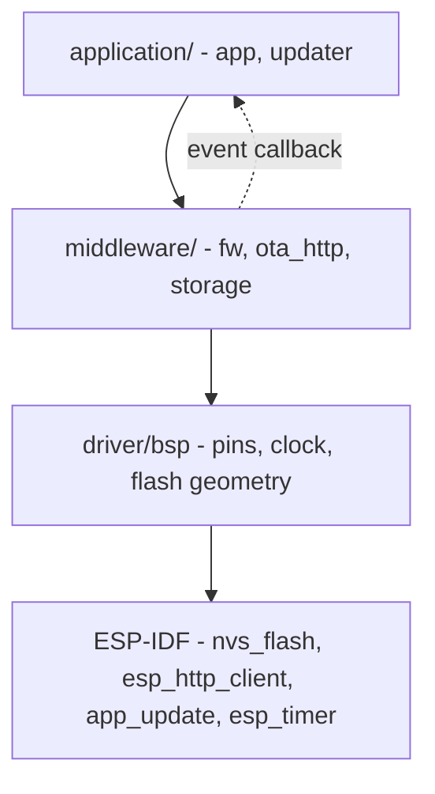
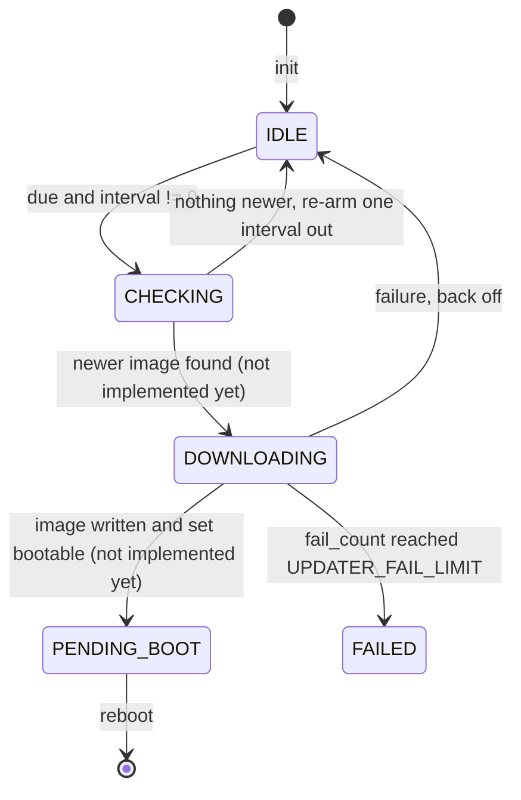

# Project Memory - Full Read

> Auto-generated by `memory_docs.py digest`. Do NOT edit by hand - edit the
> source docs under docs/memory-ai/ and re-run `digest`. This file concatenates
> the whole bank into one read for session start; overview.md stays the map.
> Transient state comes first, then durable docs in reproduction order:
> architecture -> data -> interface -> behavior -> rule (then adr/).
> Confidence per doc: 🟢 confirmed | 🟡 inferred (verify) | 🔴 gap (needs a human).

_Generated 2026-09-06 - 24 durable doc(s)._

## State (transient)

### progress.md

# Progress

> Current delivery state — what works, what's left, known issues. Update at every checkpoint (feature shipped, milestone, direction change).

## What works

- The full three-layer tree exists with six modules, each with one public
  header, one source file, and a component registration.
- **Verified by execution:** the update-cycle state machine and the status-code
  lookup compile clean on host GCC under the house warning set with `-Werror`,
  and every behavioural assertion passes — including the 2^32 ms clock wrap, the
  scheduling horizon rejection, and the repeatable stop/deinit contract.
- **Verified mechanically:** `clang-format` clean across all 24 sources; each
  symbol prefix declared in exactly one module directory; no upward include
  across a layer; no pin literal outside `driver/bsp/`; no source of ours under
  `workspace/`.
- `docs/scripts/tool-esp.py` resolves the repo root and the workspace correctly
  and refuses to run without `IDF_PATH`.
- The repo is published: 8 commits on `main`, `developing` and `release/v0.1`,
  with branch protection on the first two **verified by an actual rejected
  push**, not just by the API response.
- A host test harness that actually runs: 13 Unity tests, green, built under the
  firmware's own `-Werror` warning set. **Proven to have teeth** — breaking the
  wrap-safe due check makes exactly one test go red, and restoring it makes the
  suite green again.
- Static analysis at a clean baseline, verified by running it locally **and in
  the CI container**: `cppcheck` 0 findings, `clang-tidy` 0 findings, no secrets
  in the tree. One real finding (a parameter that could be `const`) was found
  and fixed, not suppressed.
- **The firmware compiles.** `idf.py build` completes in `espressif/idf:v6.1`:
  1090 targets, `app_updater.bin` 198 KB against a 1.875 MB slot, 90% free.

## What's left

1. **A self-test in `confirm_or_roll_back()`** — the highest-value hole. Until
   it exists, a broken image confirms itself and rollback never fires.
2. `updater` `CHECKING` step: fetch the manifest, compare versions, decide.
3. `updater` `DOWNLOADING` step: drive the fetch into the OTA write API, set the
   boot partition.
4. Network bring-up (Wi-Fi or Ethernet) — not in this repo at all.
5. Real board values in the BSP table, from the 0xF001 schematic.
6. An **on-target** smoke test. The host suite runs; nothing exercises a board.
7. Record migration in `storage`, before any field release.
8. Enable `gcc -fanalyzer` — deferred on purpose, not forgotten. The trigger is
   the first code that does buffer arithmetic, parsing, or allocation; see
   [rule/static-analysis.md](rule/static-analysis.md) for the exact list and the
   two-line change it takes.

## Known issues

- ⚠ The firmware has been **built** but never **flashed**. The partition table
  is accepted by the build and the image fits with 90% of its slot free; whether
  the layout boots on real hardware is still unknown.
- 🔴 `spec-verify` has never been run against this repo. It will at minimum flag
  the deviations in
  [rule/known-deviations.md](rule/known-deviations.md).
- ⚠ A test function that is not listed in `test/host/runner.c` compiles, links
  and never runs, with nothing going red to say so. The two lists must be kept
  in step by hand.
- 🔴 **`release.yml` has never executed.** No tag has been pushed, so the
  version gate, the artifact collection and `gh release create` are written
  against documented behaviour, not observed behaviour. `ci.yml` has run.
- ⚠ The first build may fail on `-Wconversion`/`-Werror` in SDK macros expanded
  inside our translation units. That is the rule working; fix at the call site,
  never by silencing the warning.

### active-context.md

# Active Context

> What is being worked on right now. Read first every session; rewrite when the focus shifts. Transient — not a durable fact.

## Current focus

CI runs and the firmware compiles. What is left untested is everything that
needs the two things a CI runner does not have: **a board** and **a tag**.
Nothing boots yet, and `release.yml` has never executed.

## Recent changes

- 2026-09-06 — First real CI run (34031391115): 4/6 green. Two genuine failures
  found and fixed — `-Wundef` cannot coexist with ESP-IDF's log headers, and
  `pip` is not on PATH in the IDF container until `export.sh` is sourced. Both
  fixes reproduced and verified in the same image locally before re-pushing.
- 2026-09-06 — Firmware built for the first time: 1090 targets,
  `app_updater.bin` 198 KB, 90% of its slot free.

- 2026-09-06 — CI grown to the six jobs R-SAN asks for: format, cppcheck +
  clang-tidy, host tests, ASan/UBSan, firmware build, gitleaks. Tool versions
  pinned. Baseline verified clean by running each locally.
- 2026-09-06 — Host test harness added under `test/host/`; `tool-esp.py` gained
  `test` and `analyse`. The wrap test was found to pass against a broken
  implementation and was rewritten until a mutation made it fail.
- 2026-09-06 — Partition labels renamed to `app_updater` / `app_firmware`: the
  two app slots now hold two different programs, which costs the updater its own
  rollback slot.
- 2026-09-06 — README rewritten with badges in the R-RPO-08 section order.
- 2026-09-06 — `docs/CHANGELOG/` removed again: nothing is released, so every
  entry is back under `[Unreleased]`.

- 2026-09-06 — Changelog split: the root `CHANGELOG.md` now holds only
  `[Unreleased]` plus a released-version index; `docs/CHANGELOG/v0.1.0.md` holds
  the first entry. Recorded as a deviation from R-VER-13.
- 2026-09-06 — Branch protection enabled on GitHub: `main` requires a pull
  request (0 approvals) and blocks force-push and deletion; `developing` blocks
  force-push and deletion. No bypass actors, so the owner is bound too.
  Default branch moved from `developing` to `main`.
- 2026-09-06 — First 8 commits pushed; branches `main`, `developing` and
  `release/v0.1` all published and tracking.
- 2026-09-06 — Memory bank generated: 20 durable docs across the five
  categories, from the source as written.
- 2026-09-06 — `scripts/fw.py` moved to `docs/scripts/` and renamed
  `tool-esp.py`; every reference updated.
- 2026-09-06 — Repository scaffolded from scratch against the house embedded-C
  standard: six modules, the 0xF001 build entry, format config, git hook,
  README and changelog.

## Next steps

1. Flash a real 0xF001 board. That is the only thing that can confirm
   [data/flash-and-partitions.md](data/flash-and-partitions.md), which is still
   arithmetic rather than observation.
2. Fill the BSP board table from the real schematic first — the current GPIO is
   a placeholder and may be wired to something else.
3. Run `spec-verify` and resolve or record what it finds.
4. Then the self-test in `confirm_or_roll_back()`, the hole that matters most.
5. `release.yml` stays unproven until a tag is pushed; consider a throwaway
   pre-release tag on a branch to exercise it before it matters.

## Active decisions

- The project-wide status type is `fw_err_t` in `middleware/fw/`, **not**
  `updater_err_t` — that name would collide with the `updater` module prefix.
- Developer scripts live in `docs/scripts/`, a deliberate departure from the
  house standard's repo-root `scripts/`. Recorded in
  [rule/known-deviations.md](rule/known-deviations.md).
- ESP-IDF has no `main` component here; `application/app/` provides `app_main()`
  so that `workspace/` holds no source of ours.
- The changelog is split per version under `docs/CHANGELOG/`; the root file
  keeps `[Unreleased]` and the index only.
- `main` is push-protected with no bypass actor. Every change into it goes
  through a pull request from `developing`, self-merged (0 approvals required).
- No git tag exists. `v0.1.0` is a changelog file and a `VERSION` string, not a
  release.


## Memory

### [architecture] Repository Layout
*`architecture/repo-layout.md` - The three-layer source tree, the shape of one module, and where build entries, scripts and hooks live. - status: active - source: application/, middleware/, driver/, workspace/0xF001/, test/host/, .github/workflows/, docs/, README.md - keywords: application, middleware, driver, bsp, workspace, 0xF001, include, src, module directory*

# Repository Layout

> Three top-level source directories name the three layers, one directory per module inside them, and a `workspace/<product-id>/` that composes them into an image without holding any source of its own.

## Responsibility

`app-updater` is firmware for an ESP32-S3 product whose job is to keep itself up
to date in the field: check a manifest on a schedule, write a new image into the
spare OTA slot, then confirm or roll back on the next boot.

The top level names the layer, so an upward dependency is visible in a path
before anyone opens a header.

## Layout

| Path | Holds |
|------|-------|
| `application/app/` | Entry point. Brings every module up, owns the main loop. |
| `application/updater/` | The update cycle: when to check, when to retry, when to give up. |
| `middleware/fw/` | The project-wide status code every app and middleware call returns. |
| `middleware/ota_http/` | Fetches an image over HTTPS and hands it out chunk by chunk. |
| `middleware/storage/` | The persisted settings/boot record in NVS. |
| `driver/bsp/` | Pin map, clock, flash geometry. The only place a pin number appears. |
| `workspace/0xF001/` | Build entry for product 0xF001: CMakeLists, sdkconfig.defaults, partitions.csv. |
| `test/host/` | Unity runner, the host fake for `esp_log.h`, and the CMake that builds them. |
| `.github/workflows/` | CI on every push, release on every `v*` tag. |
| `docs/scripts/` | Developer commands (Python 3). |
| `docs/.githooks/` | Git hooks (Python 3). |
| `docs/memory-ai/` | This memory bank. |

There is no `third_party/` yet: nothing needed to go in it. `test/` exists but
holds only the **host harness** — the tests themselves stay beside their modules
(R-RPO-07), and no on-target test exists yet.

## Module shape

Every directory under the three layer directories has the same inside:

| File | Role |
|------|------|
| `include/<mod>.h` | The single public header. The only file an outsider includes. |
| `src/<mod>.c` | Implementation. |
| `src/<mod>_priv.h` | Internal declarations. Present only where something is actually shared; currently only `application/app/`. |
| `test/test_<mod>.c` | Host tests, present for `fw` and `updater`. Each function must also be listed in `test/host/runner.c` or it never runs. |
| `CMakeLists.txt` | ESP-IDF component registration. |

The directory name, the public header name, and the symbol prefix are the same
word, so one grep for the prefix finds the folder, the file and every symbol in
it. Verified: each of `app`, `updater`, `fw`, `ota_http`, `storage`, `bsp` is
declared in exactly one module directory.

## Dependencies & build

Toolchain is ESP-IDF 6.x targeting ESP32-S3, C11. The build entry is
`workspace/0xF001/`; it reaches the layer directories through
`EXTRA_COMPONENT_DIRS` rather than copying or symlinking, so one
`driver/bsp/` compiles into every product that lists it. See
[build-and-toolchain.md](build-and-toolchain.md).

## Reproduction notes

- A module lives in exactly one layer directory. A module that looks like it
  belongs to two is two modules: the part that knows the device goes down, the
  part that knows why it is used stays up.
- **No source of ours ever lives under `workspace/`.** That is why
  `application/app/` provides `app_main()` and ESP-IDF has no `main` component
  here — see [build-and-toolchain.md](build-and-toolchain.md).
- Pin numbers and peripheral instances live only in `driver/bsp/`. Verified: no
  pin literal appears under `application/` or `middleware/`.
- A second product takes the next id as a sibling of `workspace/0xF001/`, never
  a `<mcu>-<role>` name and never a `#if` inside a module.

## See also

- [layering-and-dependencies.md](layering-and-dependencies.md) — which layer may call which
- [build-and-toolchain.md](build-and-toolchain.md) — how the tree is compiled
- [../rule/coding-standard-source.md](../rule/coding-standard-source.md) — where the R-XXX-nn rules come from

### [architecture] Layering and Dependencies
*`architecture/layering-and-dependencies.md` - The call direction between layers, the component dependency graph, and why there are two separate error code spaces. - status: active - source: application/app/CMakeLists.txt, application/updater/CMakeLists.txt, middleware/*/CMakeLists.txt, driver/bsp/CMakeLists.txt - keywords: REQUIRES, PRIV_REQUIRES, layering, dependency direction, callback, fw_err_t, bsp_err_t*

# Layering and Dependencies

> Calls go down, events come back up through a callback, and no file includes a header from a layer above it.

## Responsibility

The layer a module sits in decides what it may include. Naming the layer in the
path makes a violation visible at review, in the `#include` line, before anyone
opens a header.



## Component dependency graph

Each module is one ESP-IDF component. `REQUIRES` means the dependency appears in
the module's own public header; `PRIV_REQUIRES` means only the `.c` uses it.

| Component | REQUIRES | PRIV_REQUIRES (ours) | PRIV_REQUIRES (SDK) |
|-----------|----------|----------------------|---------------------|
| `app` | `fw` | `bsp`, `storage`, `updater` | `app_update`, `esp_app_format`, `esp_partition`, `esp_timer`, `freertos`, `nvs_flash` |
| `updater` | `fw` | `ota_http`, `storage` | `app_update`, `esp_partition` |
| `ota_http` | `fw` | — | `esp_http_client`, `esp-tls` |
| `storage` | `fw` | — | `nvs_flash`, `esp_rom` |
| `fw` | — | — | — |
| `bsp` | — | — | `esp_driver_gpio`, `esp_hw_support` |

`fw` is a leaf: it depends on nothing, which is what lets both layers above it
include it.

## Two error code spaces, and where they meet

| Space | Type | Used by | Why |
|-------|------|---------|-----|
| Project-wide | `fw_err_t` | `application/`, `middleware/` | One code space means the application handles a timeout the same way whichever module produced it. |
| Driver-local | `bsp_err_t` | `driver/bsp/` | The driver layer must not include a middleware header, so it cannot use `fw_err_t`. |

Both share the same meanings for the generic range `-1 .. -19`, so the map
between them is one-for-one. It is applied in exactly one place, inside
`bring_up_bsp()` in `application/app/src/app.c`. If `bsp` ever grows a code the
application must distinguish, that function is the only edit.

Vendor status codes (`esp_err_t`) never escape the module that called the SDK:
each of `bsp`, `storage` and `ota_http` has a private `from_esp_err()` helper
that logs the vendor value and returns the module's own code.

## Reproduction notes

- Verified: nothing under `driver/` includes `fw.h`, `storage.h`, `ota_http.h`,
  `updater.h` or `app.h`; nothing under `middleware/` includes `updater.h` or
  `app.h`.
- `middleware/fw` is included sideways by its middleware siblings. That is a
  one-way include of a leaf, not a cycle.
- A driver must never report upward with a direct call. `updater` receives state
  changes from nothing below it, but `ota_http` reports progress upward through
  a `void *ctx` callback supplied at init — the module does not know the name of
  what it notifies.
- `esp_err_t` must not appear in any public header above the driver layer.
  `ota_http_t` and `storage_t` therefore hold their vendor handles as `void *`
  and `uint32_t` respectively, described in their interface docs.

## See also

- [repo-layout.md](repo-layout.md) — the tree these layers occupy
- [../data/error-code-model.md](../data/error-code-model.md) — the two code spaces in detail

### [architecture] Build and Toolchain
*`architecture/build-and-toolchain.md` - How the 0xF001 image is configured and compiled, including the main-less ESP-IDF build and the warning policy. - status: active - source: workspace/0xF001/CMakeLists.txt, workspace/0xF001/sdkconfig.defaults, VERSION, .clang-format - keywords: EXTRA_COMPONENT_DIRS, COMPONENTS, house_warnings, PROJECT_VER, sdkconfig.defaults, idf.py, Werror, esp32s3*

# Build and Toolchain

> One CMake entry in `workspace/0xF001/` pulls the three layer directories in, applies the house warning set to our targets only, and takes the version from the repo's single `VERSION` file.

🟢 **Verified by building it.** `idf.py build` completes inside
`espressif/idf:v6.1` — 1090 targets, `app_updater.bin` at 0x30380 bytes (198 KB)
against a 0x1E0000 slot, 90% free. The main-less shape, the component names in
`PRIV_REQUIRES`, `EXTRA_COMPONENT_DIRS` and the partition table are therefore
observed facts, not documented intentions.

## Toolchain

| Setting | Value |
|---------|-------|
| Target | ESP32-S3 |
| SDK | ESP-IDF **v6.1** (CI pins `espressif/idf:v6.1`) |
| Language | C11 (`-std=gnu11`) |
| Build system | CMake, ESP-IDF component model |
| Formatter | `clang-format`, config at repo root, requires v15+ |

## What the project CMakeLists does

In order, in `workspace/0xF001/CMakeLists.txt`:

1. Defines a CMake function `house_warnings(<target>)` **before** the IDF build
   runs, so every component of ours can call it on its own library target.
2. Sets `EXTRA_COMPONENT_DIRS` to the three layer directories, reached with
   relative paths up out of the workspace.
3. Reads the repo-root `VERSION` file and strips it into `PROJECT_VER`, before
   `project()` is called.
4. Includes the IDF project script and declares the project as `app_updater`.

A commented-out `set(COMPONENTS app)` line is the trim knob: leaving it off
builds every component found, which is slower but cannot fail on a missing
implicit dependency.

## The main-less build

ESP-IDF normally auto-adds a `main` component and makes every other component
its dependency. This repo has no `main`, because the house standard forbids any
source of ours under `workspace/`. `application/app/` provides `app_main()`
instead.

Consequences a rebuild must honour:

- `application/app/` must be reachable through `EXTRA_COMPONENT_DIRS`.
- Its dependencies are **not** inferred: every one is listed explicitly in its
  `idf_component_register` call.
- `MINIMAL_BUILD` cannot be used — that build property relies on a `main`
  component existing.

## Warning policy

`house_warnings()` applies, **per target and never globally**, so a vendor
warning we cannot fix cannot stop our build:

`-Wall -Wextra -Werror` plus `-Wshadow -Wconversion -Wsign-conversion
-Wdouble-promotion -Wswitch-enum -Wpointer-arith -Wcast-align
-Wmissing-prototypes -Wstrict-prototypes -Wold-style-definition`.

**`-Wundef` is missing from the target list on purpose**, and it is the one
place the house warning set cannot be applied whole. It is a *preprocessor*
warning: it fires where a header is included, not where the header lives, so a
per-target flag cannot keep it off the vendor SDK the way R-BLD-01 requires.
ESP-IDF's own `esp_log_config.h`, `esp_log_color.h` and `esp_log_timestamp.h`
test `BOOTLOADER_BUILD`, `CONFIG_LOG_COLORS_SUPPORT` and others without
defining them, so **every** file of ours that includes `esp_log.h` failed the
build. Observed in CI run 34031391115, then reproduced locally.

The check keeps its teeth where it can work: `test/host` still applies
`-Wundef`, and no SDK header is in scope there.

Two consequences visible in the source:

- `-Wswitch-enum` with no `default` label is what forces every `..._err_str()`
  and `updater_state_str()` to name a newly added enum value or fail the build.
- `-Wmissing-prototypes` is why `app_main()` is declared in
  `application/app/src/app_priv.h`: ESP-IDF publishes no prototype for it.

🟢 Verified independently: `middleware/fw/src/fw.c` and
`application/updater/src/updater.c` compile clean under this exact warning set
with `-Werror` on host GCC, through the `test/host/` harness, which applies the
same list on purpose — a host test must not be able to pass on code the target
build would reject. See [../rule/testing.md](../rule/testing.md).

## Configuration knobs

Every build knob is versioned in `workspace/0xF001/sdkconfig.defaults`, never in
a developer's environment:

| Knob | Value | Why |
|------|-------|-----|
| `CONFIG_IDF_TARGET` | `esp32s3` | The product's chip. |
| `CONFIG_ESPTOOLPY_FLASHSIZE_4MB` | on | Must change together with `partitions.csv`. |
| `CONFIG_PARTITION_TABLE_CUSTOM` + `..._FILENAME` | `partitions.csv` | Two OTA slots, no factory. |
| `CONFIG_BOOTLOADER_APP_ROLLBACK_ENABLE` | on | A new image gets one boot to confirm itself. |
| `CONFIG_COMPILER_OPTIMIZATION_SIZE` | on | Two app slots must fit in 4 MB. |
| `CONFIG_COMPILER_OPTIMIZATION_ASSERTIONS_ENABLE` | on | Asserts stay on in Release. |
| `CONFIG_LOG_MAXIMUM_LEVEL_DEBUG` / `CONFIG_LOG_DEFAULT_LEVEL_INFO` | — | Level is a compile-time filter. |

## Version single source

The repo-root `VERSION` file holds `MAJOR.MINOR.PATCH` and nothing else. CMake
reads it into `PROJECT_VER`, which lands in the image header, so
`esp_app_get_description()->version` reports that file and cannot drift from it.
Nothing else in the repo restates the number except the README badge line and
the changelog headings. See
[../rule/versioning-and-release.md](../rule/versioning-and-release.md).

## Reproduction notes

- The three CMake lines must stay in order: `cmake_minimum_required`, then the
  `set()` calls and function definition, then the IDF include, then `project()`.
- `PROJECT_VER` must be assigned **before** `project()` or the image header
  keeps the default.
- `house_warnings()` must be defined before the IDF include so it is in scope in
  every component subdirectory.

## See also

- [ci-pipeline.md](ci-pipeline.md) — where this build runs unattended
- [repo-layout.md](repo-layout.md) — the tree this build compiles
- [../data/flash-and-partitions.md](../data/flash-and-partitions.md) — the partition table this config selects
- [../interface/tool-esp-cli.md](../interface/tool-esp-cli.md) — the wrapper that runs this build

### [architecture] CI and Release Pipeline
*`architecture/ci-pipeline.md` - What GitHub Actions runs on a push and on a tag, in which container, and which gates can stop a release. - status: inferred - source: .github/workflows/ci.yml, .github/workflows/release.yml - keywords: GitHub Actions, ci.yml, release.yml, espressif/idf:v6.1, ctest, clang-format, clang-tidy, cppcheck, gitleaks, ASan, UBSan, gh release create, SHA256SUMS*

# CI and Release Pipeline

> Three checks on every push, and a tag that cannot publish unless it agrees with `VERSION` and has a changelog entry waiting for it.

🟢 **`ci.yml` has run.** First run (34031391115) went 4/6: `clang-format`, both
host-test jobs and the secret scan passed on the first try; `firmware` and
`analyse` failed, and both failures were real rather than cosmetic — see below.
`release.yml` has **still never executed**, because no tag has been pushed.

Two things the first run taught, both now fixed:

| Failure | Cause | Fix |
|---------|-------|-----|
| `firmware` | `-Wundef` fires inside ESP-IDF's own log headers when they are included from our files; a per-target flag cannot prevent it | Dropped `-Wundef` from the target warning set, kept it on the host build |
| `analyse` | `pip: not found` — the IDF image keeps python in a virtualenv that is only on `PATH` after `export.sh`, and the default container shell is `sh` | `shell: bash` plus `. $IDF_PATH/export.sh` before `python -m pip` |

Both fixes were then verified by running the same commands in the same image
locally before pushing again.

## CI — `.github/workflows/ci.yml`

Triggers on push to `main`, `developing`, `release/**`, and on pull requests
into `main` or `developing`. Concurrent runs of the same ref cancel each other.

| Job | Runs in | Does | Fails when |
|-----|---------|------|-----------|
| `format` | `ubuntu-latest` | `tool-esp.py format --check` | A source file is not `clang-format` clean |
| `analyse` | `espressif/idf:v6.1` | `cppcheck` + `clang-tidy` | Any finding in our code |
| `host-tests` | `espressif/idf:v6.1` | Configure `test/host`, build, `ctest` | A test fails, or our code trips the warning set |
| `sanitizers` | `espressif/idf:v6.1` | The same suite with `-DSANITIZE=ON` | ASan or UBSan trips (the build traps, it does not just report) |
| `firmware` | `espressif/idf:v6.1` | `idf.py build`, then `idf.py size` | A warning in our code, or a build error |
| `secrets` | `ubuntu-latest` | `gitleaks` over the **full history** | A credential is found anywhere in the tree |

All six run in parallel; a concurrent push to the same ref cancels the earlier
run.

**Every tool version is pinned**, named once in the workflow's `env` block:
`clang-format 22.1.5`, `clang-tidy 22.1.8`, `gitleaks 8.30.1`. An unpinned CI
rejects on Tuesday what it accepted on Monday, on code nobody touched — and a
CI that disagrees with the pre-commit hook is worse than no CI, because
developers learn to ignore it.

The host-test and sanitizer jobs need no extra install: Unity comes from the
ESP-IDF checkout already inside the image. The `analyse` job adds `cppcheck`
through apt and `clang-tidy` through pip.

`gitleaks` is installed from its pinned release tarball rather than through a
third-party action, so nothing else executes while a token is in scope.

## Release — `.github/workflows/release.yml`

Triggers on a tag matching `v*`. Two jobs, because the ESP-IDF image has the
toolchain and the plain runner has the `gh` CLI.

1. **`build`** (in `espressif/idf:v6.1`)
   - **Gate:** the tag with its `v` stripped must equal the `VERSION` file. A
     mismatch means one of the two is a typo, and shipping either is worse than
     shipping neither (R-VER-01).
   - Build, capture the size report.
   - Collect into `dist/`: the app `.bin` / `.elf` / `.map`, the bootloader, the
     partition table, the flash args, the size report, and a `SHA256SUMS` over
     all of them.
2. **`publish`** (on `ubuntu-latest`)
   - **Gate:** `docs/CHANGELOG/<tag>.md` must exist. It should already, because
     an entry is written the day the change is made (R-VER-05); if it does not,
     the release was never prepared and an unexplained binary is not a release.
   - `gh release create` with `--verify-tag`, the changelog file as the notes,
     and everything in `dist/` attached.

## Reproduction notes

- Both containers run `git config --global --add safe.directory` before
  anything else; a checkout owned by a different uid inside a container is
  otherwise refused by git.
- Every step that calls `idf.py` or `cmake` sources `$IDF_PATH/export.sh` first.
  A `container:` step does not inherit the image's entrypoint, so nothing is on
  `PATH` without it.
- The image tag is pinned to `v6.1`, not `release-v6.1`: the latter moves.
- `publish` needs `contents: write`; the token comes from `github.token`, so no
  secret is stored in the repo.

## See also

- [../rule/static-analysis.md](../rule/static-analysis.md) — what the analysers check and what is switched off
- [build-and-toolchain.md](build-and-toolchain.md) — what the build itself does
- [../rule/testing.md](../rule/testing.md) — the suite the `host-tests` job runs
- [../rule/versioning-and-release.md](../rule/versioning-and-release.md) — the procedure the tag gates enforce

### [data] Error Code Model
*`data/error-code-model.md` - The two status enums the firmware uses, their numeric ranges, and where a vendor code is converted. - status: active - source: middleware/fw/include/fw.h, driver/bsp/include/bsp.h:33-49, middleware/storage/src/storage.c:209-227, middleware/ota_http/src/ota_http.c:189-205, driver/bsp/src/bsp.c:155-167 - keywords: fw_err_t, bsp_err_t, FW_OK, BSP_OK, FW_ERR_PARAM, FW_ERR_STATE, from_esp_err, esp_err_t*

# Error Code Model

> Zero is success, every failure is negative, the range `-1 .. -19` means the same thing in every module, and a vendor status never leaves the module that produced it.

## Shape: `fw_err_t`

The project-wide status. Every fallible function in `application/` and
`middleware/` returns it; results leave through trailing out-parameters.

| Constant | Value | Meaning |
|----------|-------|---------|
| `FW_OK` | 0 | The call succeeded. |
| `FW_ERR_PARAM` | -1 | Caller passed something impossible. Caller has a bug. |
| `FW_ERR_STATE` | -2 | Legal call, wrong lifecycle moment. Caller called too early or twice. |
| `FW_ERR_TIMEOUT` | -3 | The peer or the bus did not answer in time. |
| `FW_ERR_NO_SPACE` | -4 | A buffer or an internal queue is full. |
| `FW_ERR_UNSUPPORTED` | -5 | The build or the hardware cannot do this. |
| `FW_ERR_NOT_FOUND` | -6 | The named record or partition is absent. |
| `FW_ERR_IO` | -7 | The transport or the flash itself failed. |
| `FW_ERR_CRC` | -8 | Stored or received data did not check out. |
| `FW_ERR_NO_MEM` | -9 | An allocation the call needed failed. |

## Shape: `bsp_err_t`

The driver layer cannot include a middleware header, so `driver/bsp/` carries
its own space. The generic values keep the same meanings, which is what makes
the map to `fw_err_t` one-for-one.

| Constant | Value | Meaning |
|----------|-------|---------|
| `BSP_OK` | 0 | The call succeeded. |
| `BSP_ERR_PARAM` | -1 | Same as `FW_ERR_PARAM`. |
| `BSP_ERR_STATE` | -2 | Same as `FW_ERR_STATE`. |
| `BSP_ERR_IO` | -7 | The vendor SDK refused the operation. |
| `BSP_ERR_NO_PIN` | -20 | Module-specific: this board does not wire that function. |

## Invariants

1. `0` is the only non-negative value. A truthiness test on a status is
   therefore obviously wrong rather than subtly wrong.
2. `-1 .. -19` is the shared generic range: identical meaning in every module.
   `-20 .. -99` is free for module-specific failures; `BSP_ERR_NO_PIN` is the
   only one so far.
3. **A numeric value is never reused for a second meaning.** Retire a code by
   leaving it defined and unused; codes reach field logs and support tickets.
4. Both enums must have a `..._err_str()` covering every value with no `default`
   label, so `-Wswitch-enum` fails the build when a code is added without a
   name. Each falls through to `"FW_ERR_UNKNOWN"` / `"BSP_ERR_UNKNOWN"` for a
   value cast in from outside.
5. `FW_ERR_PARAM` and `FW_ERR_STATE` must stay distinct: one says the caller has
   a bug, the other says the caller called at the wrong moment, and they lead to
   different fixes.

## Vendor conversion boundary

`esp_err_t` never escapes the module that called the SDK. Three modules each
carry a private `from_esp_err()` that logs the vendor value at the call site
then returns the module's own code:

| Module | Maps | Everything else |
|--------|------|-----------------|
| `bsp` | `ESP_ERR_INVALID_ARG`→`BSP_ERR_PARAM`, `ESP_ERR_INVALID_STATE`→`BSP_ERR_STATE` | `BSP_ERR_IO` |
| `storage` | plus `ESP_ERR_NVS_NOT_FOUND`→`FW_ERR_NOT_FOUND`, `ESP_ERR_NVS_NOT_ENOUGH_SPACE`→`FW_ERR_NO_SPACE`, `ESP_ERR_NO_MEM`→`FW_ERR_NO_MEM` | `FW_ERR_IO` |
| `ota_http` | plus `ESP_ERR_TIMEOUT`→`FW_ERR_TIMEOUT`, `ESP_ERR_NO_MEM`→`FW_ERR_NO_MEM` | `FW_ERR_IO` |

The `bsp_err_t` → `fw_err_t` map is applied in exactly one place, in
`bring_up_bsp()` in `application/app/src/app.c`.

## See also

- [../interface/fw-status-api.md](../interface/fw-status-api.md) — the `fw_err_str()` contract
- [../architecture/layering-and-dependencies.md](../architecture/layering-and-dependencies.md) — why there are two spaces

### [data] Persisted Storage Record
*`data/storage-record.md` - The single NVS blob the updater persists, its field layout, and the invariants a reader must enforce. - status: active - source: middleware/storage/include/storage.h:44-58, middleware/storage/src/storage.c:56-66, middleware/storage/src/storage.c:176-207 - keywords: storage_record_t, STORAGE_RECORD_VERSION, crc32, manifest_url, check_interval_ms, boot_fail_count, nvs blob*

# Persisted Storage Record

> One versioned, CRC-protected blob in NVS holds everything the updater must remember across a reboot; anything that fails validation falls back to compiled-in defaults.

## Shape

Stored as a single NVS blob under a namespace + key chosen at init (defaults
`updater` / `record`).

| Field | Type | Meaning | Notes |
|-------|------|---------|-------|
| `version` | uint16 | Record layout version | **Always first.** Currently `1`. |
| `length` | uint16 | Size of the record as written | Lets newer firmware read a shorter old record. |
| `manifest_url` | char[128] | HTTPS manifest URL | NUL-terminated. Default points at an `.invalid` host. |
| `last_ok_fw_version` | char[32] | Last image confirmed healthy | Empty by default. |
| `check_interval_ms` | uint32 | Milliseconds between update checks | Default 6 h. `0` disables checking. |
| `boot_fail_count` | uint32 | Unconfirmed boots since the last good one | `0` by default. |
| `crc32` | uint32 | CRC-32 over every byte above it | **Always last.** |

## Invariants

1. `version` is the first field and `crc32` the last. The CRC covers exactly the
   bytes before `crc32`, computed as the offset of that member.
2. Every field has a compiled-in default. A device with erased flash must boot
   into a usable state, so no setting is left uninitialised "because it is
   always written".
3. The CRC is validated on **every** read. A power cut mid-write and flash
   bit-rot both produce a record that parses fine and means nothing.
4. `manifest_url` must be NUL-terminated within its buffer; the validator
   rejects a record whose last byte is not `\0`, because a stored string is
   untrusted input.
5. A record whose stored `length` differs from the compiled `sizeof` is
   rejected as damaged.
6. An unrecognised `version` falls back to defaults rather than being
   reinterpreted.

## Validation verdicts

`record_validate()` returns, in this order of checks:

| Condition | Verdict |
|-----------|---------|
| length mismatch | `FW_ERR_CRC` |
| CRC mismatch | `FW_ERR_CRC` |
| unknown `version` | `FW_ERR_NOT_FOUND` |
| `manifest_url` unterminated | `FW_ERR_CRC` |
| otherwise | `FW_OK` |

The caller treats `FW_ERR_CRC` and `FW_ERR_NOT_FOUND` the same way — use the
defaults and log it. The module never guesses on the caller's behalf.

## Formats & encoding

The blob is written and read as a raw struct, so its byte layout is whatever the
compiler produces for the target. That is acceptable because only this firmware
on this chip ever reads it. **It is not a wire format** — an OTA manifest or a
host tool must not assume this layout.

🔴 **Open hole (code, not knowledge):** there is no migration path yet. `STORAGE_RECORD_VERSION` is `1` and
`record_validate()` carries a TODO for the chained per-version migration
functions. Adding a field to this struct today invalidates every deployed
record; the deployed unit falls back to defaults, silently losing its
`manifest_url`. Resolve before the first field release.

## See also

- [../interface/storage-api.md](../interface/storage-api.md) — the contract that reads and writes it
- [../behavior/config-load-and-save.md](../behavior/config-load-and-save.md) — the load/save algorithm

### [data] Flash Layout and Partitions
*`data/flash-and-partitions.md` - The 4 MB partition table, why the two app slots hold two different applications, and the constraints a change must respect. - status: active - source: workspace/0xF001/partitions.csv, workspace/0xF001/sdkconfig.defaults - keywords: partitions.csv, app_updater, app_firmware, ota_0, ota_1, otadata, nvs, phy_init, rollback, CONFIG_ESPTOOLPY_FLASHSIZE_4MB*

# Flash Layout and Partitions

> Two app slots holding two different applications — a small updater and the product firmware — with no factory partition, because the bootloader never rolls back to one.

## Shape

Product 0xF001, 4 MB (`0x400000`) SPI flash.

| Name | Type | SubType | Offset | Size | Ends at |
|------|------|---------|--------|------|---------|
| *(partition table)* | — | — | `0x8000` | `0xC00` | `0x8C00` |
| `nvs` | data | nvs | `0x9000` | `0x6000` | `0xF000` |
| `otadata` | data | ota | `0xF000` | `0x2000` | `0x11000` |
| `phy_init` | data | phy | `0x11000` | `0x1000` | `0x12000` |
| `app_updater` | app | ota_0 | `0x20000` | `0x1E0000` | `0x200000` |
| `app_firmware` | app | ota_1 | `0x200000` | `0x1E0000` | `0x3E0000` |

Each app slot is 1.875 MB. `0x12000 .. 0x20000` (56 KB) is deliberately unused
padding, spent to put the first app slot on a 64 KB boundary. `0x3E0000 ..
0x400000` (128 KB) is free at the top.

## The two slots are two different programs

This is the single most important thing about this table, and it is not the
ESP-IDF default.

| Slot | Holds | Repo |
|------|-------|------|
| `app_updater` (ota_0) | Small recovery app: fetch an image, write it to the other slot, mark it bootable | this repo |
| `app_firmware` (ota_1) | The product itself | sibling `app-firmware` repo |

The bootloader still selects a slot through `otadata`, so a firmware that fails
to confirm itself falls back to the updater, which can fetch a replacement.

**What it costs.** In the ordinary A/B arrangement, either slot can recover the
other. Here there is exactly **one** updater image, so the updater has nothing
to roll back to: a bad updater is a bad unit, recoverable only over the wire it
may no longer be able to open. Two ways to buy that back if it ever matters —
a third app slot on a larger flash, or a `factory` partition holding a
known-good updater (which is never rolled back but is also never updated).

## Invariants

1. **No `factory` partition.** Rollback works only between `ota_x` slots.
2. App partitions must start on a 64 KB boundary. `0x20000` and `0x200000` both
   satisfy this; an arbitrary size change usually breaks it.
3. Nothing may start before `0x9000` — the table occupies `0x8000` for `0xC00`
   bytes and takes a full 4 KB sector.
4. `otadata` must be exactly `0x2000` (two sectors): the bootloader alternates
   between them so a power cut never destroys the only good copy.
5. The two app slots must be the **same size** while either can be written into
   the other's place. If the updater is ever shrunk to buy the firmware room,
   that symmetry — and the fallback with it — is gone.
6. A partition label is at most 16 characters. `app_updater` (11) and
   `app_firmware` (12) both fit.
7. Changing any size means changing `CONFIG_ESPTOOLPY_FLASHSIZE_*` in
   `sdkconfig.defaults` **in the same commit**, and an OTA image built against
   the old table will not fit the new one — that is a MAJOR version bump.

**Caveat:** these offsets are read straight from the CSV and arithmetic-checked
(no overlap, both app slots 64 KB aligned, total `0x3E0000` inside 4 MB), but
have **never been flashed to a device**.

## See also

- [../architecture/build-and-toolchain.md](../architecture/build-and-toolchain.md) — the config that selects this table
- [../behavior/boot-and-bring-up.md](../behavior/boot-and-bring-up.md) — how the running slot confirms itself

### [interface] Project Status API (fw)
*`interface/fw-status-api.md` - The contract of the project-wide status type and its name lookup. - status: active - source: middleware/fw/include/fw.h, middleware/fw/src/fw.c:25-56 - keywords: fw.h, fw_err_t, fw_err_str, FW_OK, FW_VERSION_MAJOR*

# Project Status API (fw)

> One enum and one lookup function; no state, no lifecycle, nothing to claim or release.

## Contract

| Name | Signature (text) | Does | Returns / errors |
|------|------------------|------|------------------|
| `fw_err_str` | `const char *fw_err_str(fw_err_t err)` | Maps a status to its constant name | A string literal with static lifetime. Never NULL, never freed by the caller. An unrecognised value yields `"FW_ERR_UNKNOWN"`. |

The header also exports `FW_VERSION_MAJOR` / `_MINOR` / `_PATCH`.

## Parameters & config

None. This module takes no configuration and holds no instance.

## Contract rules

- `fw_err_str()` is reentrant and callable from any task. It must not be called
  from an ISR, because its only purpose is to feed a log line and logging from
  an ISR is forbidden.
- The returned pointer is a literal in flash; the caller must not free, modify,
  or assume it is unique per call.
- This module has **no** `init` / `deinit`. The five lifecycle verbs apply to
  modules that claim something; this one claims nothing.

## Reproduction note

A rebuild must keep the switch in `fw_err_str()` free of a `default` label, so
the compiler's `-Wswitch-enum` fails the build when a code is added without a
name. The unknown-value fallback lives **after** the switch, not inside it.

## See also

- [../data/error-code-model.md](../data/error-code-model.md) — the values and their meanings

### [interface] BSP API
*`interface/bsp-api.md` - The board contract - resolve the board description, claim its pins, drive the status LED. - status: active - source: driver/bsp/include/bsp.h, driver/bsp/src/bsp.c:51-153 - keywords: bsp.h, bsp_init, bsp_deinit, bsp_board_get, bsp_led_status_set, bsp_err_str, bsp_board_t, bsp_cfg_t, BSP_GPIO_NONE*

# BSP API

> The only module allowed to know a pin number; everything above it takes the board description by pointer.

## Contract

| Name | Signature (text) | Does | Returns / errors |
|------|------------------|------|------------------|
| `bsp_err_str` | `const char *bsp_err_str(bsp_err_t err)` | Names a BSP status | Static literal, never NULL |
| `bsp_init` | `bsp_err_t bsp_init(bsp_t *dev, const bsp_cfg_t *cfg)` | Resolves the board row, zeroes the instance, configures the LED pin as output | `BSP_OK`; `BSP_ERR_PARAM` on NULL or unknown revision; `BSP_ERR_STATE` if already initialised; `BSP_ERR_IO` if the SDK refused the pin |
| `bsp_deinit` | `bsp_err_t bsp_deinit(bsp_t *dev)` | Resets any pin `init` claimed and forgets the board | `BSP_OK`; `BSP_ERR_PARAM` on NULL |
| `bsp_board_get` | `bsp_err_t bsp_board_get(const bsp_t *dev, const bsp_board_t **out_board)` | Hands out the resolved description | `BSP_OK`; `BSP_ERR_PARAM` on NULL; `BSP_ERR_STATE` before init |
| `bsp_led_status_set` | `bsp_err_t bsp_led_status_set(bsp_t *dev, bool is_on)` | Drives the status LED at the board's polarity | `BSP_OK`; `BSP_ERR_PARAM`/`BSP_ERR_STATE`; `BSP_ERR_NO_PIN` when the board has no LED |

## Data it exposes

`bsp_board_t` — everything about the board that is not a register:

| Field | Type | Meaning |
|-------|------|---------|
| `led_status_gpio` | int32 | Update-in-progress LED, or `BSP_GPIO_NONE` (-1) when absent |
| `led_active_high` | bool | True when driving the pin high lights the LED |
| `flash_size_bytes` | uint32 | Total SPI flash on the board |

`bsp_cfg_t` carries one field, `board_rev` (uint8), which indexes a compiled-in
board table. `0` is the only row that exists today.

## Contract rules

- The pointer from `bsp_board_get()` points **into** the caller's `bsp_t`. It
  stays valid until `bsp_deinit()` and must not be freed or outlive the
  instance.
- `bsp_led_status_set()` may be called from any task but not from an ISR.
- `BSP_ERR_NO_PIN` is an expected outcome on a board without an LED, not a
  failure. Callers treat it as success — `on_updater_state()` in the app does.
- Everything else follows the shared lifecycle rules below.

## Contract rules

- The instance pointer is always the first argument, the config struct always
  the second, both `const` where possible.
- Configuration arrives as one `const <mod>_cfg_t *`, never a long argument
  list, so a field can be added without breaking a caller.
- The status is the return value; results leave through trailing
  out-parameters.
- `deinit` (and `stop`, where present) is safe to call twice and safe on a
  partly initialised instance — cleanup runs on the error path, where the
  instance is by definition half-built.
- An operation called in the wrong lifecycle state returns `FW_ERR_STATE`, never
  undefined behaviour. The instance carries its own state flag and operations
  check it first.
- Arguments are validated at the top of every public function, before any state
  changes. Private helpers assume that check already happened.

🔴 **Unverified against hardware:** the board table values (`GPIO2`, active-high, 4 MB) are placeholders
carrying a TODO, never checked against a 0xF001 schematic. They are the single
point to fix before any bring-up.

## See also

- [../data/error-code-model.md](../data/error-code-model.md) — `bsp_err_t` and its map to `fw_err_t`

### [interface] Storage API
*`interface/storage-api.md` - The contract for loading and saving the persisted updater record in NVS. - status: active - source: middleware/storage/include/storage.h, middleware/storage/src/storage.c:48-174 - keywords: storage.h, storage_init, storage_deinit, storage_record_load, storage_record_save, storage_cfg_default, storage_record_default, storage_t, storage_cfg_t*

# Storage API

> Open a namespace, read a validated record or learn it is unusable, write one only when it actually changed.

## Contract

| Name | Signature (text) | Does | Returns / errors |
|------|------------------|------|------------------|
| `storage_cfg_default` | `storage_cfg_t storage_cfg_default(void)` | Namespace `updater`, key `record` | By value; every field set |
| `storage_record_default` | `storage_record_t storage_record_default(void)` | The compiled-in defaults, CRC already correct | By value |
| `storage_init` | `fw_err_t storage_init(storage_t *st, const storage_cfg_t *cfg)` | Opens the NVS namespace read-write | `FW_OK`; `FW_ERR_PARAM` on NULL; `FW_ERR_STATE` if already open; `FW_ERR_IO` if NVS refused |
| `storage_deinit` | `fw_err_t storage_deinit(storage_t *st)` | Closes the handle | `FW_OK`; `FW_ERR_PARAM` on NULL |
| `storage_record_load` | `fw_err_t storage_record_load(storage_t *st, storage_record_t *out_rec)` | Reads and validates | `FW_OK`; `FW_ERR_NOT_FOUND` if never written or version unknown; `FW_ERR_CRC` if damaged; `FW_ERR_IO`; `FW_ERR_PARAM`/`FW_ERR_STATE` |
| `storage_record_save` | `fw_err_t storage_record_save(storage_t *st, const storage_record_t *rec)` | Stamps version/length/CRC, then writes if changed | `FW_OK`; `FW_ERR_IO`; `FW_ERR_PARAM`/`FW_ERR_STATE` |

## Parameters & config

`storage_cfg_t` holds two `const char *` — `nvs_namespace` and `nvs_key`. They
are **borrowed, not copied**: the strings must outlive the instance. `storage_t`
keeps the key pointer so both load and save address the configured key, not a
compiled-in one.

`storage_t` also holds the vendor NVS handle as a `uint32_t`, so no SDK type
appears in this middleware header.

## Contract rules

- `nvs_flash_init()` must succeed **before** `storage_init()`. This module does
  not initialise the NVS subsystem; the application does.
- `storage_record_save()` overwrites the caller's `version`, `length` and
  `crc32` — a caller must not try to set them.
- `storage_record_save()` blocks on flash and is not callable from an ISR. One
  caller only.
- On `FW_ERR_CRC` or `FW_ERR_NOT_FOUND` the caller is expected to fall back to
  `storage_record_default()`. The module never substitutes defaults itself.

## Contract rules

- The instance pointer is always the first argument, the config struct always
  the second, both `const` where possible.
- Configuration arrives as one `const <mod>_cfg_t *`, never a long argument
  list, so a field can be added without breaking a caller.
- The status is the return value; results leave through trailing
  out-parameters.
- `deinit` (and `stop`, where present) is safe to call twice and safe on a
  partly initialised instance — cleanup runs on the error path, where the
  instance is by definition half-built.
- An operation called in the wrong lifecycle state returns `FW_ERR_STATE`, never
  undefined behaviour. The instance carries its own state flag and operations
  check it first.
- Arguments are validated at the top of every public function, before any state
  changes. Private helpers assume that check already happened.

## See also

- [../data/storage-record.md](../data/storage-record.md) — the record shape and its invariants
- [../behavior/config-load-and-save.md](../behavior/config-load-and-save.md) — the algorithm behind these calls

### [interface] OTA HTTP API
*`interface/ota-http-api.md` - The contract for downloading a firmware image over HTTPS and receiving it chunk by chunk. - status: active - source: middleware/ota_http/include/ota_http.h, middleware/ota_http/src/ota_http.c:42-155 - keywords: ota_http.h, ota_http_init, ota_http_deinit, ota_http_fetch, ota_http_progress_get, ota_http_cfg_default, ota_http_chunk_cb_t, OTA_HTTP_CHUNK_BYTES*

# OTA HTTP API

> The module owns the transport and nothing else: it never writes flash, it hands each chunk to a callback the caller supplied.

## Contract

| Name | Signature (text) | Does | Returns / errors |
|------|------------------|------|------------------|
| `ota_http_cfg_default` | `ota_http_cfg_t ota_http_cfg_default(void)` | Defaults with a 10 s timeout; `url`, `on_chunk`, `chunk_ctx` left NULL | By value |
| `ota_http_init` | `fw_err_t ota_http_init(ota_http_t *cli, const ota_http_cfg_t *cfg)` | Builds the HTTPS client. No traffic. | `FW_OK`; `FW_ERR_PARAM` on NULL url/callback or a zero timeout; `FW_ERR_STATE` if already initialised; `FW_ERR_NO_MEM` |
| `ota_http_deinit` | `fw_err_t ota_http_deinit(ota_http_t *cli)` | Cleans up the client | `FW_OK`; `FW_ERR_PARAM` on NULL |
| `ota_http_fetch` | `fw_err_t ota_http_fetch(ota_http_t *cli)` | Downloads the whole body, calling `on_chunk` in order | `FW_OK`; `FW_ERR_STATE` before init or while a fetch runs; `FW_ERR_TIMEOUT` on a truncated body; `FW_ERR_IO` on transport or non-200 status; or whatever `on_chunk` returned |
| `ota_http_progress_get` | `fw_err_t ota_http_progress_get(const ota_http_t *cli, uint32_t *out_bytes)` | Bytes delivered to the callback so far | `FW_OK`; `FW_ERR_PARAM`/`FW_ERR_STATE` |

## The chunk callback

`typedef fw_err_t (*ota_http_chunk_cb_t)(void *ctx, const uint8_t *data, size_t len)`

| Aspect | Contract |
|--------|----------|
| `ctx` | The `chunk_ctx` supplied at init, passed back unchanged |
| `data` | Valid **only** for the duration of the call — copy or consume before returning |
| `len` | 1 .. `OTA_HTTP_CHUNK_BYTES` (1024) |
| return | `FW_OK` continues; any failure aborts the fetch and is returned unchanged by `ota_http_fetch()` |
| context | Runs in the task that called `ota_http_fetch()`, never in an ISR. It may block, and blocking stalls the download. |

## Parameters & config

| Field | Type | Meaning |
|-------|------|---------|
| `url` | `const char *` | HTTPS image URL. Borrowed, must outlive the instance. |
| `cert_pem` | `const char *` | Server root cert, PEM. NULL uses whatever the build has compiled in. |
| `on_chunk` / `chunk_ctx` | callback + `void *` | Required; init rejects a NULL callback |
| `timeout_ms` | uint32 | Per-read budget. **`0` is rejected** — it would mean non-blocking, which this transport cannot honour. |

`ota_http_t` holds the vendor client handle as `void *`, so no SDK type appears
in this middleware header.

## Contract rules

- `ota_http_fetch()` blocks the calling task for the whole download. One caller
  only; not callable from an ISR.
- A second `fetch` on a running instance returns `FW_ERR_STATE` rather than
  interleaving.
- `ota_http_deinit()` is not safe while a fetch is in flight — call it from the
  fetching task.
- `ota_http_progress_get()` may be read from another task; the value may be
  stale on return, which is what a progress bar wants.
- The body is read into a 1 KB stack buffer inside the fetching task, so that
  task needs the headroom on top of the TLS stack.

## Contract rules

- The instance pointer is always the first argument, the config struct always
  the second, both `const` where possible.
- Configuration arrives as one `const <mod>_cfg_t *`, never a long argument
  list, so a field can be added without breaking a caller.
- The status is the return value; results leave through trailing
  out-parameters.
- `deinit` (and `stop`, where present) is safe to call twice and safe on a
  partly initialised instance — cleanup runs on the error path, where the
  instance is by definition half-built.
- An operation called in the wrong lifecycle state returns `FW_ERR_STATE`, never
  undefined behaviour. The instance carries its own state flag and operations
  check it first.
- Arguments are validated at the top of every public function, before any state
  changes. Private helpers assume that check already happened.

## See also

- [../behavior/ota-download-flow.md](../behavior/ota-download-flow.md) — the fetch algorithm

### [interface] Updater API
*`interface/updater-api.md` - The contract of the update cycle - lifecycle, the stepped state machine, and the state callback. - status: active - source: application/updater/include/updater.h, application/updater/src/updater.c:45-178 - keywords: updater.h, updater_init, updater_start, updater_stop, updater_deinit, updater_step, updater_state_get, updater_state_str, updater_cfg_default, updater_state_t, updater_state_cb_t, UPDATER_FAIL_LIMIT*

# Updater API

> Five lifecycle verbs plus a `step()` the caller drives with its own clock, which is what makes the whole cycle testable on a host.

## Contract

| Name | Signature (text) | Does | Returns / errors |
|------|------------------|------|------------------|
| `updater_state_str` | `const char *updater_state_str(updater_state_t state)` | Names a state | Static literal; `"UPDATER_STATE_UNKNOWN"` for an unrecognised value |
| `updater_cfg_default` | `updater_cfg_t updater_cfg_default(void)` | 6 h check interval, 60 s retry backoff, no callback | By value |
| `updater_init` | `fw_err_t updater_init(updater_t *up, const updater_cfg_t *cfg)` | Validates the config, state becomes IDLE. No traffic. | `FW_OK`; `FW_ERR_PARAM` on NULL **or an interval at/past 2^31 ms**; `FW_ERR_STATE` if already initialised |
| `updater_start` | `fw_err_t updater_start(updater_t *up, uint32_t now_ms)` | Arms the cycle, first check one interval out | `FW_OK`; `FW_ERR_PARAM`; `FW_ERR_STATE` before init or when already running |
| `updater_stop` | `fw_err_t updater_stop(updater_t *up)` | Disarms, returns to IDLE | `FW_OK`; `FW_ERR_PARAM` on NULL |
| `updater_deinit` | `fw_err_t updater_deinit(updater_t *up)` | Zeroes the instance | `FW_OK`; `FW_ERR_PARAM` on NULL |
| `updater_step` | `fw_err_t updater_step(updater_t *up, uint32_t now_ms)` | Advances the cycle by one step | `FW_OK`; `FW_ERR_PARAM` on NULL; `FW_ERR_STATE` before `start`; or the failure the step hit |
| `updater_state_get` | `fw_err_t updater_state_get(const updater_t *up, updater_state_t *out_state)` | Current state | `FW_OK`; `FW_ERR_PARAM`/`FW_ERR_STATE` |

## States

`UPDATER_STATE_IDLE` (0), `_CHECKING`, `_DOWNLOADING`, `_PENDING_BOOT`,
`_FAILED`. The transitions are in
[../behavior/update-cycle-fsm.md](../behavior/update-cycle-fsm.md).

## Parameters & config

| Field | Type | Range | Meaning |
|-------|------|-------|---------|
| `check_interval_ms` | uint32 | 0 .. 2^31-1 | Between checks. **`0` disables checking entirely** — a real setting, not a missing one. |
| `retry_backoff_ms` | uint32 | 0 .. 2^31-1 | Delay after a failed attempt |
| `on_state` | `void (*)(void *ctx, updater_state_t state)` | optional | Called after **every** state change |
| `on_state_ctx` | `void *` | — | Passed back unchanged |

The 2^31 ms (~24.8 day) ceiling is a real contract, not a formality: the due
check compares a wrapped difference against half the `uint32` range, so a longer
interval would read as already due on the first step. `updater_init()` rejects
it rather than silently checking every loop.

## Contract rules

- `now_ms` is supplied by the caller, must be monotonic, and must never go
  backwards. Wrap-around at 2^32 is handled and tested.
- `on_state` runs in the task that called `updater_step()`, never in an ISR, and
  **must not call back into the updater**.
- `updater_stop()` does not abort a download already in flight; it stops the
  next one starting.
- `updater_step()` blocks for as long as the work it starts. One caller only.

## Contract rules

- The instance pointer is always the first argument, the config struct always
  the second, both `const` where possible.
- Configuration arrives as one `const <mod>_cfg_t *`, never a long argument
  list, so a field can be added without breaking a caller.
- The status is the return value; results leave through trailing
  out-parameters.
- `deinit` (and `stop`, where present) is safe to call twice and safe on a
  partly initialised instance — cleanup runs on the error path, where the
  instance is by definition half-built.
- An operation called in the wrong lifecycle state returns `FW_ERR_STATE`, never
  undefined behaviour. The instance carries its own state flag and operations
  check it first.
- Arguments are validated at the top of every public function, before any state
  changes. Private helpers assume that check already happened.

## See also

- [../behavior/update-cycle-fsm.md](../behavior/update-cycle-fsm.md) — the state machine and the wrap arithmetic

### [interface] Developer CLI (tool-esp.py)
*`interface/tool-esp-cli.md` - The command surface of the repo's single developer entry point and what each command expands to. - status: active - source: docs/scripts/tool-esp.py - keywords: tool-esp.py, build, flash, monitor, size, clean, menuconfig, format, test, analyse, --port, --check, IDF_PATH, UNITY_DIR*

# Developer CLI (tool-esp.py)

> Every developer command in one place: each is `idf.py` or `clang-format` with the parts nobody remembers already filled in.

## Contract

Invoked as `python docs/scripts/tool-esp.py <command> [flags]`.

| Command | Expands to | Notes |
|---------|-----------|-------|
| `build` | `idf.py -C workspace/0xF001 build` | |
| `flash` | `idf.py -C … flash monitor` | Deliberately fused: the boot log is what says whether it worked |
| `monitor` | `idf.py -C … monitor` | |
| `size` | `idf.py -C … size size-components` | Fused so the per-component breakdown is never skipped |
| `clean` | `idf.py -C … clean` | |
| `menuconfig` | `idf.py -C … menuconfig` | |
| `format` | `clang-format -i` over our sources | With `--check`: `--dry-run --Werror` instead |
| `test` | Configure + build `test/host`, then `ctest` | No board needed; see the note below |
| `analyse` | `cppcheck` over our `.c`, `clang-tidy` over the host compile database | Needs `test/host` configured first |

| Flag | Applies to | Meaning |
|------|-----------|---------|
| `-p` / `--port` | the `idf.py` commands | Serial port, e.g. `COM7` or `/dev/ttyUSB0`. Omit and esptool picks one. |
| `--check` | `format` | Report instead of rewriting |

## Behaviour worth knowing

- **It resolves the repo root from its own file location**, then points every
  `idf.py` at `workspace/0xF001`. The repo root has no `CMakeLists.txt`, so
  `idf.py build` typed at the root finds no project — that `-C` is the reason
  this wrapper exists. A second product means changing that one constant.
- If `IDF_PATH` is unset it exits immediately with a readable message rather
  than letting the failure surface deep inside CMake.
- If `clang-format` is not on PATH, `format` exits with a message.
- The file list for `format` is `application/`, `middleware/`, `driver/` only —
  never the SDK, never `build/`. **The pre-commit hook applies the same rule**,
  so a local format and the hook can never disagree.
- `test` configures into `build/host` and **asks for the Ninja generator on the
  first configure when `ninja` is on PATH**. On Windows the CMake default is
  MSVC, which rejects the firmware's warning flags outright. CMake will not
  change the generator of an existing tree, so a stale `build/host` must be
  deleted rather than reconfigured.
- Unity is located by the harness, not by this script: from `$IDF_PATH`, or from
  a `UNITY_DIR` passed once at configure time and then cached.
- `analyse` skips a tool that is not installed and says so, but **fails** when
  the compile database is missing — a silent partial analysis would read as a
  clean one.
- Exit status is whatever the underlying tool returned.

## Contract rules

- The ESP-IDF environment must already be exported; this script does not do it.
- The script is a CLI entry point, never imported. Its filename contains a
  hyphen, so it is not importable as a Python module.
- New developer commands belong here, not in README prose: a command with flags
  nobody remembers belongs in a script with a name.

## See also

- [../rule/formatting-and-hooks.md](../rule/formatting-and-hooks.md) — the format rule and the hook
- [../architecture/build-and-toolchain.md](../architecture/build-and-toolchain.md) — what the build actually does

### [interface] Release CLI (tool-release.py)
*`interface/tool-release-cli.md` - The contract of the release script - what it refuses, what it changes, and the order it does things in. - status: active - source: docs/scripts/tool-release.py - keywords: tool-release.py, --dry-run, --summary, --yes, chore(release), release branch, annotated tag, preflight*

# Release CLI (tool-release.py)

> One command takes a `release/*` branch to a published tag, refusing at the first step that does not add up rather than half-way through.

## Contract

```text
python docs/scripts/tool-release.py <version> [--summary S] [--dry-run] [--yes]
```

| Argument | Meaning |
|----------|---------|
| `version` | The version to cut, `MAJOR.MINOR.PATCH`, with or without a leading `v` |
| `--summary` | One line for the changelog index row and the notes file. Defaults to `Release <version>.` |
| `--dry-run` | Run pre-flight, print the notes file it would write, change nothing |
| `--yes` | Skip the confirmation prompt |

Exit status is 0 on a published release, non-zero on any refusal or failure,
with the reason and a `fix:` line.

## The seven phases

| # | Phase | Gate |
|---|-------|------|
| 0 | Pre-flight | Everything below. Nothing is written until all of it passes. |
| 1 | Files | Writes `docs/CHANGELOG/v<version>.md`, empties `[Unreleased]`, adds the index row, sets `VERSION` and both README copies |
| 2 | Commit + push | `chore(release): v<version>` onto the current branch |
| 3 | Wait for CI | A red release branch is not a release |
| 4 | PR into `developing` | Created and merged |
| 5 | PR into `main` | Created and merged — `main` accepts nothing else |
| 6 | Tag + publish | Annotated tag on the release commit, pushed, then `release.yml` is watched |

## What pre-flight refuses

Each of these stops the run before a byte changes, and each names its fix:

- `git` or `gh` missing.
- A version that is not SemVer.
- A current branch that is not `release/*`.
- A dirty working tree — a release commit must carry nothing but the release.
- No upstream, or a branch ahead of or behind it.
- A tag `v<version>` that already exists, locally **or** on origin. A tag never
  moves.
- A `docs/CHANGELOG/v<version>.md` that already exists.
- An empty `[Unreleased]` — there is nothing to release.

## Contract rules

- **The route is `release/*` → `developing` → `main`, not a push to `main`.**
  `main` carries a ruleset with no bypass actor and refuses a direct push;
  R-VER-04 still wants the tag on `main`, so the commit travels by pull
  request and the tag lands once it is an ancestor.
- Pull requests are merged with `--merge`, **never squashed**. A squash would
  leave the release commit out of `main`, and there would be nothing on `main`
  to tag.
- Phase 6 verifies the release commit really is an ancestor of `origin/main`
  before tagging, and refuses with an explanation if it is not.
- The tag is annotated, never lightweight.
- Nothing after phase 2 is undone by the script. Phase 2 prints the
  `git reset --hard HEAD~1` that undoes it while the push has not happened.
- Re-running after a partial failure is safe: an existing open pull request is
  reused rather than duplicated, and the tag checks stop a second attempt at a
  version that already shipped.

## See also

- [../rule/versioning-and-release.md](../rule/versioning-and-release.md) — the procedure this automates
- [../architecture/ci-pipeline.md](../architecture/ci-pipeline.md) — the two workflows it waits on

### [behavior] Boot and Bring-Up
*`behavior/boot-and-bring-up.md` - What runs from app_main to the main loop, in what order, and what happens when a step fails. - status: active - source: application/app/src/app.c:64-174, application/app/src/app.c:195-210 - keywords: app_main, app_run, bring_up_storage, bring_up_bsp, bring_up_updater, confirm_or_roll_back, on_updater_state, now_ms, APP_TICK_MS*

# Boot and Bring-Up

> Decide the fate of the running image first, then bring every module up and check every status, and only then let the loop run.

## What it does

1. Log identity: project name, version and IDF version, read from the image
   header. A unit that cannot say what it runs cannot be debugged.
2. **Confirm or roll back**, before anything that could make the decision
   impossible. See below.
3. Zero the one application context struct that owns every module's instance.
4. Bring up **storage**: initialise NVS (erasing and retrying once if it is
   unusable), open the namespace, load the record. A missing or damaged record
   is not a failure — log it and use the compiled-in defaults.
5. Bring up **bsp**: resolve board revision 0 and claim its pins. Map the
   driver's status onto the project status.
6. Bring up **updater**: take the check interval from the loaded record, install
   the state callback, init and start with the current clock.
7. Loop forever: step the updater with `now_ms()`, log any non-OK step once,
   delay `APP_TICK_MS` (1000 ms).

Each bring-up step returns early on failure with the failure logged; nothing
starts until every module is up.

## Confirm or roll back

Runs only when the bootloader marked the running partition `PENDING_VERIFY`,
which happens on the first boot after an OTA write:

| Situation | Action |
|-----------|--------|
| Cannot read the partition state | Return, do nothing |
| State is not `PENDING_VERIFY` | Return — this is an ordinary boot |
| State is `PENDING_VERIFY` | Confirm the image as valid, cancelling rollback |

🔴 **Open hole (code, not knowledge):** the confirmation is currently **unconditional** — there is no
self-test between "pending" and "confirmed". The source carries an explicit
`SPEC-DEVIATION` marker for it. An image that can confirm itself while broken
defeats the rollback the whole product exists to provide. This is the single
most important hole in the repo. See
[../rule/known-deviations.md](../rule/known-deviations.md).

## Inputs → outputs

| Reads | Produces |
|-------|----------|
| Image header (name, version, IDF version) | Boot log line |
| `otadata` partition state | Image confirmed valid, or left pending |
| NVS record, or defaults | The updater's check interval |
| Board table row 0 | Claimed LED pin |
| `esp_timer` monotonic microseconds | `now_ms()` for every step |

Side effect on every updater state change: the status LED is lit while the state
is `CHECKING` or `DOWNLOADING`, dark otherwise. A `BSP_ERR_NO_PIN` result there
is treated as success, so a board with no LED is not a warning storm.

## Edge cases & error handling

- **NVS unusable** (no free pages, or a newer NVS version): erase and re-init
  once. A second failure aborts bring-up with `FW_ERR_IO`.
- **A bring-up step fails:** `app_run()` returns the status. `app_main()` logs it
  and calls `abort()`. Stopping loudly beats running on with half a stack up, and
  asserts stay enabled in Release for the same reason.
- **A step fails inside the loop:** logged once, at this layer — the layer that
  decides what to do about it — and the loop continues. The cycle carries its own
  retry budget, so the app does not add a second one.
- `now_ms()` truncates a 64-bit microsecond counter to 32-bit milliseconds, so it
  wraps every ~49.7 days. That is expected; the cycle's scheduling handles it.

## See also

- [update-cycle-fsm.md](update-cycle-fsm.md) — what a step does
- [config-load-and-save.md](config-load-and-save.md) — the record load in step 4

### [behavior] Update Cycle State Machine
*`behavior/update-cycle-fsm.md` - The updater state machine, its wrap-safe scheduling arithmetic, and its retry budget. - status: active - source: application/updater/src/updater.c:131-228, application/updater/test/test_updater.c - keywords: updater_step, is_due, enter_state, step_checking, step_downloading, note_failure, UPDATER_FAIL_LIMIT, UPDATER_HORIZON_MS, next_due_ms*

# Update Cycle State Machine

> One state advances per `updater_step()` call, scheduled by a wrapped difference rather than a timestamp comparison, so the cycle survives the 49.7-day clock wrap.

## States and transitions



`PENDING_BOOT` and `FAILED` are terminal until the application reboots or
restarts the cycle. Stepping them is legal and does nothing.

Every transition goes through one helper that logs the change and fires the
optional state callback. A transition to the state already held is a no-op and
does not fire the callback.

## The scheduling arithmetic

The instance holds `next_due_ms`, an absolute deadline on the caller's clock.
The due test is:

```text
due  <=>  (uint32)(now_ms - next_due_ms) < 2^31
```

Unsigned wrap-around is defined in C, so this stays correct across the 2^32 ms
boundary. **Comparing the two timestamps directly would be wrong** for the whole
window after a wrap.

The cost is a hard ceiling: any delay at or past 2^31 ms (~24.8 days) is
indistinguishable from "already due". `updater_init()` therefore rejects a
`check_interval_ms` or `retry_backoff_ms` at or past that value with
`FW_ERR_PARAM`, rather than silently checking every loop.

🟢 Verified by execution, not by reading: the wrap case, the not-yet-due case,
the horizon rejection, the zero-interval case and the re-arm case are all
exercised by assertions that were compiled and run on a host.

## Per-state work

| State | What the step does |
|-------|--------------------|
| `IDLE` | If the interval is non-zero and the deadline has passed, enter `CHECKING`. Otherwise nothing. |
| `CHECKING` | 🔴 **gap** — not implemented. Currently re-arms the deadline and returns to `IDLE`, so the cycle never finds an update. |
| `DOWNLOADING` | 🔴 **gap** — not implemented. Currently records a failure and returns `FW_ERR_UNSUPPORTED`. Unreachable today because nothing enters this state. |
| `PENDING_BOOT` / `FAILED` | Nothing; returns `FW_OK`. |

What `CHECKING` must eventually do: fetch the manifest through the OTA HTTP
module, compare its version against the running image's version, and enter
`DOWNLOADING` only when it is newer. What `DOWNLOADING` must do: drive the fetch
into the OTA write API, set the boot partition, enter `PENDING_BOOT`.

**The stub fails in the safe direction** — finding nothing is harmless, whereas
a stub that claimed to find an update would not be.

## Retry budget

A failed attempt increments `fail_count`:

- Below `UPDATER_FAIL_LIMIT` (3): set the deadline one backoff out and return to
  `IDLE`.
- At or above the limit: log and enter `FAILED`, which is terminal. The cycle
  stops trying until reboot or a fresh `start`.

`fail_count` resets to 0 on `updater_start()`, never on a success — because no
success path exists yet. Whether a completed download should
reset it is an **open design decision**, not something the source answers.

## Edge cases & error handling

- `check_interval_ms == 0` disables checking entirely. Verified: stepping at
  `now_ms` 1 and at `0xFFFFFFFF` both leave the state `IDLE`.
- `stop` then `step` returns `FW_ERR_STATE`; `stop` and `deinit` are both
  repeatable and safe on an instance that was never initialised.
- The state callback must not call back into the updater — the module is
  mid-transition when it fires.

## See also

- [../interface/updater-api.md](../interface/updater-api.md) — the contract these steps implement
- [boot-and-bring-up.md](boot-and-bring-up.md) — who calls `step`

### [behavior] OTA Download Flow
*`behavior/ota-download-flow.md` - How one image fetch runs, from opening the connection to detecting a truncated body. - status: active - source: middleware/ota_http/src/ota_http.c:99-187 - keywords: ota_http_fetch, drain_body, esp_http_client_open, fetch_headers, is_complete_data_received, received_bytes, OTA_HTTP_CHUNK_BYTES*

# OTA Download Flow

> Open, check the status line, then drain the body into the caller's callback 1 KB at a time, treating a short body as a timeout rather than a success.

## What it does

1. Reject the call unless the instance is initialised and no fetch is already
   running.
2. Open the connection. On failure, convert the vendor status and return without
   touching the running flag.
3. Mark the instance running and reset the delivered-byte counter.
4. Fetch the response headers, which yields a content length, and read the HTTP
   status code.
5. Decide:
   - content length below zero → `FW_ERR_IO` (header fetch failed)
   - status is not 200 → `FW_ERR_IO`, logged with both the received and the
     expected status
   - otherwise → drain the body
6. Close the connection and clear the running flag **whatever the outcome**, then
   return the verdict.

## Draining the body

Loop, reading into a 1 KB stack buffer:

| Read result | Action |
|-------------|--------|
| below zero | Log the byte count reached, return `FW_ERR_IO` |
| zero | Ambiguous — see below |
| above zero | Call the consumer callback; abort on its failure, otherwise add to the counter and continue |

A zero-length read means either "the body is finished" or "the read timed out
with nothing to give". The two are told apart by asking the client whether the
complete body was received:

- complete → `FW_OK`
- not complete → log the byte count and return **`FW_ERR_TIMEOUT`**

That distinction is the point of the loop: a truncated image that reported
success would be written to flash and booted.

## Inputs → outputs

| Reads | Produces |
|-------|----------|
| The configured URL and cert | An HTTPS body |
| — | One callback invocation per chunk, in order |
| — | `received_bytes`, readable from another task while the fetch runs |

The module **never writes flash**. Where the bytes go is entirely the caller's
decision, which is what keeps this module in the middleware layer.

## Edge cases & error handling

- The consumer's failure status is returned **unchanged** by the fetch, so a
  caller can tell its own error apart from a transport error.
- The connection is closed on every path, including the non-200 path, so a
  failed fetch leaves the instance reusable.
- `timeout_ms` is a per-read budget, not a total budget for the download. A very
  slow but never-idle server can therefore exceed any wall-clock expectation.
  No total-duration cap exists; whether one is
  needed is an **open design decision**.
- The 1 KB buffer lives on the fetching task's stack.

## See also

- [../interface/ota-http-api.md](../interface/ota-http-api.md) — the contract, including the callback rules
- [update-cycle-fsm.md](update-cycle-fsm.md) — the state that will drive this

### [behavior] Config Load and Save
*`behavior/config-load-and-save.md` - How the persisted record is validated on read and how a write avoids wearing the flash out. - status: active - source: middleware/storage/src/storage.c:103-174, middleware/storage/src/storage.c:176-207 - keywords: storage_record_load, storage_record_save, record_validate, record_crc, read-compare-write, nvs_set_blob, nvs_commit, esp_rom_crc32_le*

# Config Load and Save

> Every read is validated before it is believed, and every write is skipped unless the bytes actually changed.

## Load

1. Read the blob at the configured key into a local record.
2. "Not found" is returned as such, distinctly from a failure — the caller uses
   it to mean "first boot".
3. Any other vendor failure is logged and converted.
4. Validate: stored length, CRC, record version, and that the URL string is
   NUL-terminated inside its buffer. See
   [../data/storage-record.md](../data/storage-record.md) for the verdict table.
5. Only on a clean verdict is the caller's output written. A failed validation
   leaves the caller's buffer untouched.

The CRC covers every byte before the trailing CRC field, using the ROM CRC-32
routine seeded with zero so the result is the standard CRC-32 of the buffer.

## Save

1. Copy the caller's record, then **overwrite** its version, length and CRC. The
   caller cannot set them wrong.
2. **Read back the current record and compare.** If the stored bytes already
   equal what is about to be written, return success without touching flash.
3. Otherwise write the blob and commit.

Step 2 is what makes the function safe to call every cycle. NVS wear is measured
in sector erases; the compare is cheap and the erase is not. Without it, a
caller saving on every loop iteration wears a sector out in weeks.

Power-fail safety is delegated: NVS commits the new copy before dropping the old
one, so a cut here leaves the previous record readable. The module does not
implement its own two-slot scheme.

## Inputs → outputs

| Reads | Produces |
|-------|----------|
| NVS blob at the configured namespace/key | A validated record, or a verdict |
| The caller's record | A stamped, CRC-correct blob — or nothing, if unchanged |

## Edge cases & error handling

- A record written by a **newer** firmware (unknown version) is reported as
  "not found" rather than reinterpreted, so the device falls back to defaults
  instead of guessing at a layout it does not know.
- 🔴 **Open hole (code, not knowledge):** there is no migration. `record_validate()` carries the TODO. Today,
  changing the struct silently costs every deployed unit its stored settings.
- The compare in step 2 uses the load path, so a **damaged** stored record makes
  the compare fail and the write proceed — which is the right repair behaviour.
- Both calls block on flash and are not callable from an ISR.

## See also

- [../data/storage-record.md](../data/storage-record.md) — the shape and its invariants
- [../interface/storage-api.md](../interface/storage-api.md) — the contract

### [rule] Where the R-XXX-nn Rules Come From
*`rule/coding-standard-source.md` - How to resolve a rule ID cited in this repo's comments, and what outranks what. - status: active - source: conversation, E:/Baotd/docs/embedded-spec - keywords: R-RPO, R-LAY, R-ERR, R-LFC, R-CFG, R-BLD, R-VER, R-FMT, embedded-spec, emb-dtbao, spec_doc, spec-verify*

# Where the R-XXX-nn Rules Come From

> Every `R-XXX-nn` in this repo's comments cites the house embedded-C standard; resolve it there before changing a shape it mandates.

## When this applies

Any time you read a comment like `(R-RPO-10)` or `SPEC-DEVIATION(R-VER-08)` in
this repo, or are about to change a file layout, a header shape, an error code,
or a lifecycle signature.

## The rule

1. The standard lives at `E:\Baotd\docs\embedded-spec`, published as the Claude
   Code plugin `emb-dtbao`. Its 34 docs are under `spec/`, one file per family,
   named `<code>-<slug>.md`.
2. A citation `R-<CODE>-<nn>` resolves to rule `nn` inside `spec/<code>-*.md`.
   The families this repo cites most: `RPO` (repo layout), `LAY` (layering),
   `MOD` (module boundaries), `NAM` (naming), `HDR`/`SRC` (file contracts),
   `LFC` (lifecycle), `ERR` (error model), `CFG` (config and NVS), `BLD`
   (build), `VER` (versioning), `FMT` (formatting), `LOG` (logging), `TST`
   (tests), `DOX` (comments).
3. When the plugin is loaded, prefer its tools over reading files: `spec_list`
   for the map, `spec_search` for a topic, `spec_rule` to cite one, `spec_doc`
   for a whole doc **including its skeleton**.
4. **Never write a file skeleton from memory.** Header and source section order,
   the banner comments, and the changelog shape all live inside the doc that
   mandates them. Render that, not a recollection of it.
5. Precedence when they disagree: this repo's existing convention beats the
   default shape; the project's own `CLAUDE.md` beats the global one.
6. A deliberate departure is written as `SPEC-DEVIATION(R-XXX-nn)` in the source
   **and** listed in [known-deviations.md](known-deviations.md). An undocumented
   departure is a defect.

## Example

The comment in `application/app/CMakeLists.txt` explaining why there is no
`main` component cites `R-RPO-10`. To change that arrangement, read
`spec/rpo-repo-layout.md` rule 10 first — it is what forbids a source file of
ours under `workspace/`.

## Not yet done

The `spec-verify` skill has **never been run** against this repo. It is the
check that every generated file matches the standard, and it will find at least
the deviations already listed. Run it before the first release.

## See also

- [known-deviations.md](known-deviations.md) — where this repo departs on purpose
- [formatting-and-hooks.md](formatting-and-hooks.md) — the one rule that is machine-enforced today

### [rule] Formatting and Git Hooks
*`rule/formatting-and-hooks.md` - How code layout is decided and enforced, and how to install the hook that enforces it. - status: active - source: .clang-format, docs/.githooks/pre-commit, docs/scripts/tool-esp.py, .github/workflows/ci.yml - keywords: clang-format, pre-commit, core.hooksPath, InsertBraces, BreakBeforeBraces, format --check*

# Formatting and Git Hooks

> `clang-format` decides layout, the config file at the repo root is the rule, and a hook stops an unformatted commit reaching review.

## When this applies

Before every commit that touches a `.c` or `.h` file, and whenever a layout
question comes up in review.

## The rule

1. **Never hand-format.** Run `python docs/scripts/tool-esp.py format`. Layout is
   not a review topic; time spent on a brace is time not spent on the logic
   under it.
2. Install the hook once per clone:
   `git config core.hooksPath docs/.githooks`
3. The hook refuses a commit whose **staged** `.c`/`.h` files under
   `application/`, `middleware/` or `driver/` are not clean, and prints the fix
   command. It skips silently when `clang-format` is not on PATH, so a machine
   without it is not blocked — which also means the check is not a guarantee.
4. Do not reformat lines your change does not touch. A whitespace-only diff
   hides the two real lines inside it. A repo-wide reformat is its own commit.
5. `clang-format 15+` is required — the config uses `InsertBraces`, which
   younger versions reject.
6. **CI pins the exact version, `22.1.5` from PyPI.** Two clang-format releases
   disagree on real code, so an unpinned CI would reject what the hook had just
   accepted. Bumping it is a deliberate commit that reformats the tree, not a
   drift. The hook itself is unpinned and skips silently when the tool is
   absent, so CI is the check that actually holds.

## The settled values

4-space indent, never a tab. 100 columns. Attached braces, always present even
on a one-line body. Pointer binds to the name. Case labels indented one level.
Consecutive assignments and trailing comments aligned by the tool.

`SortIncludes` is **off on purpose**: the include order is own header, project,
SDK, C standard, separated by blank lines, and that grouping is meaningful — the
module's own header first is the cheapest proof it is self-contained.

## Example

```text
python docs/scripts/tool-esp.py format          # rewrite in place
python docs/scripts/tool-esp.py format --check  # report only, what the hook runs
```

The two share one file-selection rule, so a clean local format and a passing
hook can never disagree.

## See also

- [../architecture/ci-pipeline.md](../architecture/ci-pipeline.md) — the job that re-checks this
- [../interface/tool-esp-cli.md](../interface/tool-esp-cli.md) — the full command surface
- [coding-standard-source.md](coding-standard-source.md) — the standard behind these values

### [rule] Testing
*`rule/testing.md` - Where a test lives, how to run it without a board, and how to tell a test that passes from a test that works. - status: active - source: test/host/CMakeLists.txt, test/host/runner.c, test/host/stub/esp_log.h, middleware/fw/test/test_fw.c, application/updater/test/test_updater.c, .github/workflows/ci.yml - keywords: Unity, ctest, test/host, runner.c, UNITY_DIR, host_tests, esp_log stub, mutation*

# Testing

> Pure logic is tested on a PC under the firmware's own warning set; a test that has never been seen to fail has not been shown to test anything.

## When this applies

Adding or changing any logic that does not need a register: a state machine
step, a parser, a conversion, a status mapping.

## The rule

1. **A module's tests live with the module**, at `<module>/test/test_<mod>.c`.
   They move with it when it is reused. Only the harness is shared, at
   `test/host/`.
2. Run them with `python docs/scripts/tool-esp.py test`. No board, no flashing.
3. **Add the new test function to `test/host/runner.c`.** Nothing discovers
   tests automatically — a function not listed there compiles, links, and never
   runs, and nothing goes red to tell you.
4. Also declare the function at the top of its own test file. It is a
   non-static symbol, so `-Wmissing-prototypes` requires it; the declaration
   list doubles as the file's index.
5. **Inject the clock.** A step function takes `now_ms` from its caller; nothing
   under test reads a system tick. That is what makes a 49.7-day wrap testable
   in microseconds.
6. Fake a vendor header at the module's own boundary, in `test/host/stub/`,
   never by patching the SDK. The logging fake keeps the `printf` format
   attribute so a `%lu` against an `int` still fails the build.
7. **Test the error paths.** The happy path is exercised by the product every
   second; the error paths are exercised once, in the field, at night.
8. The harness compiles our code with `-Werror` and the full firmware warning
   set. A host test must not be able to pass on code the target build rejects.
   It refuses to configure under MSVC for exactly that reason.
9. CI runs the suite **twice**: once plain, once with `-DSANITIZE=ON` for ASan
   and UBSan (R-SAN-08). The instrumented build traps on the first violation
   rather than reporting it, so undefined behaviour is a red run. Sanitizers
   are applied to our code only, never to Unity.
10. A new module's `test/` directory needs a copy of the `.clang-tidy` that
    already sits beside the existing tests — see
    [static-analysis.md](static-analysis.md).

## Prove the test fails

A green suite is evidence of nothing until you have seen it go red. Before
trusting a new test, break the code it covers and confirm that specific test
fails — then restore.

This is not ceremony. The wrap test in `test_updater.c` originally stepped the
clock only past the wrap point, where a correct implementation and a naive
`now_ms >= next_due_ms` give the *same* answer. It passed against both. Adding
one tick *before* the wrap — where `now_ms` is numerically larger than the
deadline but earlier than it — is what gave the test its teeth.

## Example

```text
python docs/scripts/tool-esp.py test        # 13 tests, 0 failures
```

Unity is taken from `$IDF_PATH`. To point it elsewhere, configure once:

```text
cmake -S test/host -B build/host -G Ninja -DUNITY_DIR=<dir containing unity.c>
```

## Not yet done

There are no on-target tests. `test/` holds only the host harness; an on-target
smoke test that boots, exercises every peripheral once and prints a verdict is
the last gate before a release tag, and it does not exist.

## See also

- [../architecture/ci-pipeline.md](../architecture/ci-pipeline.md) — where this suite runs automatically
- [../interface/tool-esp-cli.md](../interface/tool-esp-cli.md) — the command surface

### [rule] Static Analysis
*`rule/static-analysis.md` - Which analysers run, what is switched off and why, and how to disposition a finding. - status: active - source: .clang-tidy, application/updater/test/.clang-tidy, middleware/fw/test/.clang-tidy, .github/workflows/ci.yml, docs/scripts/tool-esp.py - keywords: clang-tidy, cppcheck, gitleaks, ASan, UBSan, sanitizer, NOLINTNEXTLINE, SANITIZE, analyse*

# Static Analysis

> The compiler first, then clang-tidy and cppcheck, then the host suite under ASan and UBSan; a suppression is a line with a reason, never a config-wide off switch.

## When this applies

Every push. Locally, before opening a pull request:

```text
python docs/scripts/tool-esp.py analyse
```

## What runs, and over what

| Tool | Where | Scope | Gate |
|------|-------|-------|------|
| Compiler warnings, `-Werror` | Every build, host and target | Our code only | Blocking |
| `clang-format --dry-run --Werror` | Pre-commit + CI | Our `.c` / `.h` | Blocking |
| `clang-tidy` | CI, and `analyse` locally | Files with a compile database | Blocking |
| `cppcheck --enable=warning,style` | CI, and `analyse` locally | Every `.c` we own | Blocking |
| ASan + UBSan | CI, on the host test build | Our code, not Unity | Blocking |
| `gitleaks` | CI, full history | Whole tree | Blocking |

**clang-tidy does not cover the whole tree, and pretending otherwise would be
worse than the gap.** It needs the exact compile flags, and the only build that
emits them for a compiler clang can parse is the host one — the firmware targets
Xtensa, which upstream clang does not support. So clang-tidy sees the
pure-logic modules; cppcheck, which needs no compile database, sees the rest.

## The rule

1. **Fix a finding rather than suppress it**, unless the tool is provably wrong.
   Most `bugprone-` hits on firmware are real: a narrowing conversion, a
   `sizeof` on a pointer, an uninitialised read on an error path.
2. A suppression is a `NOLINTNEXTLINE(<check>)` **at the line, with the
   reason** — never a check removed from the config to make a build green.
3. A check disabled in `.clang-tidy` carries its justification in that file.
   Read the comments there before adding a seventh.
4. **Never run the analysers over the vendor SDK.** Findings nobody can fix
   train everyone to ignore the report.
5. Test directories carry their own `.clang-tidy` that inherits the root config
   and drops exactly two checks — a test function is deliberately non-static so
   the runner can call it, and an out-of-range enum cast is the thing under
   test. A new module's `test/` needs a copy of that file.

## Versions are pinned

`clang-format 22.1.5`, `clang-tidy 22.1.8`, `gitleaks 8.30.1`, named once at the
top of `ci.yml`.

**`cppcheck` is the exception and is not pinned**: it comes from the container's
apt, which currently gives 2.13.0 — older than a typical desktop install. A
newer local cppcheck can therefore report something CI does not. That is the
safe direction to be wrong in (a developer sees more, not less), but it means a
clean CI is not proof of a clean local run. Pinning it would mean building
cppcheck from source in every job, which is not worth the minutes. An unpinned analyser rejects on Tuesday what it accepted on
Monday, on code nobody touched. Match `clang-tidy` locally with
`pip install clang-tidy==22.1.8`; the local `clang-format` must be 22.1.5
exactly, because formatting differences are diffs.

## What they find today, and why that is not the point

On the current tree all four are at **zero findings** — verified by running
them, not assumed. cppcheck found one real issue while this was being set up
(a parameter that could be `const`) and it was fixed rather than suppressed.

A 2000-line scaffold has little to find. The value is in the code that is not
written yet: the download path that writes flash, the manifest parser, the OTA
write. That is where pointer and boundary bugs live, and turning the analysers
on while the baseline is clean costs nothing — turning them on afterwards means
triaging fifty findings at once, which nobody does.

## Deferred: `gcc -fanalyzer`

**Decision: not enabled today, and this is the note that says when to enable
it.** Verified to run clean on the current tree, so turning it on later starts
from a green baseline just as the others did.

Why not now: it is not in the house standard, and what it is good at —
`malloc`/`free` pairing, use-after-free, double-free, leaked file descriptors,
null dereference along a specific path — has nothing to work on. This codebase
allocates nothing, opens nothing, and its two implemented modules are pure
logic. A check with no subject is a check that only produces false positives.

**Turn it on when any of these lands** — each gives it something real to find:

| Trigger | What it would catch |
|---------|---------------------|
| The OTA download path starts writing flash with offset/length arithmetic (`drain_body` into `esp_ota_write`) | A write past the end of the slot, a length that underflows |
| A manifest parser appears | Reading past a buffer on a malformed response |
| Any module starts calling `malloc`/`calloc`/`free` | Leak, double-free, use-after-free |
| Anything opens a file, socket or `esp_http_client` handle outside a single function | A handle leaked on the error path |

**How, when the time comes.** It is one flag on the host build, and the pattern
is already in place — add it beside the sanitizer block in
`test/host/CMakeLists.txt`, guarded by its own option so it can be introduced
without blocking anyone:

```text
option(ANALYZER "Build the host tests with -fanalyzer" OFF)
# ... target_compile_options(host_tests PRIVATE -fanalyzer)
```

then a job in `ci.yml` mirroring `sanitizers`. Introduce it **blocking from the
first commit**: a non-blocking analyser is one nobody reads. If the first run is
noisy, disable the individual checker with a reason — the same discipline as
every other suppression here (R-SAN-02) — rather than leaving the whole job
advisory.

## See also

- [../architecture/ci-pipeline.md](../architecture/ci-pipeline.md) — the jobs these run in
- [testing.md](testing.md) — the suite the sanitizers instrument
- [formatting-and-hooks.md](formatting-and-hooks.md) — the one check that also runs pre-commit

### [rule] Versioning and Release
*`rule/versioning-and-release.md` - Where the version number lives, what bumps it, and the order of a release. - status: active - source: VERSION, CHANGELOG.md, workspace/0xF001/CMakeLists.txt, .github/workflows/release.yml - keywords: VERSION, PROJECT_VER, CHANGELOG.md, docs/CHANGELOG, SemVer, Unreleased, esp_app_get_description*

# Versioning and Release

> One number in one file; every other copy is derived from it, and the bump is the delivery step rather than paperwork after it.

## Do it with the script

```text
python docs/scripts/tool-release.py <version> --summary "<one line>" --dry-run
```

`tool-release.py` performs every numbered step below in order and refuses at
the first one that does not add up. Read the steps anyway — a script you do not
understand is one you cannot debug at the moment it stops half-way. Its
contract is in
[../interface/tool-release-cli.md](../interface/tool-release-cli.md).

## When this applies

Any change that ships, and any question of the form "what is running on that
unit".

## The rule

1. **The repo-root `VERSION` file is the single source of truth.** CMake reads
   it into `PROJECT_VER`, which lands in the image header, so what the firmware
   reports on boot is that file and cannot drift from it. Never type the number
   into a header, into `project()`, or into an artifact name.
2. Pick the component:
   - **MAJOR** — a stored layout or a wire protocol breaks compatibility. A
     change to the persisted record or to the partition table is MAJOR.
   - **MINOR** — a backward-compatible feature.
   - **PATCH** — a defect fixed with no interface change.
3. **Write the changelog entry the day the change is made**, under
   `## [Unreleased]` in the root `CHANGELOG.md`, grouped `Added` / `Changed` /
   `Fixed` / `Removed`, dropping the groups with nothing in them. Write it for
   whoever installs the release, not for whoever wrote it.
4. **Releasing moves that section out into its own file.** This repo splits the
   changelog one-file-per-version, which departs from the house standard's
   single-file shape — see
   [known-deviations.md](known-deviations.md). The move is:
   - Create `docs/CHANGELOG/v<version>.md`, headed `# <version> — <YYYY-MM-DD>`,
     holding the entries that were under `[Unreleased]`.
   - Add a row to the **Released** index table in the root `CHANGELOG.md`,
     newest first, linking that file.
   - Leave a fresh, empty `## [Unreleased]` in the root file and refresh the
     compare link at the bottom.

   The root file therefore only ever holds unreleased work plus the index; the
   history lives in `docs/CHANGELOG/`.
5. Bump in one commit that changes the single source and the changelog and
   nothing else, then tag on `main`. **A tag never moves** — it is what a support
   ticket maps back to.

   Pushing that tag runs `.github/workflows/release.yml`, which **refuses to
   publish** unless the tag matches `VERSION` and `docs/CHANGELOG/<tag>.md`
   exists. Steps 1-4 are therefore enforced, not merely documented.

   `main` refuses a direct push, so the commit reaches it through
   `release/*` → `developing` → `main`, merged rather than squashed so the
   release commit survives to be tagged.
6. Before tagging: rebuild and confirm the version the firmware reports is the
   one you typed. A mismatch means a copy escaped step 1.
7. Record the flash and RAM figures with each release and compare them with the
   previous one. `python docs/scripts/tool-esp.py size` prints both.
8. **Verify a rollback works before shipping the update mechanism.** An update
   path with no way back turns one bad release into a truck roll per unit.

## Current state

`VERSION` holds `0.1.0` and the root `CHANGELOG.md` carries every entry under
`[Unreleased]`. **`docs/CHANGELOG/` does not exist**, because nothing has been
released: the directory and its first file appear with the first tag.

**Nothing has been tagged.** `0.1.0` is a `VERSION` string, not a release. The
open holes in [known-deviations.md](known-deviations.md) are the reason it has
not been cut, and the release workflow would refuse the tag anyway until a
changelog file is prepared for it.

## See also

- [../architecture/ci-pipeline.md](../architecture/ci-pipeline.md) — the gates that enforce this
- [../architecture/build-and-toolchain.md](../architecture/build-and-toolchain.md) — how `VERSION` reaches the image
- [../data/flash-and-partitions.md](../data/flash-and-partitions.md) — why a partition change is MAJOR

### [rule] Known Deviations and Open Holes
*`rule/known-deviations.md` - Every place this repo departs from the house standard on purpose, plus the unfinished work that must not ship. - status: active - source: application/app/src/app.c:176-193, application/updater/src/updater.c:200-215, middleware/storage/src/storage.c:182-207, driver/bsp/src/bsp.c:22-33, CHANGELOG.md, conversation - keywords: SPEC-DEVIATION, TODO, R-VER-08, R-RPO-06, R-RPO-01, gap, self-test, migration*

# Known Deviations and Open Holes

> Six deliberate departures and six unfinished holes; the holes are the list that must be empty before a field release.

## When this applies

Before a release, before running `spec-verify`, and whenever a reviewer asks why
this repo does not match the standard.

## Deliberate deviations

| # | Rule | What this repo does instead | Why |
|---|------|------------------------------|-----|
| 1 | `R-RPO-06` | Developer scripts live in `docs/scripts/`, not a repo-root `scripts/` | User decision. `spec-verify` will flag it. If it is to stay, change the standard rather than letting each repo drift. |
| 2 | `R-RPO-01` | A `<mod>_priv.h` exists only in `application/app/` | The private header is the home for declarations shared across split parts; no module is split yet. The one that exists carries the `app_main` prototype that `-Wmissing-prototypes` demands. |
| 3 | LOG doc prose | No `LOG_E`/`LOG_W`/`LOG_I` wrapper; the SDK log macros are used directly with the module `TAG` | A wrapper usable by `driver/bsp/` would have to sit below the driver layer, which is exactly where the SDK's own logging already sits. Every numbered LOG rule still holds. |
| 4 | `R-RPO-09` tree | No `third_party/`; `test/` holds only the host harness, no on-target test | Nothing to put in `third_party/` yet. The on-target smoke test is missing, which is a hole rather than a departure — see below. |
| 5 | naming | The project-wide status is `fw_err_t`, not the `updater_err_t` first proposed | `updater_err_t` would collide with the `updater` module's symbol prefix, and a grep for a prefix must land in exactly one place. `fw_err_t` is the standard's own name for the app-wide type. |
| 6 | `R-VER-13` | Once anything is released, the changelog splits one-file-per-version under `docs/CHANGELOG/`; the root `CHANGELOG.md` keeps `[Unreleased]` plus an index. Nothing is released yet, so that directory does not exist | User decision. The standard wants one newest-first file, so a reader or tool looking for "what changed in 0.1.0" no longer finds it in the conventional place. The index table is what keeps the trail followable. |

## Open holes (must be empty before a field release)

| # | Where | Hole | Consequence if shipped |
|---|-------|------|------------------------|
| 1 | `app.c`, `confirm_or_roll_back()` | `SPEC-DEVIATION(R-VER-08)` — the new image confirms itself with **no self-test** | A broken image marks itself valid and rollback never fires. This defeats the product's whole reason to exist. |
| 2 | `updater.c`, `step_checking()` | Not implemented — never finds an update | The updater never updates. Fails safe, but does nothing. |
| 3 | `updater.c`, `step_downloading()` | Not implemented | Unreachable today. |
| 4 | `storage.c`, `record_validate()` | No migration between record versions | Adding a field silently costs every deployed unit its stored settings. |
| 5 | `bsp.c` board table | GPIO, polarity and flash size are placeholders, never checked against a schematic | The LED drives the wrong pin, or a pin that is wired to something else. |
| 6 | `partitions.csv` | Only ONE updater image exists — the two app slots hold different programs | A bad updater has no slot to roll back to. See [../data/flash-and-partitions.md](../data/flash-and-partitions.md). |

Two more, outside the source:

- Network bring-up (Wi-Fi or Ethernet) is not in this repo. The updater assumes
  something else brought the interface up before a fetch runs.
- There is **no on-target test**. An on-target smoke test that boots, exercises
  every peripheral once and prints a verdict is the last gate before a release
  tag (R-TST-10), and it does not exist. The host suite runs and is enforced in
  CI — see [testing.md](testing.md).
- **Neither GitHub Actions workflow has ever run.** They are written against
  documented behaviour, not observed behaviour.

## The rule

1. A deliberate departure carries `SPEC-DEVIATION(R-XXX-nn)` in the source **and**
   a row in the table above. One without the other is a defect.
2. Unfinished work is `TODO(<name>): what and when`, never a bare `TODO`.
3. Nothing in the "open holes" table may reach a tagged release.

## See also

- [coding-standard-source.md](coding-standard-source.md) — how to resolve the rule IDs above
- [../behavior/boot-and-bring-up.md](../behavior/boot-and-bring-up.md) — hole 1 in context
